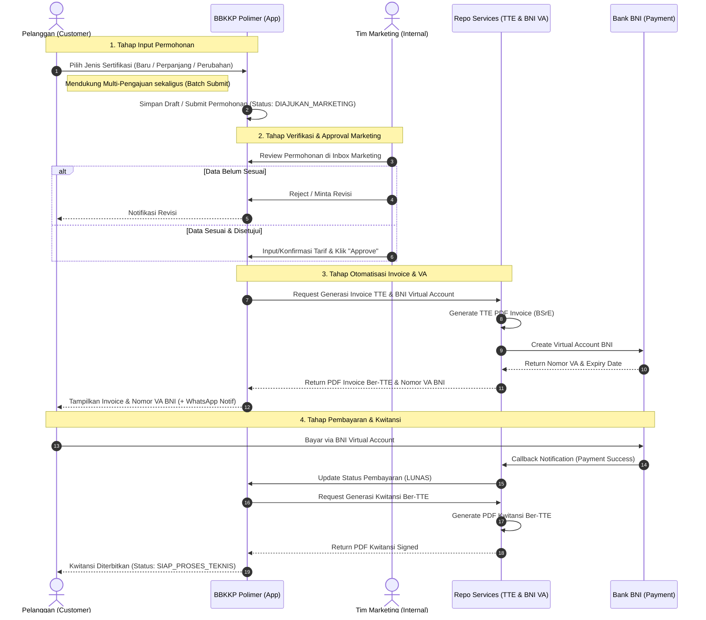
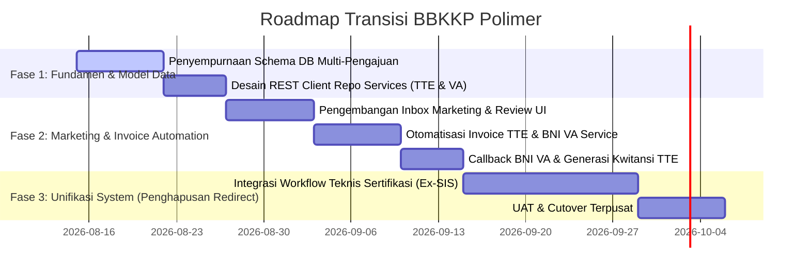

# Analisis Arsitektur Sistem BBKKP Polimer & Roadmap Transformasi Sistem Terpusat

> **Dokumen Analisis Strategis & Arsitektur Sistem**  
> **Balai Besar Kulit, Karet, dan Plastik (BBKKP) - Kementerian Perindustrian RI**  
> **Tanggal**: 13 Agustus 2026

---

## 1. Eksekutif Ringkasan & Konteks Visi

### 1.1 Kondisi Saat Ini (Current State)
Saat ini, ekosistem teknologi informasi di BBKKP terdiri dari beberapa aplikasi departmental yang berdiri sendiri (*siloed systems*), seperti sistem sertifikasi (**`bbkkp-sis`**), sistem pelatihan/Bimtek (**`bbkkp-training` / PUK**), sistem laboratorium (**`bbkkp-sil`**), serta beberapa unit/bagian kerja yang belum memiliki sistem aplikasi digital khusus. 

Dalam arsitektur eksisting, **BBKKP Polimer** bertindak sebagai **Portal Utama / Gateway Terpusat** yang utamanya berfungsi untuk:
1. Menjadi landing page dan pusat autentikasi pengguna eksternal (Pelanggan).
2. Menyediakan daftar permohonan (*tracking permohonan*) pelanggan.
3. Melakukan *redirection* (pengarahan ulang) pengguna ke aplikasi-aplikasi terpisah sesuai jenis layanan yang dituju.

### 1.2 Visi Masa Depan (Target State)
Strategi transformasi sistem mengarahkan **BBKKP Polimer** untuk berkembang dari sekadar *connector portal* menjadi **Single Unified Operation Hub (Super App)** terpusat.

Di masa depan:
- **Internal User (Staff, Marketing, Penilai, Auditor, Bendahara, Manajemen)** dan **External User (Pelanggan)** akan menyelesaikan seluruh pekerjaan, tugas, verifikasi, hingga penerbitan dokumen langsung di dalam **Polimer** tanpa perlu *login* atau berpindah ke aplikasi legacy secara langsung.
- Aplikasi legacy (seperti `bbkkp-sis`) secara bertahap akan diintegrasikan logic dan datanya ke dalam Polimer atau diposisikan sebagai *sub-service engine* di belakang layar.

---

## 2. Arsitektur Tiga Lapisan (Three-Tier Ecosystem & Services Layer)

Untuk mewujudkan sistem terpusat yang tangguh, arsitektur sistem dibagi menjadi 3 lapisan utama:

```mermaid
   graph TD
      subgraph Layer 1: Unified Interface (BBKKP Polimer)
         Pelanggan([Pelanggan / Public]) -->|Portal / React SPA| Polimer
         StaffInternal([Staff / Marketing / Bendahara]) -->|Dashboard Internal| Polimer
      end

      subgraph Layer 2: Centralized Service Layer (Repo Services / Middleware Hub)
         Polimer -->|API Request| ServiceHub[Repo Services Container]
         ServiceHub --> ServiceTTE[TTE Service / BSrE Engine]
         ServiceHub --> ServiceBNI[BNI Virtual Account Service]
         ServiceHub --> ServiceWA[WhatsApp Notification Gateway]
         ServiceHub --> ServiceIntegration[Shared Microservices Hub]
      end

      subgraph Layer 3: Legacy & Sub-System Data Store
         Polimer -.->|DB Multi-Conn| DB_SIS[(bbkkp_sis Database)]
         Polimer -.->|DB Multi-Conn| DB_SIL[(bbkkp_sil Database)]
         Polimer -.->|DB Multi-Conn| DB_PUK[(bbkkp_training Database)]
         Polimer -->|Primary DB| DB_Polimer[(bbkkp_polimer & bbkkp_services DB)]
      end
```

### 2.1 Peran Repo Services (Middleware Hub)
**Repo Services** berkedudukan di tengah antara `bbkkp-polimer` dan aplikasi/layanan eksternal. Repo ini bertindak sebagai *Microservices Container Hub* yang mengisolasi fungsi-fungsi reusable ber-workload tinggi atau yang membutuhkan keamanan khusus:
1. **Service TTE (Tanda Tangan Elektronik)**:
   - Mengurus komunikasi ke server BSrE / Kemenperin E-Sign SDK.
   - Melakukan pembubuhan QR Code, digital signature, dan verifikasi keabsahan dokumen PDF.
2. **Service BNI Virtual Account (VA)**:
   - Mengurus generasi nomor Virtual Account BNI secara dinamis.
   - Menerima callback / webhook status pembayaran dari Bank BNI secara *real-time*.
3. **Service WhatsApp & Messaging**:
   - Gateway terpusat untuk notifikasi status permohonan, pengiriman link invoice/kwitansi, dan OTP.

---

## 3. Analisis Alur Bisnis Permohonan Sertifikasi

Alur pengajuan sertifikasi di BBKKP Polimer dirancang untuk mendukung fleksibilitas transaksi pelanggan dan efisiensi verifikasi internal.

### 3.1 Diagram Alur Kerja (End-to-End Workflow)



### 3.2 Detail Tahapan Alur Kerja:

1. **Pengajuan Permohonan oleh Pelanggan**:
   - **Tipe Pengajuan**: Pelanggan dapat memilih apakah permohonan berupa:
     - *Pengajuan Sertifikasi Baru*
     - *Perpanjang (Re-Sertifikasi)*
     - *Perubahan Scope / Data Sertifikat*
   - **Fitur Multi-Pengajuan (Bulk Application)**: Dalam 1 kali proses *checkout/submit*, pelanggan dapat mengajukan **beberapa pengajuan sertifikasi sekaligus** (misalnya 3 komoditas/produk yang berbeda). Sistem akan mencatatnya dalam 1 Induk Permohonan (*Header*) dengan multiple *Detail Permohonan*.

2. **Verifikasi & Persetujuan Marketing (Marketing Review)**:
   - Data permohonan masuk ke dashboard/inbox Tim Marketing.
   - Tim Marketing melakukan verifikasi administratif dan penentuan rincian tarif layanan.
   - Tim Marketing melakukan aksi **Approve**.

3. **Generasi Invoice, TTE, & BNI Virtual Account Otomatis**:
   - Begitu aksi *Approve* dilakukan oleh Marketing:
     - Sistem Polimer memanggil **Repo Services** secara otomatis.
     - **Repo Services (TTE Engine)** mengenerate PDF Invoice yang ditandatangani secara digital.
     - **Repo Services (BNI Engine)** membuatkan nomor Virtual Account BNI baru sesuai total tagihan.
   - Invoice ber-TTE dan nomor VA BNI langsung muncul di portal pelanggan dan dikirimkan notifikasinya.

4. **Pembayaran & Penerbitan Kwitansi**:
   - Setelah pembayaran dikonfirmasi (secara otomatis via callback BNI VA atau verifikasi Bendahara), sistem secara otomatis memicu generasi **Kwitansi Pembayaran**.
   - Kwitansi diterbitkan lengkap dengan **TTE** dari Repo Services.
   - Permohonan lanjut ke tahap pemrosesan sertifikasi teknis.

---

## 4. Analisis Kesenjangan Kode Saat Ini (Gap Analysis Codebase `bbkkp-polimer`)

Berdasarkan pemeriksaan struktur basis kode `bbkkp-polimer` saat ini, berikut adalah perbandingan antara kondisi existing dan kebutuhan target:

| Komponen | Kondisi Saat Ini (Existing Codebase) | Kebutuhan Target Visi Baru | Gap & Langkah Penyesuaian |
| :--- | :--- | :--- | :--- |
| **Model Data Permohonan** | `App\Models\Db2\Permohonan` mengaitkan `DetailPermohonan` menggunakan polymorphic relation (`FormLsp`, `FormPelatihan`). | Harus mendukung *multi-item permohonan sertifikasi* (Baru vs Perpanjang/Perubahan) dalam 1 nomor header. | Penambahan struktur relasi `FormSertifikasi` / penyempurnaan `FormLsp` untuk mendukung flagship permohonan sertifikasi multi-item. |
| **Workflow Enum & State Machine** | Status workflow di `Permohonan` berfokus pada status umum (`DRAFT`, `DIAJUKAN`, `APPROVED`, `REVISI`). | Membutuhkan tahapan spesifik: `SUBMITTED_MARKETING`, `MARKETING_APPROVED`, `INVOICE_GENERATED`, `WAITING_PAYMENT`, `PAYMENT_CONFIRMED`, `KWITANSI_ISSUED`. | Penyesuaian Enum Workflow di `App\Enums` dan tabel `permohonan`. |
| **Integrasi Service TTE & BNI VA** | SDK TTE di-load lokal via composer (`dolkode/bbkkp-sdk-esign-service-php`). Belum ada kelas integrasi khusus untuk BNI VA. | Seluruh pemanggilan TTE, BNI VA, & WhatsApp harus di-bridge via **Repo Services API Client**. | Membuat Dedicated Service Client Layer (`App\Services\RepoServicesClient.php`) yang membungkus HTTP REST request ke Repo Services. |
| **Role & Dashboard Marketing** | Role `SysGroup` memiliki fungsi admin/bendahara, namun belum ada dashboard khusus Marketing Workflow. | Dashboard internal khusus Tim Marketing untuk me-review, menyesuaikan tarif, dan melakukan bulk approval. | Pembuatan UI Inbox Marketing pada modul `Modules/Permohonan`. |
| **Redirect vs Integrated System** | Pelanggan dan staff sering diarahkan via link luar / DB sync `sis` (`DB_URL_SIS`). | Seluruh workflow teknis sertifikasi dilakukan di dalam UI Polimer. | Migrasi fungsionalitas UI `bbkkp-sis` menjadi sub-modul terintegrasi di `bbkkp-polimer`. |

---

## 5. Pertimbangan Arsitektur & Rekomendasi Teknis

### 5.1 Pertimbangan Struktur Database Multi-Pengajuan
Untuk mengakomodasi 1 kali pengajuan dengan *multiple items* (Sertifikasi Baru, Perpanjang, Perubahan), disarankan struktur data berikut:

```
[permohonan] (Header)
  ├── id (UUID)
  ├── no_permohonan (misal: CERT-202608-0001)
  ├── created_by (Pelanggan ID)
  ├── id_pt_ins (Perusahaan/Instansi)
  ├── status_workflow (MARKETING_REVIEW, INVOICE_ISSUED, LUNAS, PROSES_TEKNIS)
  ├── total_harga
  ├── va_number (BNI Virtual Account)
  ├── invoice_pdf_tte
  ├── kuitansi_pdf_tte
  │
  └─── [detail_permohonan] (1 to Many)
         ├── id (UUID)
         ├── permohonan_id
         ├── tipe_pengajuan (BARU / PERPANJANG / PERUBAHAN)
         ├── jenis_sertifikasi_id
         ├── detail_produk_scope (JSON / Model Relasi)
         └── status_item
```

### 5.2 Pertimbangan Komunikasi dengan Repo Services (Async / Queue)
Generasi TTE PDF dan pembuatan nomor BNI Virtual Account melibatkan koneksi ke pihak ke-3 (BSrE & Bank BNI). Untuk mencegah HTTP Request *timeout* saat Marketing mengklik tombol *Approve*:
1. Gunakan **Laravel Queues / Background Jobs** (`ProcessMarketingApprovalJob`).
2. Begitu Marketing melakukan *Approve*, status permohonan berubah menjadi `PROCESSING_INVOICE`.
3. Job di background memanggil Repo Services -> Menghasilkan PDF Invoice TTE & BNI VA -> Mengupdate DB dan mengirim notifikasi WhatsApp ke Pelanggan secara asynchronous.

### 5.3 Pertimbangan Hak Akses (RBAC) & Isolasi Modul
1. **Modul Permohonan (`Modules/Permohonan`)**:
   - Perlu penambahan permission khusus `marketing.review`, `marketing.approve`, `marketing.reject`.
2. **Modul Eksternal (`Modules/Eksternal`)**:
   - Pembaruan form React SPA untuk wizard multi-item sertifikasi (memungkinkan pengisian beberapa komoditas sekaligus sebelum submit).

---

## 6. Roadmap Tahapan Pengembangan



---

## 7. Kesimpulan

Rencana penyesuaian **BBKKP Polimer** menjadi **Sistem Terpusat (Super App)** merupakan langkah strategis yang sangat tepat untuk efisiensi operasional BBKKP. 

Dengan memosisikan:
1. **Polimer** sebagai *Single User Interface* bagi seluruh pengguna (Pelanggan & Internal Staff),
2. **Repo Services** sebagai *Centralized Service Layer* (TTE, BNI VA, WhatsApp),
3. **Alur Otomatisasi Marketing -> Invoice TTE + BNI VA -> Kwitansi TTE**,

sistem ini akan mengeliminasi fragmentasi aplikasi, mempercepat waktu pemrosesan permohonan sertifikasi, serta meningkatkan transparansi layanan kepada masyarakat dan pelanggan BBKKP.
