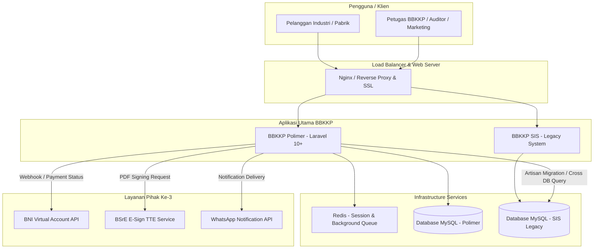

# 🌐 Overview Arsitektur Ekosistem BBKKP
## Gambaran Umum Arsitektur Sistem, Modul, dan Integrasi Lintas Aplikasi

> **Dokumen Arsitektur Ekosistem BBKKP**  
> **Balai Besar Kulit, Karet, dan Plastik (BBKKP) - Kementerian Perindustrian RI**  
> **Status Dokumen**: Active / Architecture Baseline  
> **Tanggal Efektif**: 17 Agustus 2026

---

## 1. Pendahuluan

Ekosistem aplikasi pada **Balai Besar Kulit, Karet, dan Plastik (BBKKP)** terdiri dari beberapa aplikasi utama yang menangani pelayanan sertifikasi industri, pengujian laboratorium, manajemen pelanggan, hingga integrasi dengan instansi/penyedia layanan eksternal.

Dokumen ini memberikan panduan arsitektural helikopter (*high-level architecture*) mengenai bagaimana aplikasi **BBKKP Polimer** (sistem utama baru berbasis Laravel) dan **BBKKP SIS** (sistem sertifikasi legacy) saling terhubung dan berinteraksi dengan layanan eksternal.

---

## 2. Diagram Arsitektur Ekosistem

---

## 3. Komponen Utama Ekosistem

### 3.1. BBKKP Polimer (`bbkkp-polimer`)
* **Peran**: Sistem informasi pelayanan sertifikasi dan manajemen operasional modern.
* **Tech Stack**: PHP 8.2+, Laravel 10+, MySQL 8.0+, Redis, Bootstrap/Tailwind.
* **Fitur Utama**:
  * Portal Permohonan Sertifikasi Pelanggan (Pengajuan, Surveilans, Perpanjangan).
  * Manajemen Profil Pabrik & Produk Industri.
  * Billing & Integrasi Pembayaran BNI Virtual Account.
  * Pembubuhan TTE (Tanda Tangan Elektronik) Sertifikat via BSrE.

### 3.2. BBKKP SIS (`bbkkp-sis`)
* **Peran**: Sistem Informasi Sertifikasi legacy yang memuat riwayat permohonan, sertifikat aktif masa lalu, dan data master pelanggan historis.
* **Status**: *Read-Only / Legacy Maintenance* selama masa transisi migrasi ke Polimer.

### 3.3. DB & Queue Infrastructure
* **MySQL Database**: Dipisahkan antara DB Polimer (`bbkkp_polimer`) dan DB SIS (`bbkkp_sis`).
* **Redis**: Digunakan untuk manajemen sesi pengguna dan *distributed queue* untuk pengiriman notifikasi WhatsApp serta pemanggilan API TTE BSrE secara asinkron.

### 3.4. Integration Services (Pihak Ke-3)
1. **BNI Virtual Account**: Menerima callback status pembayaran otomatis (*Real-time Notification*).
2. **BSrE E-Sign (BSSN)**: Melakukan verifikasi dan pembubuhan TTE berstandar hukum pada file PDF Sertifikat.
3. **WhatsApp Gateway**: Pengiriman notifikasi tagihan VA dan perubahan status permohonan ke WhatsApp pelanggan.

---

## 4. Alur Integrasi & Transisi Data

Dalam strategi integrasi Polimer & SIS:
1. **Single Door Login**: Pelanggan lama dari SIS dapat melakukan *claim account* di Polimer menggunakan Email/NPWP.
2. **Migrasi Sertifikat Aktif**: Data sertifikat aktif (`status = on_going`) dari DB SIS termigrasi secara otomatis ke tabel `pelanggan_sertifikasi` di Polimer via Artisan Command (`php artisan integration:migrate-sis-history`).
3. **Idempotensi**: Proses migrasi aman dijalankan berulang kali tanpa menciptakan duplikasi record.

---

## 5. Dokumen Referensi Terkait
* **[SOP Git Dual-Remote Workflow](../standards/git_dual_remote_workflow.md)**
* **[Coding & Security Guidelines](../standards/coding_guidelines.md)**
* **[Spesifikasi Migrasi DB SIS ke Polimer](../../projects/integrasi-sis-polimer/02-architecture/db_schema_migration.md)**
