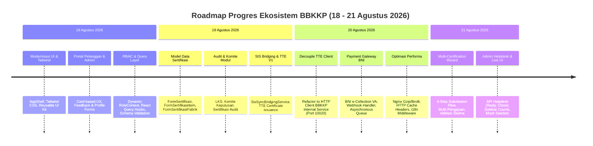

# 📜 Global Changelog Ekosistem BBKKP (4 Hari Terakhir)

> **Periode**: 18 Agustus 2026 s/d 21 Agustus 2026  
> **Ruang Lingkup**: Seluruh repositori ekosistem BBKKP (`private-polimer`, `private-sis`, `bbkkp-internal-service`, `integrasi-sis-polimer`, `BBKKP-Docs`)  
> **Status Integrasi**: Single Source of Truth (SSOT)

---

## 🎯 Ringkasan Eksekutif Perkembangan Ekosistem

Dalam kurun waktu 4 hari terakhir (18–21 Agustus 2026), terjadi akselerasi modernisasi besar pada ekosistem Balai Besar Kulit, Karet, dan Plastik (BBKKP), khususnya pada portal utama **BBKKP Polimer (v2.1)** dan sinkronisasinya dengan sistem legacy **BBKKP SIS** serta mikroservis **BBKKP Internal Service**.

---

## 📊 Matriks Progres & Status Repositori

| Repositori | Total Commit (4 Hari) | Status Utama | Sorotan Fitur Baru |
| :--- | :---: | :---: | :--- |
| **`bbkkp-polimer`** | 38 commit | 🟢 Sangat Aktif | Multi-Sertifikasi Wizard, BNI VA e-Collection, TTE HTTP Client, Admin Helpdesk, Tailwind UI, Async Payment Processing |
| **`bbkkp-sis`** | 1 commit | 🟢 Stabil | Public tables migration, Co-existence schema alignment |
| **`bbkkp-internal-service`**| Terintegrasi | 🟢 Aktif (Port 10020) | Service BSrE TTE & Document Hash Verification melayani Polimer |
| **`integrasi-sis-polimer`**| Lintas Sistem | 🟢 Terhubung | Idempotent Bridging Service, Dual-write & Read compatibility |
| **`BBKKP-Docs`** | 5 commit | 🟢 Terbarui | MOC terpusat, Audit komprehensif, Panduan Onboarding, FRD, API Docs |

---

## 🗓️ Catatan Perubahan Global Harian

### 📅 Hari ke-4: Jumat, 21 Agustus 2026
* **BBKKP Polimer**:
  * **Multi-Certification Submission Flow**: Penambahan kapabilitas pengajuan sertifikasi multi-item/multi-komoditi dalam 1 transaksi permohonan. Implementasi wizard 4-tahap (`Step1JenisPermohonan`, `Step2KategoriDanKomoditi`, `Step3PerusahaanDanPabrik`, `Step4PernyataanKonfirmasi`).
  * **Admin Helpdesk APIs & Live UI**: Implementasi endpoint live helpdesk (`adminList`, `adminReply`, `adminClose`) di `PertanyaanController`, integrasi counter notifikasi pada `AdminShell`, perombakan halaman `AdminPertanyaanPage`, dan pembuatan seeder komprehensif `DummyPolimerSeeder` serta `MarketingUserSeeder`.
  * **Master Layanan Endpoint**: Pembuatan API `GET /api/eksternal/dashboard/layanan` untuk memuat katalog dinamis jenis layanan aktif.

### 📅 Hari ke-3: Kamis, 20 Agustus 2026
* **BBKKP Polimer**:
  * **Refactoring TTE Client**: Memutus dependensi library OpenAPI lama dan beralih ke native Guzzle HTTP Client yang terhubung ke `bbkkp-internal-service` (FrankenPHP Octane di port `10020`). Penambahan mode `TTE_DUMMY=true` untuk fallback pengujian lokal tanpa internet/kredensial BSrE.
  * **Integrasi BNI Virtual Account (e-Collection)**: Implementasi enkripsi 2-Step Double Hashing XOR standar BNI, pembuatan VA dinamis saat penetapan invoice permohonan.
  * **Webhook BNI & Idempotency Guard**: Endpoint `POST /api/v1/payment/bni/callback` dengan proteksi tanda tangan, bypass CSRF terisolasi, dan pencegahan double-processing.
  * **Asynchronous Payment Queue**: Eksekusi penerbitan kuitansi DomPDF dan pengubahan status permohonan melalui job antrian `ProcessBniPaymentJob`.
  * **Internasionalisasi (i18n)**: Middleware `SetLocaleMiddleware` dan route switcher `/locale/{lang}` untuk dukungan multibahasa (ID / EN).
  * **Optimasi Aset & Nginx**: Konfigurasi header cache agresif untuk static assets dan kompresi gzip/brotli.

### 📅 Hari ke-2: Rabu, 19 Agustus 2026
* **BBKKP Polimer**:
  * **Struktur Data Multi-Item Sertifikasi**: Model relasional `FormSertifikasi`, `FormSertifikasiItem` (dukungan multi-SNI), dan `FormSertifikasiPabrik`.
  * **Modul Audit & Komite Keputusan**: Implementasi modul penugasan auditor sertifikasi, pencatatan ketidaksesuaian/LKS, dan lembar keputusan rapat komite sertifikasi.
  * **TTE Bridging ke SIS**: Layanan `SisSyncBridgingService` untuk menyelaraskan sertifikat digital yang terbit di Polimer ke database legacy SIS.
  * **Fitur Autofill & UX Improvement**: Peningkatan auto-fill profil pemohon pada form wizard layanan eksternal.
* **BBKKP SIS**:
  * **Public Tables Migration**: Migrasi penyesuaian tabel publik untuk mendukung sinkronisasi akun dan data pemohon dari Polimer.

### 📅 Hari ke-1: Selasa, 18 Agustus 2026
* **BBKKP Polimer**:
  * **Desain Sistem & Tailwind CSS**: Penggantian komponen legacy Bootstrap dengan Tailwind CSS modern, penambahan kumpulan UI Kit (`Button`, `Card`, `Badge`, `Input`, `Modal`, `DataTable`, `StatsCard`).
  * **Revamp Layout Portal**: Implementasi `AppShell` dan `AdminShell` yang responsif dengan sidebar navigation dan loading Suspense.
  * **Modernisasi Form Layanan**: Refactoring seluruh form wizard permohonan (Pengujian Lab, Kalibrasi, Konsultansi, Pelatihan, LSP).
  * **Dynamic RBAC Context**: Penyediaan context role React untuk proteksi halaman admin dan pelanggan, serta dropdown role switcher.
  * **Query Layer & Validasi**: Integrasi TanStack React Query hooks dan validasi schema Yup/Zod.
  * **Sanitasi Auth & reCAPTCHA**: Fallback aman saat Google reCAPTCHA dinonaktifkan di local development.

---

## 🔗 Navigasi Log Rinci Tiap Proyek

Untuk melihat daftar commit, diff teknis, dan rincian perubahan pada masing-masing repositori, silakan buka:
* 🟢 [Changelog BBKKP Polimer](file:///f:/!Productive/BBKKP/BBKKP-Docs/docs/projects/bbkkp-polimer/changelog_polimer.md)
* 🔵 [Changelog BBKKP SIS](file:///f:/!Productive/BBKKP/BBKKP-Docs/docs/projects/bbkkp-sis/changelog_sis.md)
* 🟣 [Changelog Integrasi SIS & Polimer](file:///f:/!Productive/BBKKP/BBKKP-Docs/docs/projects/integrasi-sis-polimer/changelog_integrasi.md)
* 🟡 [Changelog BBKKP Internal Service](file:///f:/!Productive/BBKKP/BBKKP-Docs/docs/projects/bbkkp-internal-service/changelog_internal_service.md)
