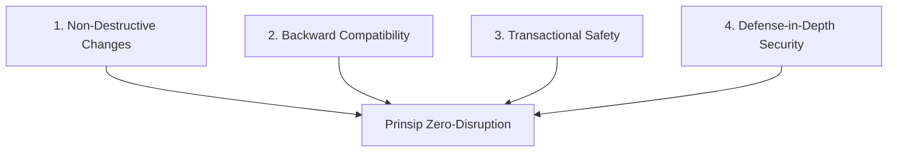
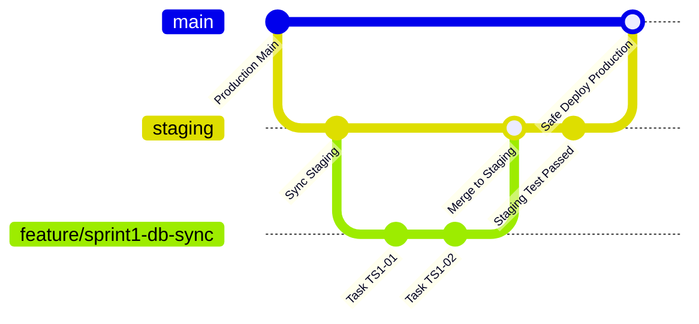

# Rules & Development Guidelines: Integrasi Sistem BBKKP Polimer
## Panduan Standar Keamanan, Kestabilan, dan Kesinambungan Operasional

> **Dokumen Panduan Teknis & SOP Pengerjaan Sistem**  
> **Balai Besar Kulit, Karet, dan Plastik (BBKKP) - Kementerian Perindustrian RI**  
> **Status Dokumen**: Active / Mandatory Guidelines  
> **Tanggal Efektif**: 14 Agustus 2026

---

## 1. Prinsip Utama Pengembangan (Core Principles)

Sistem **BBKKP Polimer** dan **BBKKP SIS** saat ini **aktif digunakan secara live** dalam operasional harian balai. Oleh karena itu, setiap aktivitas pengembangan, migrasi, dan penggabungan kode wajib tunduk pada 4 pilar utama:



1. **Zero Operational Disruption**: Tidak boleh ada fitur, rute, atau alur transaksi yang sedang berjalan di produksi yang terhenti atau rusak akibat penambahan fitur baru.
2. **Minimalisir Perombakan Alur Eksisting (*Preserve Existing Flows*)**: Gunakan alur data dan modul yang sudah ada sebagai fondasi awal. Penambahan fitur baru dilakukan secara modular tanpa mengubah logika dasar yang sedang aktif.
3. **Non-Destructive Database Migrations**: Tidak diperkenankan melakukan `DROP COLUMN`, `DROP TABLE`, atau mengubah tipe data kolom aktif secara sepihak. Terapkan pola *Expand and Contract*.
4. **Idempotensi & Ketahanan Antrean**: Seluruh background job dan webhook pihak ke-3 (TTE BSrE, BNI VA) harus aman dari eksekusi ganda (*idempotent*).

---

## 2. Aturan Keamanan Sistem (Security Rules)

### 2.1 Autentikasi, Hak Akses & RBAC
- **Validasi Ganda**: Pengecekan permission dilakukan di 2 level: **Middleware Rute** dan **Controller/Policy** (`$this->authorize(...)`).
- **Pencegahan IDOR (Insecure Direct Object References)**: Setiap query pengambilan data permohonan atau dokumen wajib memvalidasi kepemilikan data pelanggan:
  ```php
  // BENAR: Memastikan data milik user yang sedang login
  $permohonan = Permohonan::where('id', $id)
      ->where('created_by', auth()->user()->id)
      ->firstOrFail();

  // SALAH (IDOR Risk):
  $permohonan = Permohonan::findOrFail($id);
  ```
- **Kredensial & Secrets**: Dilarang keras menaruh API Key, Secret Token, atau password database secara *hardcoded* di source code. Wajib menggunakan `config(...)` yang membaca dari `.env`.

### 2.2 Validasi Input & Sanitasi Berkas
- Gunakan `FormRequest` khusus untuk setiap endpoint API/Form dengan aturan validasi ketat:
  ```php
  // Validasi Berkas Unggahan
  'dokumen_syarat' => 'required|file|mimes:pdf,jpg,png|max:5120', // Max 5MB
  ```
- Seluruh input teks yang dirender ke Blade/UI wajib di-escape (`{{ $var }}`) untuk mencegah XSS.
- Gunakan Eloquent ORM atau Parameter Binding PDO untuk mencegah SQL Injection.

### 2.3 Keamanan Callback Webhook (BNI VA & Repo Services)
- Endpoint callback (`/api/integration/bni-callback`) **wajib**:
  1. Memverifikasi signature HMAC / Secret API Key header.
  2. Memeriksa IP Whitelist jika tersedia.
  3. Menerapkan *Distributed Lock* (Redis atau Database Lock) agar tidak terjadi *race condition* saat BNI mengirimkan notifikasi ganda dalam milidetik yang sama.

### 2.4 Pencatatan Audit Trail (`sys_audit_log`)
Setiap mutasi status kritis (perubahan tarif, approval marketing, status lunas, penugasan audit, pembubuhan TTE) **wajib mencatat log audit**:
- ID Pengguna & Role
- Aksi & Entitas yang diubah
- Nilai sebelum (*old values*) dan nilai sesudah (*new values*)
- IP Address & Timestamp

---

## 3. Aturan Kestabilan & Penanganan Error (Stability & Error Minimization)

### 3.1 Transaksi Database (`DB::transaction`)
Setiap proses yang melibatkan lebih dari 1 tabel (misalnya: pembuatan permohonan + detail item + profil pabrik) **wajib** dibungkus dalam blok transaksi database:

```php
use Illuminate\Support\Facades\DB;

DB::beginTransaction();
try {
    $permohonan = Permohonan::create([...]);
    $permohonan->detailPermohonan()->create([...]);
    $permohonan->formSertifikasi()->create([...]);
    
    DB::commit();
} catch (\Throwable $e) {
    DB::rollBack();
    report($e); // Log ke Sentry
    return response()->json(['success' => false, 'message' => 'Gagal memproses permohonan.'], 500);
}
```

### 3.2 Isolasi Antrean Background Job (Queue Safety)
Panggilan ke layanan pihak ke-3 (BSrE E-Sign, BNI Virtual Account, WhatsApp Cast) **wajib** dijalankan di background queue (tidak boleh dieksekusi secara sinkron di web request thread):
- **Tentukan Timeout & Max Tries**:
  ```php
  public $tries = 3;
  public $backoff = [10, 60, 180]; // Retry setelah 10s, 1m, 3m
  public $timeout = 120;
  ```
- **Penanganan Gagal (Failed Jobs)**:
  Sediakan method `failed(\Throwable $exception)` pada Job Class untuk mencatat alert ke admin jika seluruh percobaan retry gagal tanpa membuat permohonan *stuck*.

### 3.3 Penanganan Error Ramah Pengguna (Graceful Degradation)
- Jangan pernah menampilkan *raw stack trace* atau SQL error ke pengguna akhir.
- Jika layanan TTE/BNI sedang mengalami pemeliharaan (*downtime* pihak ke-3), sistem harus menampilkan pesan informatif: *"Permohonan Anda telah disetujui dan antrean penerbitan tagihan sedang diproses."*

---

## 4. Strategi Pemeliharaan Skema Database & Data Flow Eksisting

### 4.1 Pola Migrasi Database (*Expand and Contract Pattern*)
Untuk menjaga sistem lama tetap berjalan saat sistem baru dibangun:

```
[Fase 1: Expand]
- Tambahkan tabel/kolom baru dengan nilai DEFAULT atau NULLABLE.
- Jangan hapus kolom lama.
- Sistem lama tetap membaca kolom lama, sistem baru mulai membaca tabel baru.

[Fase 2: Parallel Run]
- Sistem membaca dari skema baru dengan fallback ke skema lama jika kosong.
- Gunakan command sinkronisasi dua arah.

[Fase 3: Contract (Setelah Cutover Final)]
- Hapus kolom/tabel yang sudah benar-benar tidak terpakai setelah masa tenggang aman.
```

### 4.2 Aturan Koneksi Multi-Database
Aplikasi Polimer terhubung ke beberapa database (`Db1`, `Db2`, `DB_URL_SIS`, `DB_URL_APPS`):
- Jangan melakukan SQL JOIN lintas database koneksi yang berbeda di query raw.
- Gunakan relasi Eloquent atau pemanggilan terpisah berbasis UUID / ID relasi.
- Pastikan koneksi ke database legacy bersifat **Read-Only** untuk data historis, kecuali melalui Service Sync yang terisolasi.

---

## 5. Standar Alur Kerja Git & Deployment (Workflow SOP)



### 5.1 Standar Penamaan Branch
- Fitur Baru: `feature/sprint-[nomor]-[nama-fitur]` (Contoh: `feature/sprint-1-db-migration`)
- Perbaikan Bug: `fix/sprint-[nomor]-[nama-bug]` (Contoh: `fix/sprint-2-cart-validator`)
- Hotfix Produksi: `hotfix/[nama-kendala]`

### 5.2 Checklist Wajib Sebelum Merge ke Branch `staging`
1. [ ] **Lint & Static Analysis**: Tidak ada syntax error atau unresolved dependencies.
2. [ ] **Automated Test**: Seluruh Unit & Feature Tests berhasil (`php artisan test`).
3. [ ] **Migration Check**: File migration dapat di-`migrate` dan di-`rollback` tanpa error (`php artisan migrate:rollback --step=1`).
4. [ ] **No Hardcoded Secrets**: Tidak ada token, password, atau credential yang ter-commit.

### 5.3 Checklist Wajib Deployment ke Server Produksi
1. [ ] **Backup Database Penuh**: Lakukan snapshot backup `bbkkp_polimer` dan `bbkkp_sis` sebelum menjalankan migrasi.
2. [ ] **Maintenance Flag (Jika Diperlukan)**: Gunakan `php artisan down --secret="bypass-token"` jika ada migrasi besar.
3. [ ] **Run Migration**: `php artisan migrate --force`
4. [ ] **Cache Re-generation**:
   ```bash
   php artisan config:cache
   php artisan route:cache
   php artisan view:cache
   ```
5. [ ] **Queue Worker Restart**: `php artisan queue:restart` agar worker membaca kode terbaru.
6. [ ] **Post-Deploy Smoke Test**: Cek login pelanggan, landing page, dan inbox internal untuk memastikan ketersediaan layanan.

---

## 6. Rangkuman & Catatan Penting Pengembang

> [!IMPORTANT]
> **Pedoman Utama**: Prioritaskan keutuhan data pelanggan dan kelancaran transaksi yang sedang berlangsung. Apabila ragu mengenai dampak suatu perubahan database atau flow data terhadap alur yang sedang berjalan, pilih pendekatan modular non-destruktif (*additive-only*) dan konsultasikan sebelum melakukan perubahan drastis.
