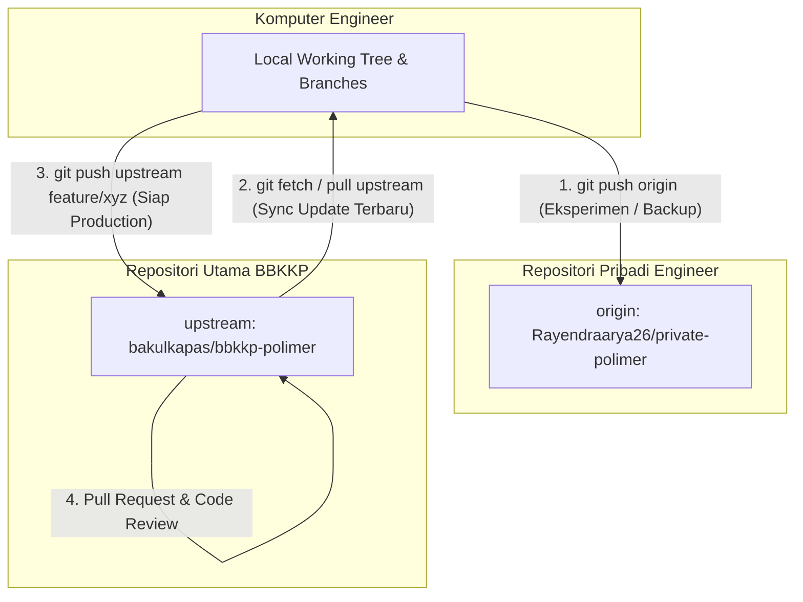

# Standar SOP Git: Dual-Remote Workflow Development
## Panduan Pengembangan & Pengelolaan Codebase Sistem BBKKP

> **Dokumen Panduan Teknis & SOP Git Workflow**  
> **Balai Besar Kulit, Karet, dan Plastik (BBKKP) - Kementerian Perindustrian RI**  
> **Status Dokumen**: Active / Mandatory SOP  
> **Tanggal Efektif**: 17 Agustus 2026

---

## 1. Pendahuluan & Tujuan

Dokumen ini mengatur standar alur kerja pengkodean (*Git Workflow*) menggunakan pendekatan **Dual-Remote** untuk pengembang (*engineer*) yang mengerjakan sistem di lingkungan BBKKP (`bbkkp-polimer`, `bbkkp-sis`, dan repositori terkait).

### Mengapa Menggunakan Dual-Remote?
Sistem BBKKP berada pada lingkungan produksi (*live*). Untuk menjaga integritas dan kestabilan repository utama, setiap engineer diwajibkan melakukan eksperimen, uji coba, dan pengerjaan fitur awal pada **repository pribadi (Private Remote)** sebelum kodenya dipindahkan ke **repository utama (Upstream)**.

Manfaat utama strategi ini:
1. **Isolasi Eksperimen**: Kode eksperimen atau *refactoring* radikal tidak akan mengotori atau merusak *commit history* repositori utama.
2. **Zero Accidental Push**: Mencegah *accidental push* atau commit kotor ke repositori utama.
3. **Fleksibilitas Engineer**: Engineer memiliki kendali 100% atas repositori pribadi (bebas *rebase*, *squash*, atau *force push* jika diperlukan di area pribadi).

---

## 2. Arsitektur & Konsep Dual-Remote

Dalam lingkungan lokal Anda, Git dikonfigurasi untuk terhubung ke **dua server remote**:



### Definisi Remote Alias:
* **`origin`**: Repositori pribadi milik engineer (misal: `https://github.com/USERNAME/private-polimer.git`). Digunakan untuk *backup* harian, eksperimen, dan pengujian internal.
* **`upstream`**: Repositori resmi milik organisasi BBKKP (misal: `https://github.com/bakulkapas/bbkkp-polimer.git`). Digunakan sebagai sumber kebenaran (*single source of truth*) kode produksi.

---

## 3. Panduan Setup Awal (Initial Setup)

Setiap engineer yang baru mulai pengerjaan wajib mengatur repositori lokalnya agar memiliki dua remote ini.

### Langkah 1: Buat Repositori Private Pribadi
Buat repositori kosong baru berkategori **Private** di akun GitHub/GitLab pribadi Anda (misal: `private-polimer` atau `private-sis`).

### Langkah 2: Konfigurasi Remote di Lokal

Buka Terminal / PowerShell pada direktori project:

```bash
# 1. Ubah nama remote 'origin' bawaan menjadi 'upstream' (Repositori Asli BBKKP)
git remote rename origin upstream

# 2. Tambahkan repositori pribadi Anda sebagai 'origin' baru
git remote add origin https://github.com/USERNAME_ANDA/private-polimer.git

# 3. Verifikasi konfigurasi remote
git remote -v
```

**Hasil yang diharapkan dari `git remote -v`:**
```text
origin    https://github.com/USERNAME_ANDA/private-polimer.git (fetch)
origin    https://github.com/USERNAME_ANDA/private-polimer.git (push)
upstream  https://github.com/bakulkapas/bbkkp-polimer.git (fetch)
upstream  https://github.com/bakulkapas/bbkkp-polimer.git (push)
```

---

## 4. SOP Alur Kerja Harian (Daily Development SOP)

### 4.1. Memulai Fitur Baru / Hari Kerja
Sebelum membuat kode baru, pastikan branch utama lokal Anda tersinkronisasi dengan pembaruan dari `upstream`:

```bash
# Switch ke branch utama lokal
git checkout main  # atau master

# Ambil pembaruan terkini dari repositori utama BBKKP
git fetch upstream
git merge upstream/main

# Push update terbaru ke repositori pribadi agar ikut up-to-date
git push origin main
```

### 4.2. Membuat Branch & Melakukan Pengembangan
Selalu buat branch fitur (*feature branch*) baru untuk setiap tugas/sprint:

```bash
# Buat dan pindah ke branch fitur baru
git checkout -b feature/migrasi-sertifikat-sis

# Kerjakan fitur & lakukan commit secara berkala
git add .
git commit -m "feat(migrasi): tambah command artisan migrate-sis-history"

# Push perkembangan harian ke REPO PRIBADI (origin)
git push -u origin feature/migrasi-sertifikat-sis
```

### 4.3. Menyinkronkan Branch Fitur dengan Upstream
Jika ada engineer lain yang melakukan update ke `upstream/main` saat Anda sedang bekerja, update branch fitur Anda menggunakan *rebase*:

```bash
# Ambil data terbaru dari upstream
git fetch upstream

# Rebase branch fitur Anda di atas upstream/main
git rebase upstream/main

# Jika ada konflik, selesaikan konflik lalu lanjutkan:
# git add .
# git rebase --continue

# Update branch di repo pribadi (gunakan --force-with-lease jika rebase merubah commit history)
git push origin feature/migrasi-sertifikat-sis --force-with-lease
```

---

## 5. SOP Pemindahan Kode ke Repositori Utama (Upstream)

Setelah fitur selesai diuji di lingkungan lokal/pribadi dan **siap untuk dipindahkan ke repositori utama BBKKP**, ikuti langkah-langkah berikut:

### Syarat Sebelum Push ke Upstream:
1. Kode telah lulus pengujian lokal (*unit test / manual test* berjalan tanpa error).
2. Kode telah disinkronkan (*rebase*) dengan `upstream/main` terbaru.
3. Tidak ada file kredensial (`.env`, secret key, password DB) yang terbawa.

### Langkah Pemindahan:

```bash
# 1. Pastikan Anda berada di branch fitur yang sudah teruji
git checkout feature/migrasi-sertifikat-sis

# 2. Push branch fitur dari komputer Anda LANGSUNG ke Repositori Utama (upstream)
git push upstream feature/migrasi-sertifikat-sis
```

### 3. Buat Pull Request (PR) di Browser
1. Buka repositori resmi BBKKP di GitHub/GitLab (`https://github.com/bakulkapas/bbkkp-polimer`).
2. Klik tombol **Compare & Pull Request** untuk branch `feature/migrasi-sertifikat-sis`.
3. Tuliskan deskripsi ringkas perubahan, rincian testing, dan nomor tiket/task.
4. Minta peninjauan (*code review*) dari Tech Lead / Senior Engineer.
5. Setelah disetujui, gabungkan (*merge*) ke branch `main`.

---

## 6. Tabel Referensi Perintah Git (Cheat Sheet)

| Kebutuhan Perintah | Command Git | Penjelasan |
| :--- | :--- | :--- |
| Cek daftar remote | `git remote -v` | Memastikan `origin` (pribadi) & `upstream` (asli) terdaftar. |
| Ambil update dari repo asli | `git fetch upstream` | Mengunduh commit terbaru dari repo utama tanpa mengubah file lokal. |
| Sync `main` lokal dengan asli | `git merge upstream/main` | Menggabungkan kode terbaru dari repo utama ke branch lokal. |
| Simpan kerjaan ke repo pribadi | `git push origin <nama-branch>` | Menyimpan backup/eksperimen ke GitHub pribadi. |
| Kirim fitur siap ke repo utama | `git push upstream <nama-branch>` | Mengirimkan branch fitur ke repo utama BBKKP untuk diajukan PR. |
| Rebase dengan repo asli | `git rebase upstream/main` | Merapikan history commit fitur di atas commit terbaru repo utama. |

---

## 7. Aturan Wajib & LARANGAN (Do's and Don'ts)

### ✅ Yang WAJIB Dilakukan (Do's):
- **Wajib** selalu menjalankan `git fetch upstream` dan `git rebase upstream/main` sebelum mengajukan Pull Request.
- **Wajib** menuliskan pesan commit yang jelas dengan format konvensional (`feat: ...`, `fix: ...`, `docs: ...`, `refactor: ...`).
- **Wajib** menyimpan cadangan pengerjaan harian ke `origin` (repo pribadi).

### ❌ Yang DILARANG (Don'ts):
- **DILARANG KERAS** melakukan `git push --force` atau `git push -f` ke repositori `upstream`.
- **DILARANG KERAS** langsung melakukan push ke branch `main` atau `master` di repositori `upstream` tanpa melalui Pull Request / Code Review.
- **DILARANG** memasukkan file konfiguras lokal (`.env`, `.idea/`, `node_modules/`, `vendor/`) ke commit Git.

---
*Dokumen ini dibuat untuk menjamin standar kualitas dan keamanan pengelolaan kode pada proyek BBKKP.*
