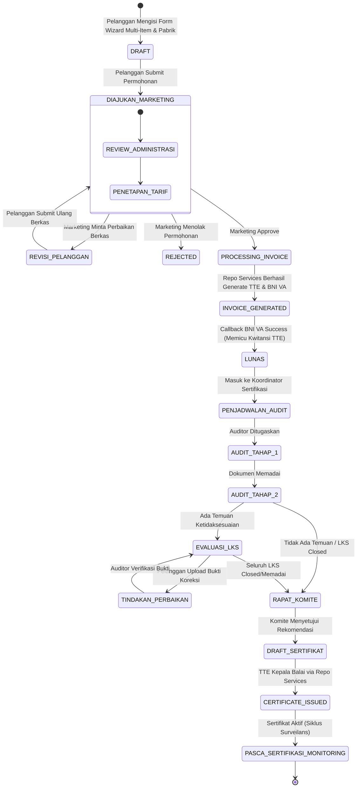

# Functional Requirements Document (FRD)
## Integrasi Sistem Informasi Sertifikasi (BBKKP-SIS) ke Dalam BBKKP Polimer

> **Dokumen Spesifikasi Kebutuhan Fungsional & Analisis Integrasi Komprehensif**  
> **Balai Besar Kulit, Karet, dan Plastik (BBKKP) - Kementerian Perindustrian RI**  
> **Versi**: 2.0 (Updated & Enhanced)  
> **Tanggal**: 14 Agustus 2026

---

## 1. Pendahuluan & Tujuan Proyek

### 1.1 Latar Belakang
Saat ini, pemrosesan sertifikasi produk dan sistem manajemen di Balai Besar Kulit, Karet, dan Plastik (BBKKP) ditangani oleh sistem terpisah bernama **`bbkkp-sis`**. Pengguna pada aplikasi **BBKKP Polimer** saat ini di-redirect (diarahkan keluar) ke `bbkkp-sis` untuk melakukan pengajuan dan pemantauan sertifikasi.

Dalam rangka mewujudkan Polimer sebagai **Single Unified Operation Hub (Super App)**, fungsionalitas `bbkkp-sis` akan diintegrasikan secara penuh ke dalam `bbkkp-polimer`. Dengan integrasi ini, seluruh pemrosesan permohonan sertifikasi—mulai dari pengajuan multi-item oleh pelanggan, verifikasi Marketing, penetapan tarif, penerbitan Invoice & Kwitansi ber-TTE, integrasi BNI Virtual Account, audit teknis 2-tahap (Tahap 1 Dokumen & Tahap 2 Pabrik/Lapangan), penanganan LKS (Laporan Ketidaksesuaian), pengambilan contoh (PPC), rapat komite evaluasi, hingga penerbitan Sertifikat ber-TTE dan monitoring surveilans—akan dilakukan langsung di Polimer.

### 1.2 Tujuan
1. **Unifikasi Pengalaman Pengguna (Single System)**: Menghilangkan pengalihan (*redirection*) ke aplikasi legacy `bbkkp-sis` bagi pelanggan maupun staf internal.
2. **Otomatisasi Finansial & Dokumen**: Mengintegrasikan **Repo Services** untuk penerbitan Invoice TTE, Virtual Account Bank BNI, dan Kwitansi TTE secara otomatis dan *real-time*.
3. **Dukungan Multi-Pengajuan (Batch Submission)**: Memungkinkan pelanggan mengajukan beberapa permohonan sertifikasi (Baru, Perpanjang, Perubahan Scope/Data) dalam 1 kali transaksi *checkout*.
4. **Kelengkapan Standar Audit Sertifikasi (ISO 17065 / 17021)**: Memastikan workflow teknis internal mencakup seluruh siklus audit: Audit Tahap 1, Audit Lapangan, PPC, LKS Tindakan Koreksi, Rekomendasi Komite, hingga Penerbitan Sertifikat.
5. **Migrasi Data & Kontinuitas Layanan**: Mengintegrasikan data historis dari database `bbkkp_sis` ke `bbkkp_polimer` tanpa merusak riwayat transaksi dan data sertifikat aktif.

---

## 2. Matriks Analisis Kebutuhan & Checklist Keperluan Integrasi

| No | Kategori | Deskripsi Keperluan | Status Saat Ini | Kebutuhan Penyesuaian / Action Item |
| :-: | :--- | :--- | :-: | :--- |
| **1** | **Autentikasi & Akun** | Sinkronisasi User & Pelanggan antara DB `sis` dan DB `polimer` | Partial (Command `SyncUserSis` sudah ada) | Meningkatkan sync dua arah & automatisasi integrasi profile perusahaan & pabrik. |
| **2** | **Master Data** | Master Sertifikasi, Komoditi, Standar (SNI/ISO), Kode EA/NACE, & Tarif | Terpisah di DB `sis` | Import & sinkronisasi master data sertifikasi ke DB `bbkkp_services`/`bbkkp_polimer`. |
| **3** | **Data Pabrik & Fasilitas** | Data multi-lokasi pabrik/fasilitas produksi pemohon | Di tabel `sis_pelanggan_pabrik` | Penambahan entitas Pabrik di Polimer yang berelasi dengan Pelanggan & Permohonan. |
| **4** | **Pengajuan Multi-Item** | Form Wizard Pengajuan Sertifikasi Baru, Perpanjang, & Perubahan Scope | Form tunggal di React SPA | Modifikasi form React SPA untuk mendukung *multi-item cart submission* & upload berkas syarat. |
| **5** | **Inbox Marketing** | Dashboard verifikasi permohonan & penyesuaian tarif oleh Tim Marketing | Belum ada di Polimer | Pembuatan UI & Controller Inbox Marketing pada `Modules/Permohonan`. |
| **6** | **Repo Services: TTE** | Generasi PDF Invoice, Kwitansi, & Sertifikat ber-TTE | SDK lokal di Polimer | Integrasi HTTP Client ke **Repo Services Container API**. |
| **7** | **Repo Services: BNI VA** | Generasi Nomor Virtual Account BNI & Payment Callback | Belum ada | Integrasi Service BNI VA via Repo Services & Handler Webhook Callback. |
| **8** | **Workflow Audit 2-Tahap** | Audit Tahap 1 (Kecukupan Dokumen) & Audit Tahap 2 (Kesesuaian Pabrik) | Masih di `bbkkp-sis` | Pembuatan sub-modul Audit Teknis & Penjadwalan Auditor di `Modules/Permohonan`. |
| **9** | **LKS & Tindakan Koreksi** | Pengelolaan Temuan LKS (Kritis/Mayor/Minor), upload bukti koreksi pelanggan, verifikasi auditor | Masih di `bbkkp-sis` | Pembuatan alur interaktif LKS antara Auditor dan Pelanggan di Polimer. |
| **10** | **Komite & Sertifikat TTE** | Rapat Komite Sertifikasi, Rekomendasi, & Approval Penerbitan Sertifikat TTE | Masih di `bbkkp-sis` | Sub-modul Komite Sertifikasi & Issuer Engine Sertifikat ber-TTE. |
| **11** | **Pasca Sertifikasi (Surveilans)** | Tracking masa berlaku sertifikat, jadwal surveilans berkala (Tahun 1 & 2), notifikasi resertifikasi | Masih di `bbkkp-sis` | Engine lifecycle sertifikat & scheduler alert surveilans. |
| **12** | **Migrasi Data Historis** | Migrasi sertifikat aktif, data pabrik, & riwayat permohonan dari `bbkkp_sis` | Belum ada | Script migrasi ETL (*Extract, Transform, Load*) data historis. |

---

## 3. Spesifikasi Peran & Hak Akses Sistem (Granular RBAC)

Untuk menjamin pemisahan kewenangan (*Segregation of Duties*) sesuai standar sertifikasi ISO/IEC 17065 dan ISO/IEC 17021, hak akses di Polimer dibagi secara granular:

| Peran (Role) | Kode Group Polimer | Deskripsi Hak Akses Fungsional |
| :--- | :--- | :--- |
| **Pelanggan** | `PELANGGAN` | Mengisi form sertifikasi multi-item, melengkapi data pabrik, melihat status permohonan, mengunduh Invoice, melacak BNI VA, mengunggah bukti perbaikan LKS, mengunduh Kwitansi & Sertifikat. |
| **Tim Marketing** | `MARKETING` | Menerima inbox permohonan masuk, me-review kelengkapan administratif, mengonfirmasi/menyesuaikan tarif, me-reject/mengarahkan revisi, serta melakukan **Approve** permohonan untuk memicu penerbitan Invoice & VA. |
| **Bendahara / Keuangan** | `BENDAHARA` | Memantau rekapitulasi pembayaran BNI VA, melakukan verifikasi manual / pelunasan khusus (jika ada kendala callback), dan melihat laporan keuangan invoice/kwitansi. |
| **Koordinator Sertifikasi** | `KOORDINATOR_SERTIFIKASI` | Menerima permohonan yang sudah lunas, menyusun jadwal audit, menunjuk Lead Auditor & Tim Evaluasi Teknis, serta menerbitkan Surat Tugas (ST). |
| **Lead Auditor / Auditor** | `AUDITOR` | Mengisi form evaluasi Audit Tahap 1 (Kecukupan), melaksanakan Audit Lapangan Tahap 2, menginput temuan LKS, memverifikasi perbaikan LKS pelanggan, dan menyusun Laporan Hasil Audit (LHA). |
| **PJT / Operator LS** | `OPERATOR_LS` | Membantu penyiapan dokumen audit, sampling PPC (Pengambilan Contoh), koordinasi pengujian lab, dan logistik sertifikasi. |
| **Komite Sertifikasi** | `KOMITE_SERTIFIKASI` | Me-review resume LHA dan LKS, memberikan rekomendasi persetujuan/penolakan sertifikasi pada Berita Acara Rapat Komite. |
| **Kepala Balai** | `KEPALA_BALAI` | Melakukan otorisasi final dan penandatanganan Tanda Tangan Elektronik (TTE) Sertifikat Produk/Sistem. |
| **Super Admin** | `SUPER_ADMIN` | Mengelola RBAC, konfigurasi API Key Repo Services, master data sertifikasi, dan log sistem. |

---

## 4. Kebutuhan Fungsional (Functional Requirements)

### 4.1 FR-01: Form Pengajuan Sertifikasi Multi-Item & Profil Pabrik (Pelanggan Portal)
- **FR-01.1**: Sistem harus menyediakan antarmuka wizard di React SPA (`/app/sertifikasi`) untuk pengajuan sertifikasi.
- **FR-01.2**: Pelanggan dapat memilih tipe pengajuan pada setiap item:
  - *Pengajuan Sertifikasi Baru*
  - *Perpanjang (Re-sertifikasi)*
  - *Perubahan Scope / Data Sertifikat*
  - *Surveilans Tahunan*
- **FR-01.3**: Pelanggan dapat menambahkan **multiple item permohonan** dalam 1 transaksi checkout (1 Header Permohonan berisi N Detail Sertifikasi).
- **FR-01.4**: Pelanggan dapat memilih/menambahkan data **Lokasi Pabrik / Fasilitas Produksi** yang berbeda dengan alamat kantor pemohon.
- **FR-01.5**: Pelanggan wajib mengunggah dokumen persyaratan sesuai jenis layanan (Legalitas Usaha, Diagram Alir Proses, Manual Mutu, Dokumen SNI, dll).

### 4.2 FR-02: Inbox & Verifikasi Permohonan Tim Marketing
- **FR-02.1**: Sistem harus menyediakan antarmuka Inbox Marketing di Modul `Permohonan` (`/permohonan/marketing`).
- **FR-02.2**: Tim Marketing dapat melihat rincian setiap item pengajuan, data pabrik, serta dokumen kelengkapannya.
- **FR-02.3**: Tim Marketing dapat menginputkan/mengubah rincian tarif permohonan sesuai standar tarif PNBP BBKKP.
- **FR-02.4**: Tim Marketing dapat memberikan aksi:
  - **Approve**: Permohonan disetujui dan memicu penerbitan Invoice & BNI VA via Repo Services.
  - **Revisi**: Permohonan dikembalikan ke pelanggan dengan catatan perbaikan rincian/dokumen.
  - **Reject**: Permohonan ditolak dengan alasan penolakan yang tercatat.

### 4.3 FR-03: Otomatisasi Invoice Ber-TTE & BNI Virtual Account (Repo Services)
- **FR-03.1**: Saat Marketing mengeklik **Approve**, sistem Polimer secara *asynchronous* (via Queue Job `ProcessMarketingApprovalJob`) menghubungi **Repo Services API**.
- **FR-03.2**: Repo Services mengenerate dokumen **PDF Invoice** yang dibubuhi **TTE (Tanda Tangan Elektronik)** dari BSrE.
- **FR-03.3**: Repo Services menghubungi API Bank BNI untuk meminta **Nomor Virtual Account (VA)** sesuai nilai total tagihan.
- **FR-03.4**: Polimer menyimpan URL PDF Invoice TTE dan Nomor VA BNI, lalu mengirimkan notifikasi (App Notification & WhatsApp) ke Pelanggan.

### 4.4 FR-04: Real-Time Callback Pembayaran & Generasi Kwitansi Ber-TTE
- **FR-04.1**: Sistem harus menyediakan Endpoint Webhook Callback (`POST /api/integration/bni-callback`) untuk menerima notifikasi pelunasan dari Bank BNI via Repo Services secara aman dan idempoten.
- **FR-04.2**: Setelah callback sukses (Status: LUNAS), sistem Polimer memicu job `GenerateKwitansiTteJob` untuk memanggil Repo Services mengenerate **PDF Kwitansi Pembayaran ber-TTE**.
- **FR-04.3**: Status permohonan otomatis diperbarui menjadi `LUNAS` / `SIAP_PROSES_TEKNIS` dan notifikasi kwitansi dikirimkan ke Pelanggan.

### 4.5 FR-05: Penjadwalan Audit & Pelaksanaan Audit 2-Tahap
- **FR-05.1**: Koordinator Sertifikasi menerima permohonan yang sudah lunas, menyusun jadwal audit, dan menunjuk Lead Auditor beserta Anggota Tim Audit.
- **FR-05.2**: Auditor melaksanakan **Audit Tahap 1 (Audit Kecukupan Dokumen)** dan menginputkan hasil evaluasi klausul serta rekomendasi kelayakan lanjut ke Tahap 2.
- **FR-05.3**: Auditor melaksanakan **Audit Tahap 2 (Audit Kesesuaian Lapangan/Pabrik)**, menyusun agenda audit fisik, dan melakukan Pengambilan Contoh (PPC) jika dipersyaratkan.
- **FR-05.4**: Auditor dapat mencatat temuan **LKS (Laporan Ketidaksesuaian)** dengan kategori: *Kritis, Mayor, Minor, atau Observasi*.

### 4.6 FR-06: Pengelolaan Ketidaksesuaian (LKS) & Tindakan Koreksi Pelanggan
- **FR-06.1**: Pelanggan menerima notifikasi LKS dan dapat melihat rincian klausul ketidaksesuaian melalui portal pelanggan.
- **FR-06.2**: Pelanggan mengunggah formulir analisis akar masalah, tindakan perbaikan, dan bukti pendukung perbaikan LKS sebelum batas waktu (*due date*).
- **FR-06.3**: Lead Auditor memverifikasi bukti perbaikan LKS (Status: *Memadai* atau *Perlu Revisi*). Jika seluruh LKS telah *Closed/Memadai*, proses dapat dilanjutkan ke Rapat Komite.

### 4.7 FR-07: Rapat Komite Sertifikasi & Penerbitan Sertifikat Ber-TTE
- **FR-07.1**: Tim Komite Sertifikasi melakukan telaah terhadap Laporan Hasil Audit (LHA), hasil uji lab PPC, dan status penyelesaian LKS.
- **FR-07.2**: Komite Sertifikasi menginputkan Berita Acara & Rekomendasi Keputusan (Disetujui / Ditunda / Ditolak).
- **FR-07.3**: Jika disetujui, sistem mengenerate Draft Sertifikat Produk/Sistem lengkap dengan nomor sertifikat, masa berlaku, dan lampiran ruang lingkup.
- **FR-07.4**: Kepala Balai menandatangani Sertifikat secara digital (TTE BSrE) via Repo Services.
- **FR-07.5**: Sertifikat aktif tersimpan di database dan dapat diunduh oleh Pelanggan di portal `/app/sertifikasi`.

### 4.8 FR-08: Manajemen Pasca Sertifikasi (Surveilans & Siklus Sertifikat)
- **FR-08.1**: Sistem mencatat tanggal terbit dan masa berlaku sertifikat (default 3 atau 4 tahun).
- **FR-08.2**: Sistem memiliki scheduler otomatis untuk mengirimkan reminder jadwal pelaksanaan **Surveilans Tahunan (Tahun 1 & 2)** dan reminder **Resertifikasi** 6 bulan sebelum kedaluwarsa.
- **FR-08.3**: Sistem mendukung status siklus sertifikat: `AKTIF`, `DIBEKUKAN`, `DICABUT`, atau `EXPIRED`.

### 4.9 FR-09: Verifikasi Keabsahan Dokumen TTE (Public TTE Verify)
- **FR-09.1**: Seluruh dokumen ber-TTE (Invoice, Kwitansi, Sertifikat) dilengkapi dengan QR Code standar BSrE.
- **FR-09.2**: Pengguna publik dapat menguji keabsahan dokumen melalui halaman `/tte/verify` dengan mengunggah PDF atau memindai QR Code.

---

## 5. Alur Data & State Machine Permohonan

---

## 6. Kebutuhan Non-Fungsional (Non-Functional Requirements)

1. **Performa & Asynchronous Processing**:
   - Seluruh pemanggilan ke Repo Services (TTE BSrE, BNI VA, WhatsApp Gateway) diproses melalui Laravel Queue dengan driver Redis/Database.
   - Waktu respons render UI Dashboard dan Form Wizard < 2 detik.
2. **Keamanan Data & Idempotensi Callback**:
   - Endpoint Webhook Callback BNI VA wajib memvalidasi signature token / API Key dan menerapkan idempotency check agar callback ganda tidak memicu generasi kwitansi dobel.
   - Seluruh mutasi status audit dan dokumen dicatat dalam tabel audit trail (`sys_audit_log`).
3. **Ketersediaan & Fallback Auto-Retry**:
   - Jika Repo Services mengalami *network timeout*, queue worker melakukan auto-retry hingga 3 kali dengan *exponential backoff* sebelum memberi notifikasi kegagalan ke dashboard Admin.
4. **Kesesuaian Standar Audit ISO/IEC**:
   - Sistem menjamin integritas data evaluasi audit dan Berita Acara Komite tidak dapat diubah setelah status *Approved by Committee*.

---

## 7. Kesimpulan FRD

FRD versi 2.0 ini menyajikan spesifikasi fungsional yang lengkap dan mendalam untuk mentransformasikan seluruh kapabilitas `bbkkp-sis` ke dalam ekosistem `bbkkp-polimer`. Dengan terintegrasinya alur multi-item, profil pabrik, otomatisasi finansial (TTE Invoice, BNI VA, Kwitansi TTE), alur audit 2-tahap, manajemen LKS, hingga monitoring pasca-sertifikasi, sistem baru ini akan meningkatkan kecepatan, akurasi, dan kepatuhan standar pelayanan publik di BBKKP.
