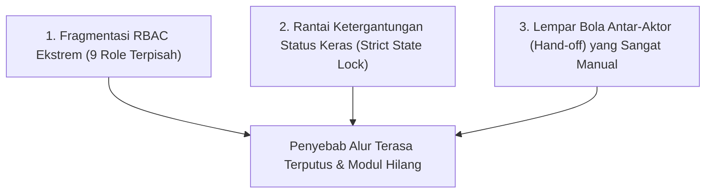
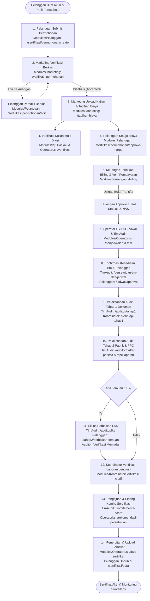
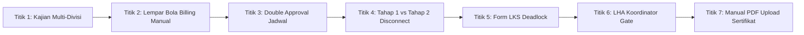

# Dokumentasi Komprehensif Alur Kerja & Modul BBKKP-SIS
## Panduan Lengkap Workflow, Pemetaan 18 Modul, dan Analisis Titik Alur Terputus

> **Dokumen Penelusuran & Analisis Sistem Informasi Sertifikasi (BBKKP-SIS)**  
> **Balai Besar Kulit, Karet, dan Plastik (BBKKP) - Kementerian Perindustrian RI**  
> **Status Dokumen**: Comprehensive Reverse Engineering Guide  
> **Tanggal Dokumen**: 14 Agustus 2026

---

## 1. Ringkasan Eksekutif: Mengapa Alur SIS Terasa "Terputus" & Modul "Hilang"?

Saat melakukan eksplorasi aplikasi **`bbkkp-sis`**, banyak pengguna/pengembang merasa bahwa **beberapa modul menghilang** atau **alurnya tiba-tiba mandek (*stuck/broken*)**. Berdasarkan penelusuran mendalam pada *source code*, controller, middleware, dan relasi database `bbkkp-sis`, hal ini terjadi karena **3 faktor utama**:

1. **Fragmentasi Role & RBAC Ekstrem (9 Peran Terpisah)**:
   - `bbkkp-sis` membagi fungsionalitasnya ke dalam 9 kelompok hak akses (*roles*) yang sangat terisolasi dengan middleware `restrict`.
   - **Jika login hanya dengan 1 akun** (misal akun Pelanggan atau Super Admin tanpa role teknis lengkap), menu-menu internal lainnya **disembunyikan secara otomatis**, sehingga tampak seperti modulnya hilang.
2. **Ketergantungan Status yang Sangat Keras (*Strict State Dependency*)**:
   - Di SIS, data pada controller berikutnya **hanya akan muncul jika kolom status di tabel permohonan sudah bernilai spesifik**.
   - *Contoh*: Modul Keuangan (`/keuangan/billing`) hanya menampilkan permohonan jika Marketing sudah melakukan `mohon_approved_status = 'accepted'`. Jika Marketing belum klik Approve, menu Keuangan akan kosong melompong.
3. **Mekanisme *Hand-off* Antar-Divisi yang Manual**:
   - SIS tidak memiliki *auto-trigger* atau notifikasi otomatis. Alur berpindah dari satu modul ke modul lain melalui aksi manual dari 9 aktor berbeda secara berurutan. Jika 1 aktor tidak menyelesaikan formnya, seluruh alur berhenti total.

---

## 2. Pemetaan Lengkap 18 Modul di `bbkkp-sis`

Berikut adalah daftar seluruh 18 modul di repositori [`bbkkp-sis/Modules`](file:///f:/!Productive/BBKKP/bbkkp-sis/Modules) beserta fungsinya dan aktor penanggung jawab:

| No | Nama Modul | Rute Prefix | Aktor Utama | Deskripsi & Tanggung Jawab Modul |
| :-: | :--- | :--- | :--- | :--- |
| **1** | **Pelanggan** | `/pelanggan` | `PELANGGAN` | Portal mandiri industri: Profil perusahaan, pendaftaran sertifikasi, konfirmasi harga, persetujuan jadwal/tim auditor, perbaikan dokumen Tahap 1, pengisian perbaikan temuan LKS Tahap 2, dan unduh invoice/sertifikat. |
| **2** | **Marketing** | `/marketing` | `MARKETING` | Verifikasi permohonan masuk, permohonan revisi/reject, penetapan/upload tagihan biaya penawaran, dan upload kajian permohonan. |
| **3** | **Keuangan** | `/keuangan` | `KEUANGAN` | Penerbitan data billing/invoice resmi, verifikasi manual bukti transfer pembayaran pelanggan, dan penetapan status lunas. |
| **4** | **KerjaSama** | `/kerjasama` | `KERJASAMA` | Penyusunan, pengunggahan draf, dan pengelolaan dokumen SPK (Surat Perjanjian Kerja Sama) sertifikasi. |
| **5** | **Pjt** | `/pjt` | `PJT` | Penanggung Jawab Teknis: Verifikasi kelayakan kajian teknis permohonan dan verifikasi pembatalan permohonan (*cancel request*). |
| **6** | **Paskal** | `/paskal` | `PASKAL` | Pasca Sertifikasi: Verifikasi kajian permohonan khusus untuk perpanjangan, perluasan lingkup, atau surveilans. |
| **7** | **OperatorLs** | `/operatorls` | `OPERATOR_LS` | Jantung operasional: Cek kelengkapan berkas, penjadwalan audit Tahap 1 & 2, penunjukan tim auditor, manajemen komite, input data sertifikat, dan agenda surveilans tahunan. |
| **8** | **KoordinatorSertifikasi** | `/koordinatorsertifikasi` | `KOORDINATOR` | Verifikasi laporan audit dokumen Tahap 1 dan verifikasi laporan lengkap audit lapangan Tahap 2 sebelum sidang komite. |
| **9** | **TimAudit** | `/timaudit` | `AUDITOR` / `KOMITE` | Persetujuan kesediaan auditor, evaluasi Audit Tahap 1, pelaksanaan Audit Tahap 2, sampling PPC, pencatatan LKS ketidaksesuaian, penyusunan LHA, serta sidang Berita Acara Komite. |
| **10** | **SiHalal** | `/sihalal` | `STAFF_HALAL` | Sub-sistem khusus layanan sertifikasi Halal (Permohonan, biaya, audit halal, invoice, dan laporan halal). |
| **11** | **Master** | `/master` | `ADMIN` | Pengelolaan data referensi: Komoditi, Standar SNI/ISO, Kode EA, Kode NACE, Badan Hukum, Jenis Perusahaan, dan Wilayah. |
| **12** | **Archive** | `/archive` | `ADMIN` | Pengarsipan berkas permohonan dan log histori pendaftaran lampau. |
| **13** | **Admin** | `/admin` | `SUPER_ADMIN` | Administrasi sistem umum. |
| **14** | **System** | `/system` | `SUPER_ADMIN` | Manajemen User, Group/Role, Menu Sistem, dan Menu Permission (`sys_group_permission`). |
| **15** | **Home** | `/home` / `/dashboard` | `ALL_STAFF` | Dashboard statistik permohonan sertifikasi per status. |
| **16** | **Auth** | `/auth` | `PUBLIC` | Login, logout, registrasi akun, lupa password. |
| **17** | **Email** | `/email` | `SYSTEM` | Template email pemberitahuan (jika mail server aktif). |
| **18** | **Public** | `/public` | `PUBLIC` | Halaman informasi publik legacy. |

---

## 3. Diagram Alur End-to-End Sertifikasi di SIS (A s.d. Z)

Berikut adalah diagram alur lengkap 14 tahapan siklus sertifikasi di `bbkkp-sis` dari permohonan awal hingga terbit sertifikat:

---

## 4. Rincian 14 Tahapan Workflow di `bbkkp-sis`

### Tahap 1: Pengajuan Permohonan oleh Pelanggan
* **Aktor**: `PELANGGAN`
* **Controller**: [`Modules/Pelanggan/Http/Controllers/SertifikasiPermohonanController.php`](file:///f:/!Productive/BBKKP/bbkkp-sis/Modules/Pelanggan/Http/Controllers/SertifikasiPermohonanController.php)
* **URL**: `/pelanggan/sertifikasi/permohonan/create`
* **Aksi**: Pelanggan mengisi formulir permohonan sertifikasi (komoditi, data pabrik, data karyawan, kuesioner kelayakan, dan dokumen persyaratan legalitas/manual mutu).
* **Status Awal**: `mohon_approved_status = 'on-progress'`, `mohon_pembayaran_status = 'proses'`.

### Tahap 2: Verifikasi Berkas Administratif oleh Tim Marketing
* **Aktor**: `MARKETING`
* **Controller**: [`Modules/Marketing/Http/Controllers/VerifikasiPermohonanController.php`](file:///f:/!Productive/BBKKP/bbkkp-sis/Modules/Marketing/Http/Controllers/VerifikasiPermohonanController.php)
* **URL**: `/marketing/verifikasi-permohonan`
* **Aksi**:
  - Jika berkas kurang: Marketing klik **Revisi** (`mohon_approved_status = 'revisi'`). Pelanggan menerima status revisi, mengedit di `/pelanggan/sertifikasi/permohonan/edit/{id}`, lalu submit ulang (`mohon_approved_status = 'fix'`).
  - Jika ditolak: Marketing klik **Reject** (`mohon_approved_status = 'rejected'`).
  - Jika disetujui: Marketing klik **Approve** (`mohon_approved_status = 'accepted'`).

### Tahap 3: Upload Kajian Permohonan & Tagihan Biaya oleh Marketing
* **Aktor**: `MARKETING`
* **Controller**: [`UploadTagihanBiayaController.php`](file:///f:/!Productive/BBKKP/bbkkp-sis/Modules/Marketing/Http/Controllers/UploadTagihanBiayaController.php) & [`UploadKajianPermohonanController.php`](file:///f:/!Productive/BBKKP/bbkkp-sis/Modules/Marketing/Http/Controllers/UploadKajianPermohonanController.php)
* **URL**: `/marketing/tagihan-biaya` dan `/marketing/kajian-permohonan`
* **Aksi**: Marketing mengunggah dokumen rincian estimasi biaya penawaran sertifikasi dan file kajian kelayakan awal.

### Tahap 4: Verifikasi Kajian Multi-Divisi (PJT / Paskal / Operator LS)
* **Aktor**: `PJT`, `PASKAL`, `OPERATOR_LS`
* **Controller**: [`Modules/Pjt/Http/Controllers/VerifKajianPermohonanController.php`](file:///f:/!Productive/BBKKP/bbkkp-sis/Modules/Pjt/Http/Controllers/VerifKajianPermohonanController.php)
* **URL**: `/pjt/verifikasi`, `/paskal/verifikasi`, `/operatorls/kajian-permohonan`
* **Aksi**: Masing-masing bagian teknis me-review dokumen kajian permohonan dari sudut pandang teknis, lingkup akreditasi, dan kesiapan laboratorium.

### Tahap 5: Persetujuan Penawaran Biaya oleh Pelanggan
* **Aktor**: `PELANGGAN`
* **Controller**: [`SertifikasiPermohonanController.php`](file:///f:/!Productive/BBKKP/bbkkp-sis/Modules/Pelanggan/Http/Controllers/SertifikasiPermohonanController.php)
* **URL Action**: `/pelanggan/sertifikasi/permohonan/approve-harga`
* **Aksi**: Pelanggan login, melihat file rincian estimasi tarif dari Marketing, lalu mengeklik tombol **Setujui Penawaran Biaya**.

### Tahap 6: Penerbitan Billing & Verifikasi Pembayaran oleh Keuangan
* **Aktor**: `KEUANGAN` & `PELANGGAN`
* **Controller**: [`Modules/Keuangan/Http/Controllers/BillingController.php`](file:///f:/!Productive/BBKKP/bbkkp-sis/Modules/Keuangan/Http/Controllers/BillingController.php) & [`Modules/Pelanggan/Http/Controllers/BillingController.php`](file:///f:/!Productive/BBKKP/bbkkp-sis/Modules/Pelanggan/Http/Controllers/BillingController.php)
* **URL**: `/keuangan/billing` dan `/pelanggan/billing`
* **Aksi**:
  1. Keuangan membuat data billing (nomor invoice, nominal, tanggal jatuh tempo).
  2. Pelanggan membuka menu `/pelanggan/billing`, mengunduh invoice, melakukan transfer bank, dan mengunggah bukti transfer (*receipt slip*).
  3. Keuangan memeriksa bukti transfer dan mengubah status pembayaran menjadi `mohon_pembayaran_status = 'lunas'`.

### Tahap 7: Penyiapan Kelengkapan & Penjadwalan Audit (Operator LS)
* **Aktor**: `OPERATOR_LS`
* **Controller**: [`KelengkapanPermohonanController.php`](file:///f:/!Productive/BBKKP/bbkkp-sis/Modules/OperatorLs/Http/Controllers/KelengkapanPermohonanController.php), [`PenjadwalanTahap1Controller.php`](file:///f:/!Productive/BBKKP/bbkkp-sis/Modules/OperatorLs/Http/Controllers/PenjadwalanTahap1Controller.php), [`PenjadwalanController.php`](file:///f:/!Productive/BBKKP/bbkkp-sis/Modules/OperatorLs/Http/Controllers/PenjadwalanController.php), [`TimController.php`](file:///f:/!Productive/BBKKP/bbkkp-sis/Modules/OperatorLs/Http/Controllers/TimController.php)
* **URL**: `/operatorls/kelengkapan-permohonan`, `/operatorls/penjadwalan-tahap1`, `/operatorls/penjadwalan`, `/operatorls/tim`
* **Aksi**: Operator LS memverifikasi kelengkapan berkas lunas, membuat draft jadwal audit Tahap 1 & Tahap 2, serta menunjuk Lead Auditor dan Auditor Anggota.

### Tahap 8: Konfirmasi Kesediaan Tim Audit & Persetujuan Pelanggan
* **Aktor**: `TIM_AUDIT` & `PELANGGAN`
* **Controller**: [`PersetujuanTimAuditController.php`](file:///f:/!Productive/BBKKP/bbkkp-sis/Modules/TimAudit/Http/Controllers/PersetujuanTimAuditController.php) & [`Tahap2JadwalController.php`](file:///f:/!Productive/BBKKP/bbkkp-sis/Modules/Pelanggan/Http/Controllers/Tahap2JadwalController.php)
* **URL**: `/timaudit/persetujuan-tim-dan-jadwal/auditor` dan `/pelanggan/jadwal`
* **Aksi**:
  1. Auditor mengonfirmasi kesediaan tugas audit.
  2. Pelanggan menyetujui tanggal pelaksanaan audit (`approve/tanggal`) dan menyetujui susunan tim auditor (`approve/tim`) untuk mencegah konflik kepentingan.

### Tahap 9: Pelaksanaan Audit Tahap 1 (Audit Kecukupan Dokumen)
* **Aktor**: `TIM_AUDIT`, `KOORDINATOR`, `PELANGGAN`
* **Controller**: [`AuTahap1Controller.php`](file:///f:/!Productive/BBKKP/bbkkp-sis/Modules/TimAudit/Http/Controllers/AuTahap1Controller.php), [`AuTahap1LapController.php`](file:///f:/!Productive/BBKKP/bbkkp-sis/Modules/TimAudit/Http/Controllers/AuTahap1LapController.php), [`VerifLapTahap1Controller.php`](file:///f:/!Productive/BBKKP/bbkkp-sis/Modules/KoordinatorSertifikasi/Http/Controllers/VerifLapTahap1Controller.php)
* **URL**: `/timaudit/auditor/tahap1`, `/koordinatorsertifikasi/verif-lap-tahap1`, `/pelanggan/tahap1/persetujuan-temuan`
* **Aksi**:
  1. Auditor mengevaluasi klausul dokumen mutu pemohon.
  2. Auditor membuat Laporan Audit Tahap 1.
  3. Koordinator Sertifikasi memverifikasi laporan Tahap 1. Jika ada ketidaksesuaian dokumen, Pelanggan mengunggah perbaikan di `/pelanggan/tahap1/perbaikan-temuan`.

### Tahap 10: Pelaksanaan Audit Tahap 2 Lapangan & Sampling PPC
* **Aktor**: `TIM_AUDIT`
* **Controller**: [`AuDaftarPeriksaController.php`](file:///f:/!Productive/BBKKP/bbkkp-sis/Modules/TimAudit/Http/Controllers/AuDaftarPeriksaController.php), [`PpcLaporanController.php`](file:///f:/!Productive/BBKKP/bbkkp-sis/Modules/TimAudit/Http/Controllers/PpcLaporanController.php), [`AuLapRingkasController.php`](file:///f:/!Productive/BBKKP/bbkkp-sis/Modules/TimAudit/Http/Controllers/AuLapRingkasController.php)
* **URL**: `/timaudit/auditor/daftar-periksa`, `/timaudit/ppc/laporan`, `/timaudit/auditor/daftar-hadir`
* **Aksi**: Tim auditor turun ke lokasi pabrik, mengisi lembar periksa kesesuaian lapangan, melakukan sampling Pengambilan Contoh (PPC), mengunggah daftar hadir, dan mencatat notulen rapat penutupan.

### Tahap 11: Pengelolaan Temuan Ketidaksesuaian (LKS) & Tindakan Koreksi
* **Aktor**: `TIM_AUDIT` & `PELANGGAN`
* **Controller**: [`AuLksController.php`](file:///f:/!Productive/BBKKP/bbkkp-sis/Modules/TimAudit/Http/Controllers/AuLksController.php) & [`Tahap2PerbaikanController.php`](file:///f:/!Productive/BBKKP/bbkkp-sis/Modules/Pelanggan/Http/Controllers/Tahap2PerbaikanController.php)
* **URL**: `/timaudit/auditor/lks` dan `/pelanggan/tahap2/perbaikan-temuan`
* **Aksi**:
  1. Auditor mencatat temuan LKS (*Kritis, Mayor, Minor, Observasi*) dengan batas waktu perbaikan.
  2. Pelanggan membuka `/pelanggan/tahap2/perbaikan-temuan/temuan-lks/{jadwal_id}`, menginput analisis penyebab masalah, rencana koreksi, mengunggah bukti foto/dokumen perbaikan, lalu menekan **Send to Auditor**.
  3. Auditor memverifikasi bukti perbaikan (`/timaudit/auditor/lks/temuan/{id}/verifikasi`) dan mengubah status menjadi **Memadai (Closed)**.

### Tahap 12: Verifikasi Laporan Lengkap oleh Koordinator Sertifikasi
* **Aktor**: `TIM_AUDIT` & `KOORDINATOR`
* **Controller**: [`AuLapLengkapController.php`](file:///f:/!Productive/BBKKP/bbkkp-sis/Modules/TimAudit/Http/Controllers/AuLapLengkapController.php) & [`VerifLapLengkapController.php`](file:///f:/!Productive/BBKKP/bbkkp-sis/Modules/KoordinatorSertifikasi/Http/Controllers/VerifLapLengkapController.php)
* **URL**: `/timaudit/auditor/laporan-lengkap` dan `/koordinatorsertifikasi/verif`
* **Aksi**: Lead Auditor menyusun Laporan Hasil Audit (LHA) lengkap. Koordinator Sertifikasi memeriksa dan memberikan tanda persetujuan verifikasi.

### Tahap 13: Sidang Komite Sertifikasi & Rekomendasi
* **Aktor**: `TIM_AUDIT (KOMITE)` & `OPERATOR_LS`
* **Controller**: [`KomiteBeritaAcaraController.php`](file:///f:/!Productive/BBKKP/bbkkp-sis/Modules/TimAudit/Http/Controllers/KomiteBeritaAcaraController.php), [`KomiteLembarPeriksaController.php`](file:///f:/!Productive/BBKKP/bbkkp-sis/Modules/TimAudit/Http/Controllers/KomiteLembarPeriksaController.php), [`RekomPersetujuanController.php`](file:///f:/!Productive/BBKKP/bbkkp-sis/Modules/OperatorLs/Http/Controllers/RekomPersetujuanController.php)
* **URL**: `/timaudit/komite/berita-acara`, `/timaudit/komite/lembar-periksa`, `/operatorls/rekomendasi-persetujuan`
* **Aksi**: Tim Komite Sertifikasi bersidang, mengisi lembar telaah independen, dan menerbitkan Berita Acara Rekomendasi (Disetujui/Ditolak).

### Tahap 14: Penerbitan Sertifikat & Pemantauan Pasca Sertifikasi
* **Aktor**: `OPERATOR_LS` & `PELANGGAN`
* **Controller**: [`DataSertifikatController.php`](file:///f:/!Productive/BBKKP/bbkkp-sis/Modules/OperatorLs/Http/Controllers/DataSertifikatController.php) & [`SertifikasiDataController.php`](file:///f:/!Productive/BBKKP/bbkkp-sis/Modules/Pelanggan/Http/Controllers/SertifikasiDataController.php)
* **URL**: `/operatorls/data-sertifikat` dan `/pelanggan/sertifikasi/data`
* **Aksi**: Operator LS menginputkan nomor sertifikat, tanggal masa berlaku, mencetak draft sertifikat fisik, lalu mengunggah file PDF sertifikat yang sudah ditandatangani. Pelanggan dapat mengunduh sertifikat aktif dari akunnya.

---

## 5. Analisis 7 Titik Rawan Alur Terputus (*Bottlenecks & Disconnections*)

Berikut adalah temuan titik-titik krusial tempat di mana alur `bbkkp-sis` sering terputus:

1. **Titik 1: Kajian Permohonan Multi-Divisi (Marketing $\rightarrow$ PJT $\rightarrow$ Paskal $\rightarrow$ Operator LS)**
   - *Masalah*: Ada 3 divisi yang memiliki menu verifikasi kajian (`/pjt`, `/paskal`, `/operatorls`). Tidak ada indikator urutan siapa yang harus melakukan approve terlebih dahulu.
2. **Titik 2: Rantai Billing & Persetujuan Biaya Manual**
   - *Masalah*: Marketing upload tagihan $\rightarrow$ Pelanggan klik setuju biaya $\rightarrow$ Keuangan buat invoice $\rightarrow$ Pelanggan transfer & upload bukti $\rightarrow$ Keuangan konfirmasi lunas. Rantai ini memerlukan 5 interaksi manual bolak-balik.
3. **Titik 3: Persetujuan Tim & Jadwal oleh Pelanggan**
   - *Masalah*: Di SIS, jika Operator LS sudah membuat jadwal, proses audit **tidak dapat dimulai** sebelum pelanggan membuka rute `/pelanggan/jadwal/approve/tanggal` dan `/pelanggan/jadwal/approve/tim`.
4. **Titik 4: Pemisahan Data Audit Tahap 1 vs Tahap 2**
   - *Masalah*: Audit Tahap 1 dan Tahap 2 memiliki controller dan tabel terpisah (`sis_audit_tahap1` vs `sis_jadwal_audit`).
5. **Titik 5: Pengiriman Bukti LKS (*Send-to-Auditor Lock*)**
   - *Masalah*: Pelanggan harus mengisi teks perbaikan dan mengunggah file bukti perbaikan di setiap item LKS sebelum tombol `send-to-auditor` dapat berfungsi.
6. **Titik 6: Verifikasi Berjenjang LHA Koordinator**
   - *Masalah*: Lead Auditor tidak bisa mengajukan permohonan ke Sidang Komite (`/timaudit/auditor/pengajuan-komite`) jika Koordinator Sertifikasi belum menekan tombol verifikasi di `/koordinatorsertifikasi/verif`.
7. **Titik 7: Upload Sertifikat Manual oleh Operator LS**
   - *Masalah*: Sertifikat di SIS tidak terhubung dengan TTE otomatis. Operator LS harus mencetak, meminta tanda tangan basah Kepala Balai, men-scan manual, lalu mengunggah file PDF.

---

## 6. Bagaimana Integrasi BBKKP Polimer Menyelesaikan Masalah Ini?

Dalam proyek integrasi ke **BBKKP Polimer**, seluruh titik putus di atas disederhanakan dan diotomatisasi secara fundamental:

| Kondisi di Legacy `bbkkp-sis` (Terputus & Rumit) | Solusi Baru di `bbkkp-polimer` (Unified Super App) |
| :--- | :--- |
| **9 Role terpisah** dengan menu terpotong-potong | **Single Unified Dashboard** dengan *Dynamic Role Switcher* dan *Clear Progress Tracker*. |
| **Billing 5 tahap manual** (Marketing $\rightarrow$ Pelanggan $\rightarrow$ Keuangan $\rightarrow$ Bukti Manual) | **Otomatisasi Penuh**: Marketing Approve $\rightarrow$ Repo Services terbitkan **Invoice TTE + BNI VA** $\rightarrow$ Callback Bank otomatis ubah status **LUNAS** & terbitkan **Kwitansi TTE**. |
| **Persetujuan jadwal manual ganda** tanpa notifikasi | **Real-time Notifications** (In-app notification & WhatsApp Alert) langsung dengan aksi *1-click approval*. |
| **Upload scan sertifikat manual** | **Otomatisasi TTE Kepala Balai** via Repo Services (BSrE QR Code) yang langsung terbit ke portal pelanggan. |
| **Data silo & redirect membingungkan** | **100% Native di Polimer** tanpa redirect keluar ke domain/port legacy. |
