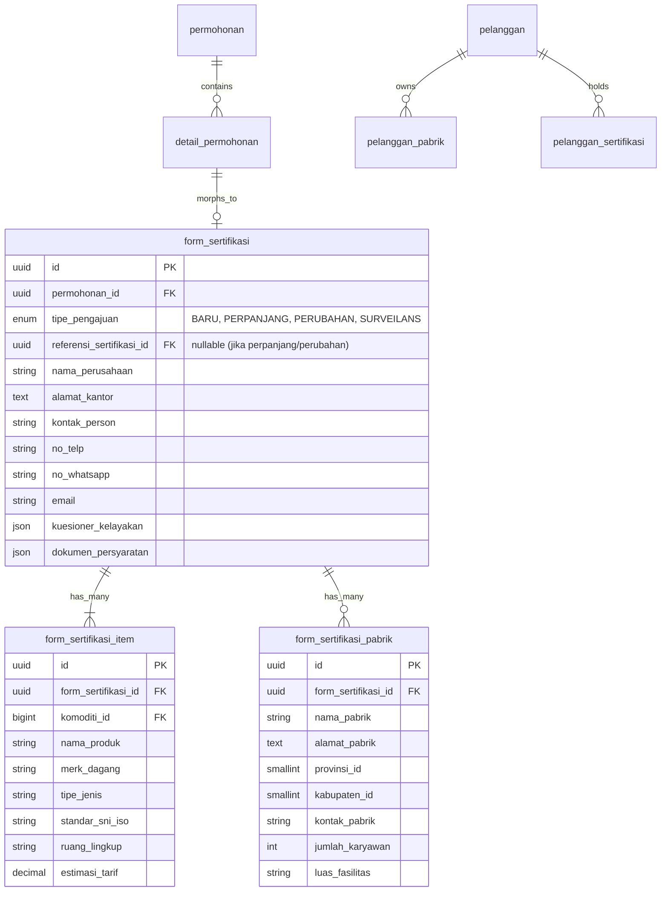

# Sprint 1 Breakdown: Database Alignment, Master Data & Migration Engine
## Integrasi BBKKP-SIS ke Dalam BBKKP Polimer

> **Sprint**: 1 of 4  
> **Durasi**: 2 Minggu (10 Hari Kerja)  
> **Fokus Utama**: Penyelarasan Skema Database, Import Master Data Sertifikasi, Two-Way User Sync, dan Engine Migrasi ETL Data Historis.  
> **Tanggal**: 14 Agustus 2026

---

## 1. Sasaran & Tujuan Sprint (Sprint Goals)
1. Menyiapkan skema database di `bbkkp_polimer` (`Db2`) untuk menampung entitas permohonan sertifikasi multi-item, komoditi/produk, dan profil lokasi pabrik.
2. Mengimpor dan menstandarkan seluruh master data sertifikasi (Komoditi, Standar SNI/ISO, Kode EA/NACE, dan Tarif PNBP).
3. Mengembangkan dan menguji script migrasi data ETL (*Extract, Transform, Load*) untuk memindahkan seluruh data pelanggan, perusahaan, pabrik, sertifikat aktif, dan riwayat permohonan dari `bbkkp_sis` ke `bbkkp_polimer`.

---

## 2. User Stories & Acceptance Criteria

### User Story 1: Skema Data Permohonan Multi-Item & Pabrik (Backend & DB)
* **Sebagai**: Pengembang Sistem (*Developer*)
* **Saya ingin**: Memiliki skema database yang mendukung pengajuan sertifikasi multi-item dan relasi multi-pabrik.
* **Agar**: Sistem Polimer dapat menyimpan dan memproses transaksi sertifikasi secara fleksibel tanpa batasan 1-permohonan 1-produk.

#### Kriteria Keberterimaan (Acceptance Criteria):
- [ ] Tabel `form_sertifikasi`, `form_sertifikasi_item`, dan `form_sertifikasi_pabrik` dibuat di database `Db2` dengan relasi yang tepat ke tabel `permohonan` dan `detail_permohonan`.
- [ ] Model Eloquent (`FormSertifikasi`, `FormSertifikasiItem`, `FormSertifikasiPabrik`) mendukung relasi polymorphic (`morphOne` / `morphMany`) sesuai standar Polimer.
- [ ] Foreign key dan index ditambahkan untuk kolom pencarian utama (`permohonan_id`, `komoditi_id`, `standar_id`, `pelanggan_id`).

### User Story 2: Import & Seeding Master Data Sertifikasi
* **Sebagai**: Tim Administrasi & Marketing
* **Saya ingin**: Master data komoditi, standar SNI/ISO, dan tarif PNBP tersedia lengkap di Polimer.
* **Agar**: Pelanggan dapat memilih lingkup sertifikasi yang valid dan tim marketing dapat menetapkan tarif secara akurat.

#### Kriteria Keberterimaan (Acceptance Criteria):
- [ ] Seeder `SertifikasiMasterSeeder.php` berhasil mengimpor data komoditi dan standar dari database `bbkkp_sis`.
- [ ] Master tarif PNBP tersinkronisasi dengan master jenis layanan dan lingkup layanan di Polimer.

### User Story 3: Engine ETL Migrasi Data Historis & Sertifikat Aktif
* **Sebagai**: Petugas Sertifikasi & Auditor
* **Saya ingin**: Data sertifikat aktif dan riwayat permohonan dari `bbkkp-sis` termigrasi ke Polimer.
* **Agar**: Pelanggan lama dapat langsung melihat sertifikat aktif mereka dan mengajukan perpanjangan/surveilans tanpa kehilangan riwayat masa lalu.

#### Kriteria Keberterimaan (Acceptance Criteria):
- [ ] Command Artisan `php artisan integration:migrate-sis-history` berjalan secara idempoten (bisa dijalankan ulang tanpa membuat duplikasi data).
- [ ] Seluruh sertifikat aktif (`status = on_going`) termigrasi ke tabel `pelanggan_sertifikasi` lengkap dengan nomor sertifikat, tanggal terbit, masa berlaku, dan tautan file PDF lama.
- [ ] Profil pabrik pelanggan lama termigrasi ke tabel `pelanggan_pabrik`.

---

## 3. Spesifikasi Teknis & Desain Database

### 3.1 Skema Tabel Baru & Modifikasi



### 3.2 Detail Migration File (`database/migrations`)
1. `2026_08_17_000001_create_form_sertifikasi_table.php`:
   - Membuat tabel induk form sertifikasi dengan kolom metadata pemohon, jenis pengajuan, dan JSON dokumen lampiran.
2. `2026_08_17_000002_create_form_sertifikasi_item_table.php`:
   - Membuat tabel rincian komoditi/produk sertifikasi yang diajukan.
3. `2026_08_17_000003_create_form_sertifikasi_pabrik_table.php`:
   - Membuat tabel relasi data fasilitas pabrik tempat produksi komoditi.
4. `2026_08_17_000004_create_pelanggan_sertifikasi_table.php`:
   - Menyimpan database sertifikat aktif milik pelanggan yang diterbitkan atau hasil migrasi dari SIS.

---

## 4. Breakdown Pekerjaan & Task List

| Task ID | Nama Task | Deskripsi Detail | Bobot (SP) | Penanggung Jawab | Status |
| :--- | :--- | :--- | :-: | :--- | :-: |
| **TS1-01.1** | Schema Migration | Buat migration file untuk tabel `form_sertifikasi`, `form_sertifikasi_item`, dan `form_sertifikasi_pabrik`. | 3 | Backend Dev | To Do |
| **TS1-01.2** | Schema Migration | Buat migration file untuk tabel `pelanggan_sertifikasi` dan `pelanggan_pabrik`. | 2 | Backend Dev | To Do |
| **TS1-02.1** | Master Seeder | Buat seeder `SertifikasiMasterSeeder.php` untuk master komoditi, SNI, dan klausul audit dari DB SIS. | 3 | Backend Dev | To Do |
| **TS1-03.1** | Sync Engine | Refactor command `integration:sync-user-sis` untuk sinkronisasi identitas akun dan mapping UUID Polimer ke ID SIS. | 5 | Backend Dev | To Do |
| **TS1-04.1** | ETL Historis | Kembangkan command `integration:migrate-sis-history` untuk migrasi batch sertifikat aktif dan riwayat permohonan. | 5 | Data/Backend Dev | To Do |
| **TS1-04.2** | Data Sanitizer | Validasi kebersihan data (sanitasi tanggal kedaluwarsa, formatting nomor SNI, path file sertifikat lama). | 3 | Data/Backend Dev | To Do |
| **TS1-05.1** | Eloquent Models | Implementasikan model `FormSertifikasi`, `FormSertifikasiItem`, `FormSertifikasiPabrik`, `PelangganSertifikasi` dengan casts dan relasi. | 5 | Backend Dev | To Do |
| **TS1-05.2** | Unit Testing | Tulis PHPUnit test untuk validasi integritas model, relasi polymorphic, dan fungsi ETL command. | 3 | QA / Backend Dev | To Do |

---

## 5. Rencana Pengujian (Test Scenarios)

### 5.1 Automated Tests (PHPUnit)
```bash
# Menjalankan test migrasi dan model sertifikasi
php artisan test --filter=SertifikasiModelTest
# Menjalankan test command migrasi SIS ETL
php artisan test --filter=MigrateSisHistoryTest
```

### 5.2 Skenario Pengujian Manual (QA Checklist):
1. **Verifikasi Fresh Migration**: Jalankan `php artisan migrate:fresh --seed` di local staging dan pastikan seluruh tabel sertifikasi terbuat tanpa constraint error.
2. **Uji Coba ETL Command**:
   - Jalankan `php artisan integration:migrate-sis-history --dry-run` -> pastikan ringkasan data yang akan dimigrasikan tampil akurat.
   - Jalankan `php artisan integration:migrate-sis-history` -> verifikasi row count antara tabel `sis_pelanggan_sertifikasi` di SIS dan `pelanggan_sertifikasi` di Polimer.
3. **Uji Idempotensi**: Jalankan command migrasi untuk kedua kalinya dan pastikan tidak terjadi duplikasi entitas.

---

## 6. Definition of Done (DoD) Sprint 1
* [x] Seluruh migration dan seeders berhasil dijalankan di database `bbkkp_polimer`.
* [x] Command migrasi ETL data historis SIS teruji dengan akurasi 100% pada data sertifikat aktif.
* [x] Seluruh unit tests untuk skema DB dan model baru berstatus **PASS**.
