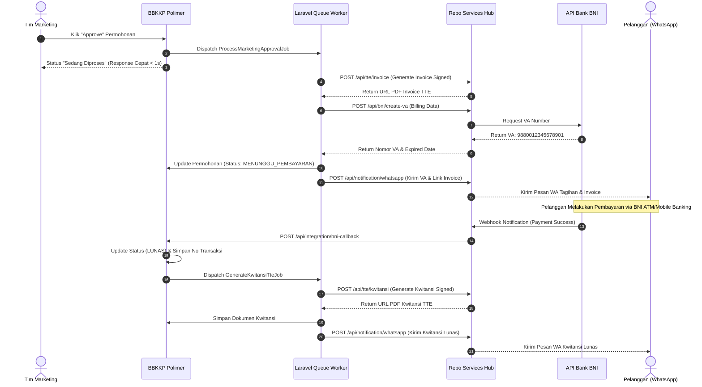

# Sprint 3 Breakdown: Repo Services Integration (TTE Invoice, BNI VA, & Kwitansi)
## Integrasi BBKKP-SIS ke Dalam BBKKP Polimer

> **Sprint**: 3 of 4  
> **Durasi**: 2 Minggu (10 Hari Kerja)  
> **Fokus Utama**: Integrasi HTTP REST Client ke Repo Services Container, Asynchronous Queue Worker untuk Invoice TTE & BNI VA, Idempotent Payment Callback Webhook, Kwitansi TTE Otomatis, dan Notifikasi WhatsApp.  
> **Tanggal**: 14 Agustus 2026

---

## 1. Sasaran & Tujuan Sprint (Sprint Goals)
1. Membangun lapisan layanan `RepoServicesClient.php` yang menghubungkan Polimer dengan Repo Services Hub untuk seluruh urusan TTE (BSrE), BNI Virtual Account, dan WhatsApp Gateway.
2. Mengimplementasikan antrean asynchronous (`ProcessMarketingApprovalJob`) saat Marketing meng-approve permohonan untuk menerbitkan Invoice PDF ber-TTE dan nomor BNI VA tanpa memblokir request pengguna.
3. Membangun endpoint callback webhook BNI VA (`POST /api/integration/bni-callback`) dengan proteksi signature dan penanganan idempoten.
4. Mengotomatisasi penerbitan Kwitansi ber-TTE via job `GenerateKwitansiTteJob` setelah pelunasan terkonfirmasi.
5. Mengirimkan notifikasi WhatsApp otomatis kepada pelanggan saat Invoice/VA terbit dan saat Kwitansi diterbitkan.

---

## 2. User Stories & Acceptance Criteria

### User Story 1: Layanan REST Client Terpusat (RepoServicesClient)
* **Sebagai**: Pengembang Sistem (*Developer*)
* **Saya ingin**: Memiliki modul HTTP Client yang terstandarisasi untuk berkomunikasi dengan Repo Services.
* **Agar**: Seluruh modul di Polimer dapat memanggil fungsi TTE, BNI VA, dan WhatsApp dengan mudah dan aman.

#### Kriteria Keberterimaan (Acceptance Criteria):
- [ ] Dibuat kelas `App\Services\RepoServicesClient.php` yang menangani autentikasi header API Key, timeouts, logging, dan retry.
- [ ] Memiliki method utama:
  - `generateInvoiceTte(array $invoiceData): array`
  - `createBniVirtualAccount(array $vaData): array`
  - `generateKwitansiTte(array $kwitansiData): array`
  - `sendWhatsappNotification(string $phone, string $message, ?string $fileUrl = null): bool`

### User Story 2: Otomatisasi Invoice TTE & BNI VA Asynchronous
* **Sebagai**: Tim Marketing & Pelanggan
* **Saya ingin**: Saat permohonan disetujui Marketing, dokumen Invoice TTE dan Nomor BNI VA terbit secara otomatis di background.
* **Agar**: Tim Marketing tidak perlu menunggu proses pembuatan TTE secara manual dan pelanggan langsung menerima rincian tagihan.

#### Kriteria Keberterimaan (Acceptance Criteria):
- [ ] Aksi *Approve* Marketing men-dispatch `ProcessMarketingApprovalJob` ke antrean worker.
- [ ] Job menghasilkan dokumen Invoice ber-TTE resmi dan nomor BNI VA yang valid.
- [ ] Nomor VA dan URL file Invoice disimpan ke tabel `permohonan` / `detail_pembayaran`.
- [ ] Status permohonan diperbarui menjadi `INVOICE_GENERATED` / `MENUNGGU_PEMBAYARAN`.
- [ ] Pelanggan menerima pesan WhatsApp berisi nomor VA, nominal tagihan, dan tautan PDF Invoice.

### User Story 3: Webhook Callback Pembayaran BNI & Kwitansi TTE
* **Sebagai**: Bendahara / Petugas Keuangan & Pelanggan
* **Saya ingin**: Sistem mendeteksi pembayaran dari Bank BNI secara *real-time* dan otomatis menerbitkan Kwitansi ber-TTE.
* **Agar**: Pelanggan tidak perlu mengunggah bukti transfer manual dan status permohonan langsung berlanjut ke tahap teknis.

#### Kriteria Keberterimaan (Acceptance Criteria):
- [ ] Endpoint `POST /api/integration/bni-callback` memvalidasi signature HMAC / token API.
- [ ] Penerapan mekanisme *Idempotency*: Jika webhook terpanggil berulang kali untuk transaksi yang sama, sistem tidak membuat kwitansi ganda.
- [ ] Status permohonan diupdate menjadi `LUNAS` (`SIAP_PROSES_TEKNIS`).
- [ ] Job `GenerateKwitansiTteJob` dieksekusi untuk menghasilkan PDF Kwitansi ber-TTE.
- [ ] Pelanggan menerima notifikasi WhatsApp beserta tautan PDF Kwitansi Lunas.

---

## 3. Spesifikasi Teknis & Alur Sequence Integrasi



---

## 4. Breakdown Pekerjaan & Task List

| Task ID | Nama Task | Deskripsi Detail | Bobot (SP) | Penanggung Jawab | Status |
| :--- | :--- | :--- | :-: | :--- | :-: |
| **TS3-01.1** | RepoServices Client | Implementasi kelas `App\Services\RepoServicesClient.php` dengan HTTP Guzzle client, timeout handling, dan logging. | 5 | Backend Dev | To Do |
| **TS3-02.1** | Job Queue Invoice | Buat job `ProcessMarketingApprovalJob.php` untuk memicu TTE Invoice dan pembuatan VA BNI via Repo Services. | 5 | Backend Dev | To Do |
| **TS3-02.2** | Retry Strategy | Konfigurasikan auto-retry (3x) dengan exponential backoff dan fallback alerting ke Sentry/Log saat terjadi kegagalan service. | 3 | Backend Dev | To Do |
| **TS3-03.1** | Callback Controller | Buat `BniCallbackController.php` di Modul `Integration` dengan signature verification dan idempotency locking (Redis/DB lock). | 5 | Backend Dev | To Do |
| **TS3-03.2** | Manual Re-check UI | Tambahkan tombol **Cek Status Pembayaran VA** di panel Bendahara (`/permohonan/keuangan`) untuk rekonsiliasi manual. | 3 | Fullstack Dev | To Do |
| **TS3-04.1** | Job Queue Kwitansi | Buat job `GenerateKwitansiTteJob.php` untuk memicu pembuatan Kwitansi PDF ber-TTE setelah payment status valid. | 5 | Backend Dev | To Do |
| **TS3-05.1** | WA Notification | Hubungkan handler pesan WhatsApp untuk templating notifikasi Invoice dan Kwitansi ber-TTE. | 3 | Backend Dev | To Do |
| **TS3-05.2** | Integration Testing | Buat skenario pengujian Mock Repo Services API dan simulasi end-to-end payment callback. | 5 | QA Dev | To Do |

---

## 5. Rencana Pengujian (Test Scenarios)

### 5.1 Automated Tests (Integration & Queue Tests)
```bash
# Menjalankan test integrasi client dan queue worker
php artisan test --filter=RepoServicesClientTest
# Menjalankan test idempotent webhook callback
php artisan test --filter=BniCallbackWebhookTest
```

### 5.2 Skenario Pengujian Manual (QA Checklist):
1. **Uji Approval Asynchronous**:
   - Marketing klik *Approve* pada permohonan.
   - Periksa tabel `sys_jobs` atau pantau worker: pastikan job `ProcessMarketingApprovalJob` berhasil diproses.
   - Verifikasi URL Invoice TTE dan Nomor BNI VA terisi di database dan dapat diunduh di portal pelanggan.
2. **Uji Webhook Pembayaran**:
   - Kirimkan mock HTTP POST ke `/api/integration/bni-callback` dengan signature yang valid.
   - Pastikan status permohonan berubah dari `MENUNGGU_PEMBAYARAN` menjadi `LUNAS`.
   - Pastikan job `GenerateKwitansiTteJob` terpicu dan URL Kwitansi TTE tersimpan.
3. **Uji Idempotensi**:
   - Kirimkan request webhook yang sama sebanyak 3 kali berturut-turut.
   - Pastikan status tetap konsisten dan Kwitansi hanya dibuat 1 kali (tidak ada duplikasi record).

---

## 6. Definition of Done (DoD) Sprint 3
* [x] `RepoServicesClient` terpasang dan berfungsi penuh menghubungkan Polimer dengan Repo Services Hub.
* [x] Alur *Approve Marketing -> Invoice TTE + BNI VA* berjalan otomatis secara asynchronous.
* [x] Webhook Callback BNI VA memproses pelunasan secara *real-time* dan idempoten.
* [x] Kwitansi ber-TTE dan notifikasi WhatsApp terkirim secara otomatis kepada pelanggan.
* [x] Seluruh integration tests lulus pengujian.
