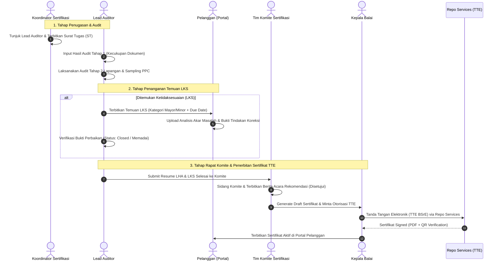

# Sprint 4 Breakdown: 2-Stage Audit, LKS Management, Committee, Certificate TTE & Cutover
## Integrasi BBKKP-SIS ke Dalam BBKKP Polimer

> **Sprint**: 4 of 4  
> **Durasi**: 2 Minggu (10 Hari Kerja)  
> **Fokus Utama**: Workflow Teknis Sertifikasi Internal (Penjadwalan Auditor, Audit Tahap 1 Dokumen, Audit Tahap 2 Pabrik/PPC), Alur Interaktif LKS (Tindakan Koreksi), Rapat Komite Sertifikasi, Penerbitan Sertifikat Ber-TTE, Scheduler Surveilans, dan Penghentian Redirect Legacy `bbkkp-sis`.  
> **Tanggal**: 14 Agustus 2026

---

## 1. Sasaran & Tujuan Sprint (Sprint Goals)
1. Memindahkan seluruh alur kerja teknis sertifikasi dari `bbkkp-sis` ke dalam Polimer: Penjadwalan Audit, Penunjukan Tim Auditor, dan Penerbitan Surat Tugas.
2. Membangun modul evaluasi **Audit Tahap 1 (Kecukupan Dokumen)** dan **Audit Tahap 2 (Kesesuaian Lapangan/Pabrik & PPC)**.
3. Membangun modul interaktif **LKS (Laporan Ketidaksesuaian)** untuk pencatatan temuan oleh Auditor, pengunggahan bukti perbaikan oleh Pelanggan, dan verifikasi tindakan koreksi oleh Lead Auditor.
4. Membangun sub-modul **Rapat Komite Sertifikasi** dan otomatisasi **Penerbitan Sertifikat ber-TTE** Kepala Balai via Repo Services.
5. Membangun engine monitoring siklus hidup sertifikat (Surveilans Tahun 1 & 2 serta Resertifikasi).
6. Menghentikan seluruh pengalihan (*redirect*) ke aplikasi legacy `bbkkp-sis` dan melakukan *Production Cutover*.

---

## 2. User Stories & Acceptance Criteria

### User Story 1: Penjadwalan Audit & Penugasan Tim Auditor
* **Sebagai**: Koordinator Sertifikasi
* **Saya ingin**: Melihat permohonan yang berstatus `LUNAS`, menentukan tanggal audit, dan menunjuk Lead Auditor beserta Anggota Tim Audit.
* **Agar**: Proses audit lapangan dapat terorganisir dengan jelas dan Surat Tugas (ST) dapat diterbitkan secara resmi.

#### Kriteria Keberterimaan (Acceptance Criteria):
- [ ] Tersedia menu `/permohonan/teknis/penjadwalan` untuk permohonan berstatus `LUNAS`.
- [ ] Koordinator dapat memilih Lead Auditor dan anggota tim dari daftar pegawai teknis BBKKP.
- [ ] Sistem mengenerate dokumen Surat Tugas (ST) Tim Audit.
- [ ] Lead Auditor menerima notifikasi penugasan audit baru di dashboard internal.

### User Story 2: Audit Tahap 1, Tahap 2, dan Pengambilan Contoh (PPC)
* **Sebagai**: Lead Auditor / Auditor
* **Saya ingin**: Mengisi lembar evaluasi Audit Tahap 1 (Kecukupan Dokumen) dan lembar verifikasi Audit Tahap 2 (Pabrik & PPC).
* **Agar**: Seluruh rekaman evaluasi kesesuaian standar (SNI/ISO) tercatat secara digital di Polimer.

#### Kriteria Keberterimaan (Acceptance Criteria):
- [ ] Form checklist evaluasi klausul Audit Tahap 1 (Status: *Lanjut Tahap 2* atau *Perlu Perbaikan Dokumen*).
- [ ] Form agenda Audit Tahap 2 Lapangan/Pabrik dengan rincian sampling PPC (Pengambilan Contoh Produk).
- [ ] Fitur upload dokumen Berita Acara Audit Lapangan dan Laporan Hasil Audit (LHA).

### User Story 3: Alur Interaktif LKS (Laporan Ketidaksesuaian & Koreksi)
* **Sebagai**: Auditor dan Pelanggan
* **Saya ingin**: Mencatat temuan ketidaksesuaian (Auditor) dan mengunggah bukti tindakan perbaikan (Pelanggan) secara interaktif di sistem.
* **Agar**: Siklus perbaikan temuan audit transparan, terpantau batas waktunya (*due date*), dan terverifikasi sebelum masuk rapat komite.

#### Kriteria Keberterimaan (Acceptance Criteria):
- [ ] Auditor dapat menginputkan temuan LKS dengan kategori: *Kritis, Mayor, Minor, atau Observasi*, klausul terkait, dan batas waktu penyelesaian.
- [ ] Pelanggan melihat daftar temuan LKS di portal `/app/sertifikasi` dan dapat mengunggah formulir analisis akar masalah serta bukti foto/dokumen perbaikan.
- [ ] Auditor dapat me-review bukti perbaikan:
  - **Memadai (Closed)**: Temuan dinyatakan selesai.
  - **Perlu Revisi**: Pelanggan diminta mengunggah bukti tambahan.
- [ ] Permohonan hanya dapat diajukan ke Rapat Komite jika seluruh temuan LKS berstatus *Closed/Memadai*.

### User Story 4: Rapat Komite & Penerbitan Sertifikat Ber-TTE
* **Sebagai**: Anggota Komite Sertifikasi & Kepala Balai
* **Saya ingin**: Mengkaji resume LHA/LKS untuk memberikan rekomendasi keputusan dan menandatangani Sertifikat Produk secara elektronik (TTE).
* **Agar**: Sertifikat resmi ber-TTE dapat diterbitkan dan langsung diakses oleh pelanggan.

#### Kriteria Keberterimaan (Acceptance Criteria):
- [ ] Halaman sidang Komite Sertifikasi menampilkan ringkasan LHA, status LKS, dan formulir Berita Acara Keputusan.
- [ ] Rekomendasi Komite: *Disetujui*, *Ditunda*, atau *Ditolak*.
- [ ] Jika disetujui, sistem mengenerate Draft Sertifikat (PDF + Lampiran Ruang Lingkup SNI).
- [ ] Otorisasi Kepala Balai memicu panggil Repo Services untuk pembubuhan TTE BSrE.
- [ ] Sertifikat ber-TTE aktif tersimpan di tabel `pelanggan_sertifikasi` dan dapat diunduh oleh pelanggan di portal `/app/sertifikasi`.

### User Story 5: Siklus Hidup Sertifikat, Surveilans & Decommissioning SIS
* **Sebagai**: Administrator Sistem & Koordinator Sertifikasi
* **Saya ingin**: Sistem memantau masa aktif sertifikat, menjadwalkan surveilans berkala, dan menonaktifkan redirect ke aplikasi legacy `bbkkp-sis`.
* **Agar**: Polimer beroperasi secara mandiri sebagai Single Operation Hub (*Super App*).

#### Kriteria Keberterimaan (Acceptance Criteria):
- [ ] Scheduler otomatis (`sertifikasi:check-surveilans-cycle`) mengirimkan notifikasi H-60 dan H-30 sebelum jatuh tempo Surveilans Tahun 1 & 2.
- [ ] Seluruh tombol dan rute pengalihan (*redirect*) ke URL legacy `bbkkp-sis` dihapus dari kode sumber Polimer.
- [ ] Rute pendaftaran dan operasional sertifikasi sepenuhnya berjalan *native* di Polimer.

---

## 3. Spesifikasi Workflow Teknis & Transisi LKS



---

## 4. Breakdown Pekerjaan & Task List

| Task ID | Nama Task | Deskripsi Detail | Bobot (SP) | Penanggung Jawab | Status |
| :--- | :--- | :--- | :-: | :--- | :-: |
| **TS4-01.1** | Penjadwalan UI/BE | Buat sub-modul penugasan auditor dan penerbitan Surat Tugas (ST) di `Modules/Permohonan`. | 5 | Backend Dev | To Do |
| **TS4-02.1** | Audit Tahap 1 & 2 | Buat antarmuka pengisian evaluasi Audit Tahap 1 (Dokumen) & Tahap 2 (Pabrik/PPC) beserta upload LHA. | 8 | Fullstack Dev | To Do |
| **TS4-03.1** | LKS Module (Admin) | Buat fitur input temuan LKS, klasifikasi kategori, dan verifikasi status perbaikan oleh Lead Auditor. | 5 | Backend Dev | To Do |
| **TS4-03.2** | LKS Module (Portal) | Buat antarmuka respons LKS di React SPA bagi pelanggan untuk mengunggah bukti tindakan koreksi. | 5 | Frontend Dev | To Do |
| **TS4-04.1** | Komite Sertifikasi | Buat sub-modul sidang komite, input Berita Acara, dan tombol rekomendasi persetujuan. | 5 | Fullstack Dev | To Do |
| **TS4-04.2** | Certificate TTE Issuer | Integrasikan engine pembuatan Sertifikat ber-TTE Kepala Balai melalui Repo Services API. | 5 | Backend Dev | To Do |
| **TS4-05.1** | Surveilans Engine | Buat model lifecycle sertifikat dan Artisan command scheduler untuk reminder surveilans/resertifikasi. | 3 | Backend Dev | To Do |
| **TS4-06.1** | Decommission Redirects | Hapus seluruh konfigurasi dan link redirect ke `bbkkp-sis` di routes, controllers, dan navigation views. | 3 | Fullstack Dev | To Do |
| **TS4-06.2** | UAT & Production Cutover | Pelaksanaan User Acceptance Testing menyeluruh, security audit, dan deployment *cutover*. | 5 | QA & DevOps | To Do |

---

## 5. Rencana Pengujian (Test Scenarios)

### 5.1 Automated Tests (Feature & Workflow Tests)
```bash
# Menjalankan test alur teknis audit dan LKS
php artisan test --filter=TechnicalAuditWorkflowTest
# Menjalankan test modul komite dan penerbitan sertifikat TTE
php artisan test --filter=CommitteeAndCertificateTteTest
```

### 5.2 Skenario Pengujian Manual (QA Checklist):
1. **Pengujian Siklus Audit & LKS**:
   - Login sebagai `KOORDINATOR_SERTIFIKASI` -> jadwalkan audit dan tunjuk Lead Auditor.
   - Login sebagai `AUDITOR` -> isi Audit Tahap 1 -> buat temuan LKS Minor.
   - Login sebagai `PELANGGAN` -> buka permohonan di `/app/sertifikasi` -> upload bukti perbaikan LKS.
   - Login sebagai `AUDITOR` -> verifikasi dan tutup status LKS menjadi *Memadai (Closed)*.
2. **Pengujian Komite & Sertifikat TTE**:
   - Login sebagai `KOMITE_SERTIFIKASI` -> approve Berita Acara Sidang.
   - Login sebagai `KEPALA_BALAI` -> klik *Tanda Tangani Sertifikat (TTE)*.
   - Verifikasi bahwa PDF Sertifikat ber-TTE muncul di akun pelanggan dan valid saat diuji di `/tte/verify`.
3. **Pengujian Verifikasi Decommissioning**:
   - Cek seluruh menu navigasi, tombol permohonan sertifikasi di portal, dan routing aplikasi: pastikan tidak ada lagi redirect ke domain/port legacy `bbkkp-sis`.

---

## 6. Definition of Done (DoD) Sprint 4
* [x] Seluruh alur audit 2-tahap, manajemen LKS, dan sidang komite berjalan 100% di Polimer.
* [x] Sertifikat resmi ber-TTE berhasil diterbitkan melalui Repo Services.
* [x] Engine surveilans aktif memantau masa berlaku sertifikat.
* [x] Pengalihan ke `bbkkp-sis` dinonaktifkan secara total (*Zero Redirects*).
* [x] UAT Sign-Off disetujui oleh seluruh pihak terkait.
