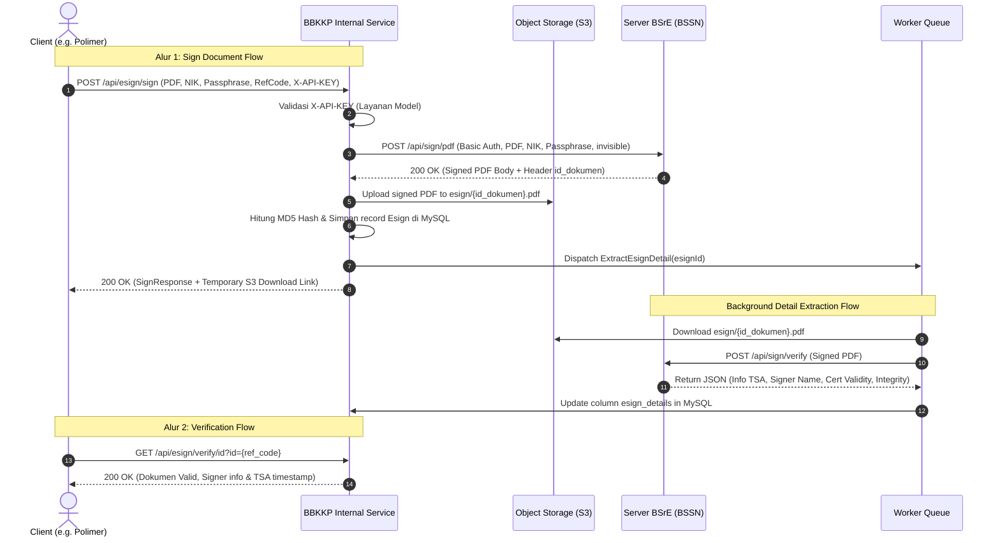

# Functional Requirements Document (FRD) - BBKKP Internal Service
## Spesifikasi Kebutuhan Fungsional Layanan Internal & Integrasi TTE BSrE

> **Status**: Approved / Production Baseline  
> **Target Audience**: Developer, DevOps, System Integrator BBKKP  
> **Komponen Terkait**: `Modules/Esign`, `BsreClient`, `ExtractEsignDetail`

---

## 1. Pendahuluan & Latar Belakang

Dalam penyelenggaraan layanan publik dan sertifikasi industri di lingkungan **Balai Besar Kulit, Karet, dan Plastik (BBKKP)**, penerbitan dokumen hukum seperti Invoice PNBP, Kuitansi, Laporan Hasil Uji (LHU), dan Sertifikat Kesesuaian SNI diwajibkan memiliki kekuatan hukum yang sah sesuai regulasi UU ITE melalui **Tanda Tangan Elektronik (TTE) Tersertifikasi** yang diterbitkan oleh **Balai Sertifikasi Elektronik (BSrE) - Badan Siber dan Sandi Negara (BSSN)**.

Alih-alih mengintegrasikan SDK BSrE secara terpisah di setiap aplikasi (Polimer, SIL, PUK, SIS), **BBKKP Internal Service** dirancang sebagai *centralized microservice* yang:
1. Menangani koneksi terpusat dan *rate limiting* ke server BSrE BSSN.
2. Mengelola *lifecycle* penyimpanan dokumen PDF ber-TTE di Object Storage (S3).
3. Menyediakan antarmuka verifikasi keaslian dokumen publik secara mandiri tanpa membebani server BSrE secara berulang.
4. Memberikan landasan terpadu bagi integrasi layanan internal lainnya (seperti Payment Gateway & Notifikasi).

---

## 2. Analisis Kebutuhan Fungsional (Functional Requirements)

### FR-01: Verifikasi Status NIK Penandatangan
* **Deskripsi**: Sebelum dokumen ditandatangani, sistem klien dapat memeriksa apakah aparatur/pejabat dengan NIK tertentu telah memiliki sertifikat digital aktif di BSrE.
* **Kriteria Penerimaan**:
  - Endpoint `GET /api/esign/nik/{nik}` mengirimkan request ke server BSrE `/api/user/status/{nik}`.
  - Jika status pengembalian adalah `ISSUE`, sistem mengembalikan `results: true` (terdaftar & aktif).
  - Jika belum terdaftar atau sertifikat kedaluwarsa, sistem mengembalikan error deskriptif `User belum terdaftar pada server TTE`.

### FR-02: Pembubuhan TTE Tidak Kasat Mata (Invisible PDF Sign)
* **Deskripsi**: Melakukan pembubuhan sertifikat digital BSrE ke dalam file PDF permohonan.
* **Kriteria Penerimaan**:
  - Menerima file PDF, NIK, Passphrase, `ref_code`, dan `ref_metadata` (opsional JSON base64).
  - Mengirim payload ke BSrE `/api/sign/pdf` dengan parameter `tampilan: invisible`.
  - Menerima PDF yang telah ditandatangani dan mengekstrak header `id_dokumen`.
  - Menyimpan file ke S3 pada path `esign/{id_dokumen}.pdf`.
  - Menghitung nilai `file_md5hash` untuk keperluan verifikasi integritas file.
  - Menyimpan rekaman ke tabel `esign` (id, ref_code, ref_metadata, layanan_id, esign_doc_id, file_md5hash, file_name, file_location).
  - Men-dispatch *asynchronous queue job* `ExtractEsignDetail` untuk mengekstrak detail sertifikat dan timestamp TSA.
  - Mengembalikan presigned URL sementara (berlaku 24 jam) ke klien pemanggil.

### FR-03: Verifikasi Dokumen Berdasarkan ID / Reference Code
* **Deskripsi**: Memverifikasi keabsahan tanda tangan dokumen menggunakan pengenal unik tanpa perlu mengunggah ulang file PDF.
* **Kriteria Penerimaan**:
  - Menerima parameter `id` yang dapat berupa `ref_code` (nomor pengenal dari sistem klien), `esign_doc_id` (ID dokumen dari BSrE), atau `id` (UUID esign record).
  - Mengembalikan informasi layanan asal, metadata dokumen, link download sementara, tanggal tanda tangan, serta detail verifikasi TTE (nama penandatangan, issuer BSSN, masa berlaku sertifikat, integritas dokumen).

### FR-04: Verifikasi Dokumen Berdasarkan Unggah Berkas Fisik (Document Hash Matching)
* **Deskripsi**: Memverifikasi keabsahan dokumen PDF yang diunggah oleh masyarakat / pihak ketiga dengan mencocokkan checksum sidik jari dokumen.
* **Kriteria Penerimaan**:
  - Menerima upload file PDF `signed_file`.
  - Menghitung nilai MD5 hash file yang diunggah.
  - Mencari rekaman di tabel `esign` berdasarkan kolom `file_md5hash`.
  - Jika hash cocok 100%, dokumen dinyatakan asli (*VALID*) dan detail penandatangan dikembalikan.
  - Jika hash berbeda (menandakan dokumen telah dimodifikasi atau bukan terbitan BBKKP), sistem mengembalikan response `404 Not Found / Data TTE tidak ditemukan`.

### FR-05: Isolasi Hak Akses Klien Berbasis API Key
* **Deskripsi**: Mengontrol dan membatasi akses klien eksternal/internal melalui *API Key Authentication*.
* **Kriteria Penerimaan**:
  - Setiap request wajib menyertakan header `X-API-KEY`.
  - Middleware `EsignMiddleware` mencocokkan key dengan tabel `layanan` (misal: `POLIMER`, `SIL`, `PUK`, `SIS`).
  - Rekaman TTE otomatis terhubung dengan `layanan_id` klien yang bersangkutan.

---

## 3. Use Case Diagram & Skenario Interaksi

---

## 4. Rencana Pengembangan (Roadmap Fitur)

1. **Payment Gateway Service (TBD / Next Milestone)**:
   - Modul agregator pembayaran terpusat untuk BNI Virtual Account, QRIS, dan Kartu Kredit.
   - Callback webhook terpusat yang mendistribusikan notifikasi lunas ke Polimer, SIL, atau PUK.
2. **Visual Signature Placement (PDF Marker Tool)**:
   - Pemanfaatan binary CLI `marker` (`markpdf`) untuk menyematkan visual stempel / QR code verifikasi sebelum dokumen dikirim ke invisible signing BSrE.
