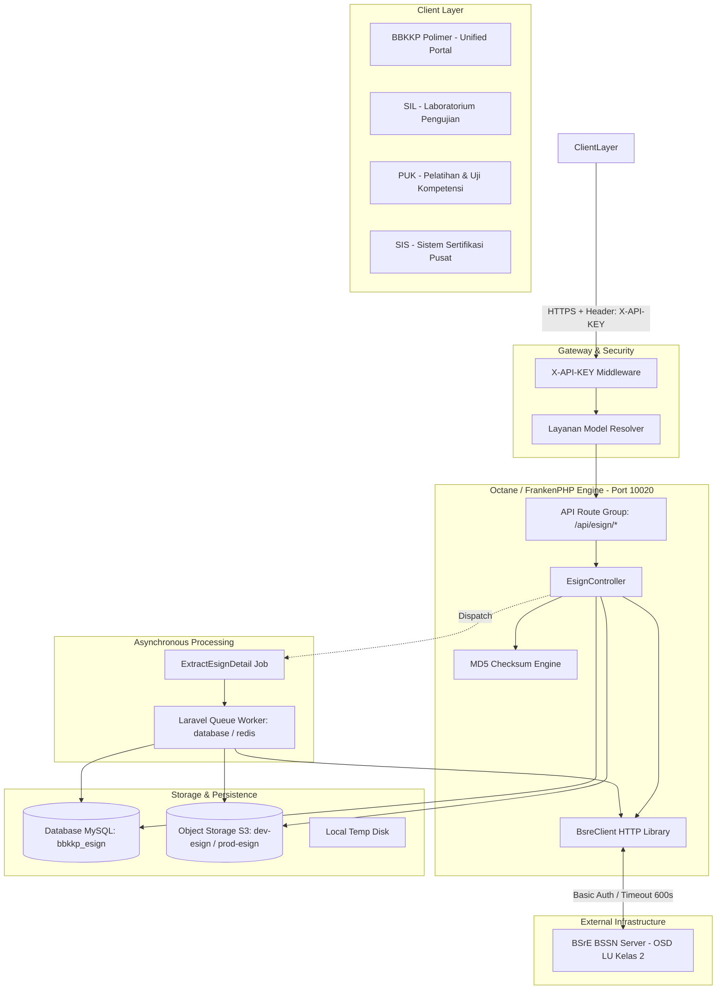
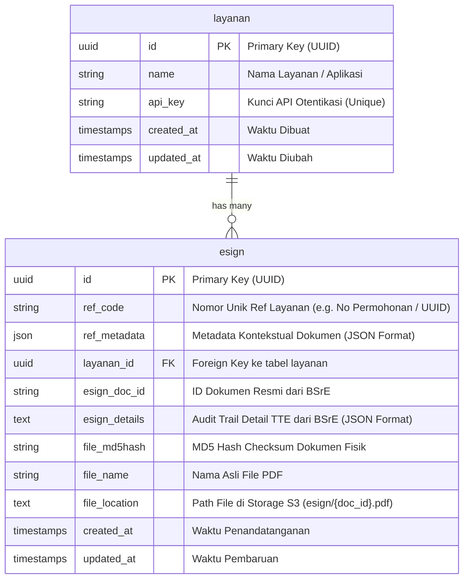

# System Architecture & Data Model - BBKKP Internal Service
## Desain Arsitektur Sistem, Komponen, dan Skema Database

> **Status**: Architecture Baseline  
> **Framework**: Laravel 11.x + Laravel Octane (FrankenPHP Server)  
> **Database**: MySQL 8.0 (`bbkkp_esign`)  
> **Storage**: S3 Compatible Storage (MinIO / AWS S3)

---

## 1. Arsitektur Komponen Tingkat Tinggi

BBKKP Internal Service dirancang dengan prinsip *High Concurrency, Low Latency, and Resilient Storage*.



---

## 2. Rincian Komponen Arsitektur

### 2.1. Runtime Server (Laravel Octane + FrankenPHP)
- Menggunakan **FrankenPHP** (Caddy-based application server) yang menjalankan aplikasi di dalam memori (*worker mode*).
- Menghilangkan *bootstrapping overhead* Laravel pada setiap request HTTP, menghasilkan latensi di bawah 10ms per transaksi internal.
- Menangani *heavy binary upload* (file PDF multi-halaman berukuran hingga 50MB) secara efisien.

### 2.2. Klien Otoritas Sertifikasi (`BsreClient.php`)
- Menggunakan `Illuminate\Support\Facades\Http` dengan `PendingRequest` terkonfigurasi.
- **Konfigurasi Timeout**: `timeoutSec = 600` (10 menit) untuk mengantisipasi dokumen berukuran besar atau beban tinggi pada server BSrE pusat.
- **Autentikasi**: *HTTP Basic Authentication* menggunakan kredensial resmi instansi `BSRE_USERNAME` dan `BSRE_PASSWORD`.
- **Handling Exception**: Logging komprehensif pada level `info`, `warning`, dan `error` dengan pelacakan *stack trace* dan payload detail.

### 2.3. Asynchronous Queue Processing (`ExtractEsignDetail.php`)
- **Tujuan**: Memisahkan proses penandatanganan instan dari proses ekstraksi audit trail sertifikat.
- **Mekanisme**:
  1. Klien menerima respon sukses penandatanganan segera setelah file tersimpan di S3.
  2. `ExtractEsignDetail` dijalankan di background oleh Queue Worker.
  3. Worker mengunduh dokumen dari S3 dan mengirimkannya ke endpoint BSrE `/api/sign/verify`.
  4. Respon JSON yang memuat rincian *Timestamp Authority (TSA)*, *Signer Name*, *Issuer DN*, *Validity Period*, dan *Document Integrity* disimpan ke kolom `esign_details` di tabel `esign`.

---

## 3. Skema Basis Data (Data Model)

Basis data `bbkkp_esign` menggunakan 2 tabel inti dengan relasi referensial:



### 3.1. Tabel `layanan`
| Kolom | Tipe Data | Keterangan |
| :--- | :--- | :--- |
| `id` | `CHAR(36)` (UUID) | Primary Key unik per sistem klien. |
| `name` | `VARCHAR(255)` | Nama identitas layanan (e.g., `POLIMER`, `SIL`, `PUK`, `SIS`). |
| `api_key` | `VARCHAR(255)` | Kunci autentikasi yang disertakan pada header `X-API-KEY`. |
| `created_at` / `updated_at` | `TIMESTAMP` | Timestamp audit record. |

### 3.2. Tabel `esign`
| Kolom | Tipe Data | Keterangan |
| :--- | :--- | :--- |
| `id` | `CHAR(36)` (UUID) | Primary Key rekaman tanda tangan. |
| `ref_code` | `VARCHAR(255)` | Nomor referensi unik per layanan (misal: ID permohonan atau kode order). |
| `ref_metadata` | `JSON` | Metadata tambahan (misal: Nomor Pengujian, Nama Pemohon, Jenis Komoditi). |
| `layanan_id` | `CHAR(36)` (UUID) | Relasi FK ke tabel `layanan(id)`. |
| `esign_doc_id` | `VARCHAR(255)` | ID Dokumen yang dihasilkan oleh server BSrE saat penandatanganan. |
| `esign_details` | `LONGTEXT / JSON` | Hasil verifikasi sertifikat BSrE (TSA, Signer, Cert Validity, Integrity). |
| `file_md5hash` | `VARCHAR(32)` | MD5 Checksum dari file PDF ber-TTE untuk pencocokan verifikasi instan. |
| `file_name` | `VARCHAR(255)` | Nama berkas dokumen (contoh: `Sertifikat-SNI-2026.pdf`). |
| `file_location` | `TEXT` | Path penyimpanan pada bucket S3 (contoh: `esign/9c96caee.pdf`). |
| `created_at` / `updated_at` | `TIMESTAMPTZ` | Waktu pembubuhan TTE. |

> **Constraint Unik**:
> ```sql
> UNIQUE KEY `esign_ref_code_layanan_id_unique` (`ref_code`, `layanan_id`);
> ```
> Mencegah duplikasi tanda tangan pada dokumen referensi yang sama di layanan yang bersangkutan (*Idempotent Signing*).

---

## 4. Keamanan & Kebijakan Penyimpanan (Storage Policy)

1. **Private Bucket Storage**: Seluruh berkas PDF tersimpan di bucket S3 privat (`dev-esign` / `prod-esign`) yang tidak dapat diakses publik secara terbuka.
2. **Presigned Temporary URL**: Akses pengunduhan dokumen hanya diberikan via URL bertanda tangan kriptografis dengan waktu kedaluwarsa terbatas (`now()->addDay()`).
3. **Passphrase Ephemeral**: Kata sandi (*passphrase*) sertifikat aparatur hanya digunakan saat transmisi ke BSrE dan tidak pernah dicatat dalam log aplikasi maupun disimpan ke basis data.
