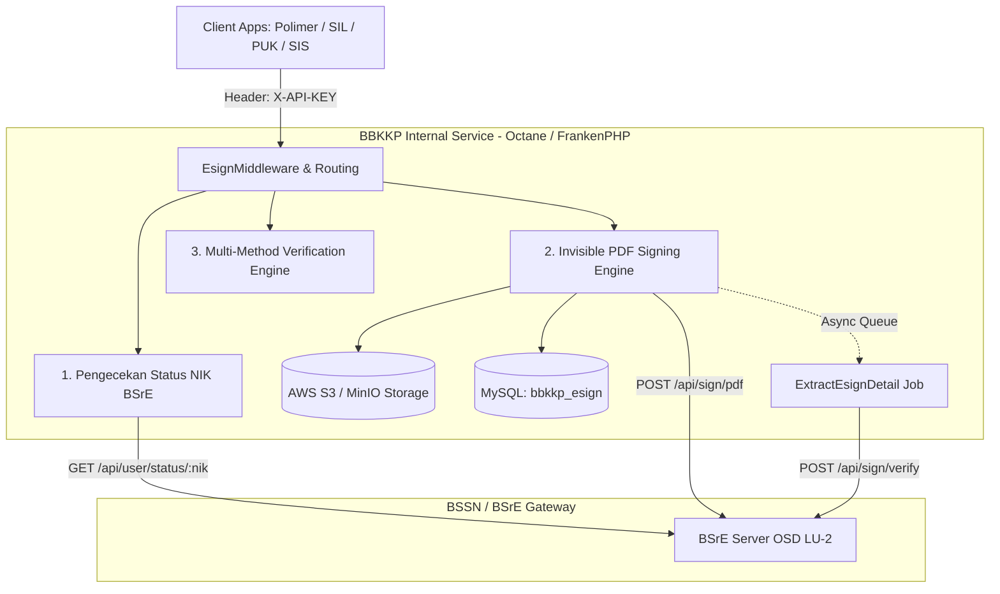

# ⚙️ BBKKP Internal Service Documentation
## Layanan Mikro Internal Terpusat untuk Tanda Tangan Elektronik (TTE BSrE), Verifikasi Dokumen, dan Integrasi Infrastruktur BBKKP

> **Balai Besar Kulit, Karet, dan Plastik (BBKKP) - Kementerian Perindustrian RI**  
> **Repository Path**: `F:\!Productive\BBKKP\bbkkp-internal-service`  
> **Status Project**: Active / Production Service  
> **Versi Layanan**: 1.0.8 (Laravel 11 + Octane FrankenPHP)

---

## 1. Ringkasan Proyek

**BBKKP Internal Service** adalah *backend microservice* berkinerja tinggi (*high-performance microservice*) yang dibangun untuk menyediakan layanan bersama (*shared internal services*) bagi seluruh aplikasi dalam ekosistem BBKKP (Polimer, SIL, PUK, SIS, dll).

Layanan utama yang beroperasi saat ini adalah **TTE (Tanda Tangan Elektronik) Service** yang terhubung langsung dengan server otoritas sertifikasi **BSrE (Balai Sertifikasi Elektronik - BSSN)**, serta dilengkapi dengan manajemen penyimpanan dokumen aman di Object Storage (S3) dan mesin verifikasi keabsahan dokumen digital.

---

## 2. Fitur Utama

1. **BSrE TTE Signing Engine**:
   - Pembubuhan tanda tangan elektronik tidak kasat mata (*invisible electronic signature*) pada dokumen PDF resmi (Invoice, Kuitansi, Sertifikat Hasil Uji, Sertifikat SNI).
   - Validasi kepemilikan sertifikat aktif penandatangan berdasarkan NIK aparatur/pejabat BBKKP.
   - Keamanan *passphrase* tanpa disimpan permanen di database.

2. **Multi-Method Verification Engine**:
   - **Verifikasi berbasis ID / Reference Code (`GET /api/esign/verify/id`)**: Pengecekan cepat status TTE melalui kode unik dokumen, ID UUID, atau ID Dokumen BSrE.
   - **Verifikasi berbasis File Dokumen (`POST /api/esign/verify/doc`)**: Pengecekan integritas fisik dokumen melalui kalkulasi instan *MD5 Hash* terhadap file PDF yang diunggah.

3. **High-Performance Architecture (Octane + FrankenPHP)**:
   - Menggunakan *Laravel Octane* berbasis *FrankenPHP* untuk waktu respon sub-milidetik dan *high-concurrency request*.
   - Pemrosesan asinkron *background job* (`ExtractEsignDetail`) untuk mengunduh dan mengurai *metadata detail sertifikat* tanpa menghambat alur penandatanganan klien.

4. **Service Isolation & Security**:
   - Otorisasi terisolasi berbasis `X-API-KEY` per klien/layanan (`layanan` model: Polimer, SIL, PUK, SIS).
   - Presigned Temporary URL dengan kedaluwarsa 24 jam untuk pengunduhan dokumen privat dari S3.

---

## 3. Struktur Dokumentasi

Dokumentasi lengkap BBKKP Internal Service diatur ke dalam beberapa bagian:

1. **[Changelog Layanan](./changelog_internal_service.md)**: Log integrasi & operasional service 4 hari terakhir (18 - 21 Agustus 2026).
2. **[Product & Functional Specifications](./01-product/frd_internal_service.md)**: Analisis kebutuhan fungsional, use case, dan roadmap layanan (Payment Service).
3. **[System Architecture & Data Model](./02-architecture/system_architecture.md)**: Arsitektur mendalam, containerization, queue lifecycle, dan skema database.
4. **[API Specifications & OpenAPI Guide](./02-architecture/api_specifications.md)**: Referensi lengkap endpoint REST API, parameter, dan contoh payload request/response.
5. **[Deployment & Operations Guide](./05-operations/deployment_and_setup.md)**: Panduan konfigurasi Docker, environment variable, database migration, dan queue worker.
