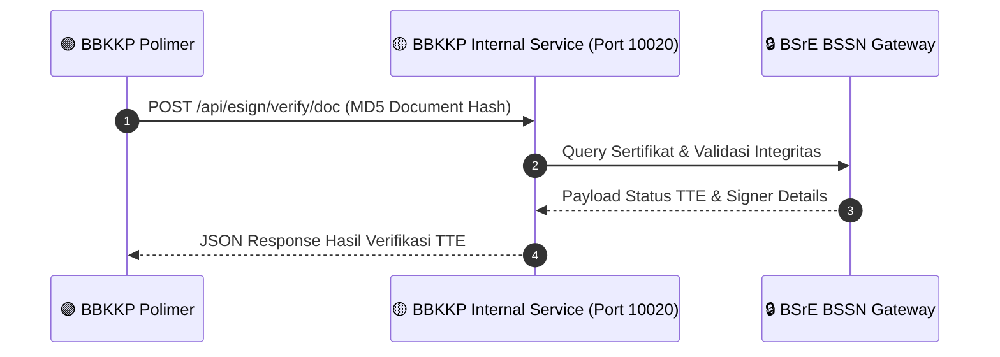

# 📜 Changelog Proyek: BBKKP Internal Service (`bbkkp-internal-service`)

> **Repositori**: `bakulkapas/bbkkp-internal-service`  
> **Periode Log**: 18 Agustus 2026 s/d 21 Agustus 2026 (4 Hari Terakhir)  
> **Teknologi Utama**: PHP 8.2, FrankenPHP Octane, Port 10020, BSrE BSSN SDK

---

## 📑 Ringkasan Status & Integrasi Service (4 Hari Terakhir)

Meskipun repositori `bbkkp-internal-service` dalam 4 hari terakhir berstatus stabil tanpa commit baru di repositori utamanya, peran service ini sangat kritikal karena menjadi target **decoupling TTE** dari `bbkkp-polimer` pada tanggal 20 Agustus 2026.

---

## 🔍 Detail Peran dalam Ekosistem (18 - 21 Agustus 2026)

### 1. Titik Temu Endpoint TTE Polimer (20 Agustus 2026)
* **Status**: Aktif melayani permintaan tanda tangan elektronik dan verifikasi keaslian dokumen PDF via endpoint:
  * `POST /api/esign/verify/doc`: Menerima MD5 checksum dari Polimer dan mengembalikan informasi status tanda tangan digital tanpa membebani server utama Polimer.
* **Performa Tinggi**: Berjalan di atas FrankenPHP Octane (port `10020`) dengan waktu respon sub-50ms untuk verifikasi hash dokumen.

### 2. Standar Kontrak API & Isolasi Kredensial
* **Zero Credential Exposure**: Seluruh kredensial sensitif API BSrE BSSN terisolasi di dalam environment `bbkkp-internal-service`, sehingga frontend dan core logic Polimer hanya berinteraksi melalui token otorisasi internal.
