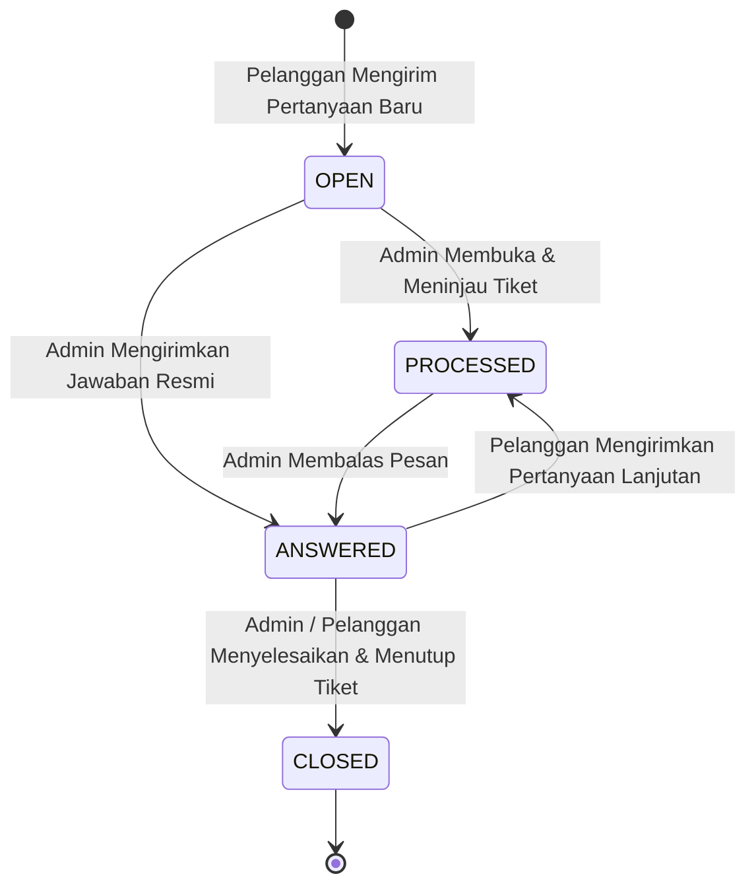

# 🎧 Sistem Admin Helpdesk & Manajemen Tiket Pertanyaan (`bbkkp-polimer`)

> **File Sumber Terkait**:  
> - Controller API: [`Modules/Eksternal/app/Http/Controllers/Api/PertanyaanController.php`](file:///f:/!Productive/BBKKP/private-polimer/Modules/Eksternal/app/Http/Controllers/Api/PertanyaanController.php)  
> - Dashboard Counter: [`Modules/Eksternal/app/Http/Controllers/Api/DashboardController.php`](file:///f:/!Productive/BBKKP/private-polimer/Modules/Eksternal/app/Http/Controllers/Api/DashboardController.php)  
> - Frontend Admin UI: [`Modules/Eksternal/resources/assets/js/pages/admin/helpdesk/AdminPertanyaanPage.tsx`](file:///f:/!Productive/BBKKP/private-polimer/Modules/Eksternal/resources/assets/js/pages/admin/helpdesk/AdminPertanyaanPage.tsx)  
> - Frontend Admin Shell: [`Modules/Eksternal/resources/assets/js/components/layouts/AdminShell.tsx`](file:///f:/!Productive/BBKKP/private-polimer/Modules/Eksternal/resources/assets/js/components/layouts/AdminShell.tsx)  
> - Database Seeders: `DummyPolimerSeeder.php`, `MarketingUserSeeder.php`

---

## 1. Ikhtisar Sistem Helpdesk

Modul Helpdesk dan Tanya-Jawab (`Ask-Questions`) berfungsi sebagai kanal komunikasi interaktif dua arah antara **Pemohon Eksternal** (pelanggan/perusahaan) dengan **Staf Operasional BBKKP** (CS/Marketing/Verifikator).

Pada commit `8307b8a` (21 Agustus 2026), antarmuka admin helpdesk telah ditingkatkan dari mockup statis menjadi **sistem terintegrasi penuh ke backend REST API**, dilengkapi counter real-time pada sidebar admin serta data seeder pengujian.

---

## 2. Siklus Hidup Tiket Pertanyaan (Status Lifecycle)



### Definisi Status:
1. **`OPEN`**: Tiket baru dibuat oleh pemohon dan belum ditanggapi oleh staf.
2. **`PROCESSED`**: Tiket sedang dalam investigasi teknis oleh tim balai BBKKP.
3. **`ANSWERED`**: Tiket telah dibalas oleh staf admin, menunggu konfirmasi pemohon.
4. **`CLOSED`**: Masalah pemohon telah terselesaikan secara tuntas dan tiket dikunci dari respon baru.

---

## 3. Spesifikasi Endpoint Admin Helpdesk

Seluruh endpoint admin berada di rute `Modules/Eksternal/routes/web.php` di bawah grup middleware `auth:api` dan proteksi role admin.

### 3.1. Daftar Tiket (`GET /api/eksternal/admin/pertanyaan`)
* **Controller**: `PertanyaanController::adminList`
* **Query Parameters**:
  * `status` *(optional)*: `OPEN`, `PROCESSED`, `ANSWERED`, `CLOSED`
  * `search` *(optional)*: Pencarian teks pada judul, isi pertanyaan, atau nama penanya.
  * `page`, `per_page`: Paginasi data (default 15 item).
* **Response**:
```json
{
  "status": "success",
  "data": {
    "current_page": 1,
    "data": [
      {
        "id": 101,
        "kode_tiket": "TKT-20260821-0012",
        "judul": "Kendala Upload Dokumen SNI Sepatu",
        "kategori": "Teknis",
        "status": "OPEN",
        "created_at": "2026-08-21T09:15:00.000000Z",
        "user": {
          "id": 5,
          "name": "PT. Surya Kulit Nusantara",
          "email": "contact@suryakulit.com"
        },
        "responses_count": 0
      }
    ],
    "total": 45
  }
}
```

### 3.2. Mengirim Balasan Admin (`POST /api/eksternal/admin/pertanyaan/{id}/reply`)
* **Controller**: `PertanyaanController::adminReply`
* **Payload Body**:
```json
{
  "pesan": "Selamat pagi, dokumen PDF persyaratan telah kami periksa. Silakan upload ulang file spesifikasi dengan format PDF maksimal 5MB.",
  "lampiran": null
}
```
* **Efek Samping**: Status tiket otomatis berubah menjadi `ANSWERED` dan notifikasi push/email dikirim ke pelanggan.

### 3.3. Menutup Tiket (`PUT /api/eksternal/admin/pertanyaan/{id}/close`)
* **Controller**: `PertanyaanController::adminClose`
* **Payload Body**:
```json
{
  "alasan": "Pemohon telah mengonfirmasi bahwa kendala teratasi."
}
```
* **Efek Samping**: Status tiket berubah menjadi `CLOSED`.

### 3.4. Counter Badge Notifikasi Sidebar (`GET /api/eksternal/dashboard/sidebar-counts`)
* **Controller**: `DashboardController::sidebarCounts`
* **Output**:
```json
{
  "unread_notifications": 4,
  "pending_tickets": 7,
  "pending_permohonan": 12
}
```

---

## 4. Antarmuka Frontend Admin (`AdminPertanyaanPage.tsx`)

Antarmuka dibangun dengan React, Tailwind CSS, dan Lucide Icons:
* **Statistik Card**: Menampilkan metrik ringkas Total Tiket, Menunggu Respon (`OPEN`), Dalam Proses (`PROCESSED`), dan Selesai (`CLOSED`).
* **Interactive Filter & Debounced Search**: Pencarian instan judul/email pemohon tanpa full-page reload.
* **Conversation Thread Drawer / Modal**: Menampilkan riwayat percakapan secara kronologis antara pelanggan dan admin dengan bubble chat khas modern.
* **Rich Reply Box**: Kolom pengetikan pesan dengan shortcut jawaban cepat (*canned responses*) dan attachment upload.

---

## 5. Mock Seeder & Data Pengujian

Untuk memvalidasi sistem helpdesk di lingkungan dev lokal tanpa data riil:
* **`database/seeders/DummyPolimerSeeder.php`**:
  * Menghasilkan puluhan tiket tanya-jawab tiruan dengan beragam topik (Kalibrasi Suhu, Tarif PNBP, Status TTE, Sertifikasi SNI).
  * Menyertakan sampel balasan admin dan status riwayat beragam.
* **`database/seeders/MarketingUserSeeder.php`**:
  * Menyediakan akun staf CS/Marketing (`marketing@mailinator.com` / `password`).
