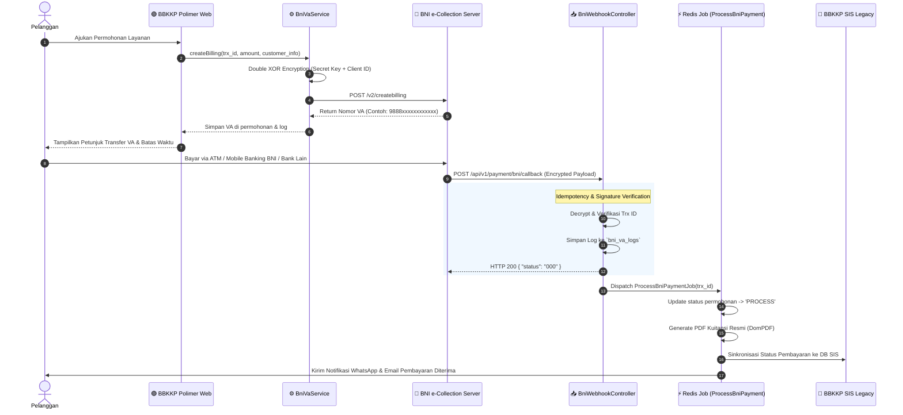

# 💳 Arsitektur Pembayaran BNI Virtual Account (e-Collection) (`bbkkp-polimer`)

> **File Sumber Terkait**:  
> - BNI Service: [`app/Services/BniVaService.php`](file:///f:/!Productive/BBKKP/private-polimer/app/Services/BniVaService.php)  
> - Webhook Controller: [`app/Http/Controllers/Api/BniWebhookController.php`](file:///f:/!Productive/BBKKP/private-polimer/app/Http/Controllers/Api/BniWebhookController.php)  
> - Asynchronous Job: [`app/Jobs/ProcessBniPaymentJob.php`](file:///f:/!Productive/BBKKP/private-polimer/app/Jobs/ProcessBniPaymentJob.php)  
> - Config: [`config/bni.php`](file:///f:/!Productive/BBKKP/private-polimer/config/bni.php)  
> - Model: `BniVaLog.php`, `Permohonan.php`, `DetailPembayaran.php`

---

## 1. Latar Belakang Integrasi BNI e-Collection

Sebagai Badan Layanan Umum / Lembaga Pemerintah di bawah Kemenperin RI, penerimaan Pendapatan Negara Bukan Pajak (PNBP) di BBKKP disalurkan melalui rekening kas negara via **BNI Virtual Account e-Collection**.

Integrasi ini menggantikan verifikasi bukti transfer manual lama, memungkinkan validasi pembayaran secara **real-time**, otomatis menerbitkan kuitansi digital, dan langsung memindahkan workflow permohonan ke tahap pengerjaan laboratorium/audit.

---

## 2. Alur Transaksi End-to-End (Sequence Diagram)



---

## 3. Spesifikasi Teknis Enkripsi BNI (Double XOR)

BNI e-Collection menggunakan algoritma enkripsi khusus:
1. Data JSON disusun dalam format array terstandar (`client_id`, `trx_id`, `trx_amount`, `customer_name`, `customer_email`, `customer_phone`, `datetime_expired`, `description`).
2. Payload dienkripsi dengan teknik XOR terhadap Client ID dan Secret Key yang dibolak-balik secara simetris.
3. String hasil enkripsi dikonversi menjadi representasi hexadecimal yang aman dikirim lewat HTTP payload.

```php
// Contoh pemanggilan di BniVaService
$response = BniVaService::createBilling([
    'trx_id'           => $permohonan->va_trx_id,
    'trx_amount'       => $permohonan->grand_total,
    'customer_name'    => $user->name,
    'customer_email'   => $user->email,
    'customer_phone'   => $user->phone,
    'datetime_expired' => now()->addDays(3)->toIso8601String(),
    'description'      => 'Pembayaran Layanan ' . $permohonan->no_permohonan,
]);
```

---

## 4. Idempotency & Penanganan Kegagalan (Fault Tolerance)

### 4.1. Pencegahan Double-Execution (Idempotency Guard)
Bank BNI dapat mengirimkan callback webhook beberapa kali jika terdapat latency jaringan. Sistem Polimer mengamankannya dengan:
* **Tabel `bni_va_logs`**: Mencatat setiap request webhook yang masuk.
* **Database Unique Lock**: Pemeriksaan apakah `trx_id` tersebut telah berstatus `PAID`. Jika sudah diproses, sistem langsung merespon HTTP `200 OK` tanpa menjalankan ulang job penerbitan kuitansi atau memicu duplikasi data di akuntansi.

### 4.2. Asynchronous Queue Processing
Pembuatan berkas PDF Kuitansi ber-QR code dialihkan ke worker background:
```bash
php artisan queue:work redis --queue=payments,default --tries=3
```
Hal ini memastikan response webhook ke server BNI tidak mengalami *timeout* (< 2 detik).

### 4.3. Mode Simulasi Lokal (`BNI_VA_DUMMY=true`)
Untuk mempermudah developer dan tim QA tanpa akses ke VPN server sandbox BNI:
* Saat `BNI_VA_DUMMY=true` diset pada `.env`:
  * Sistem akan menghasilkan nomor VA tiruan `9888` + random number.
  * Tombol **"Simulasi Bayar Instan"** muncul di portal pelanggan untuk menandai transaksi lunas seketika.
