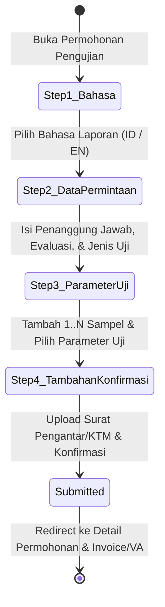
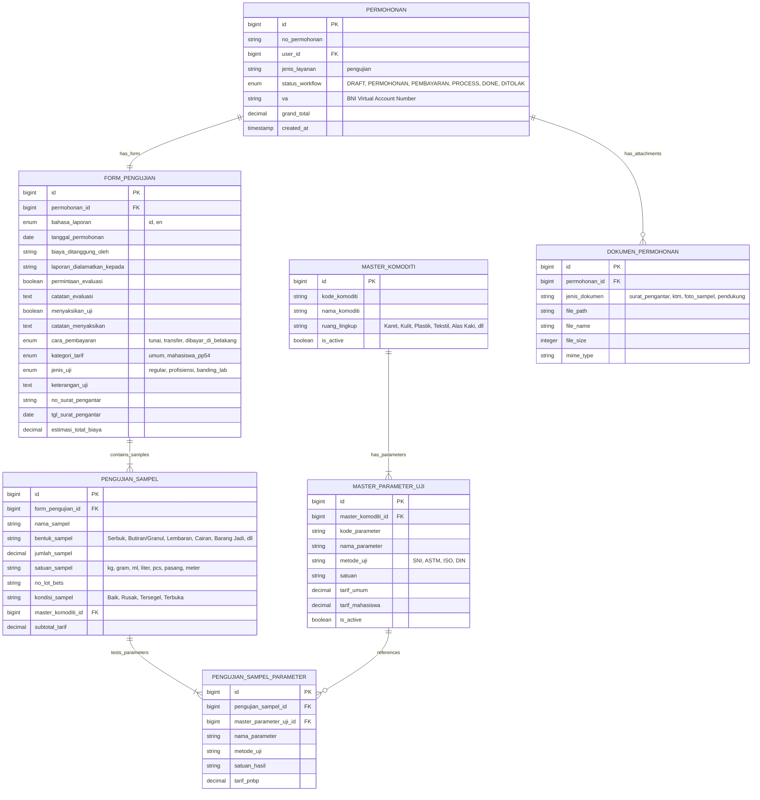
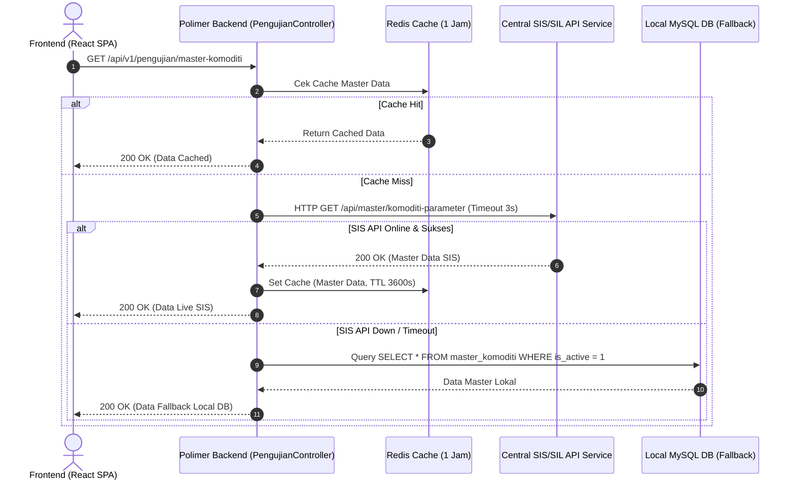

# 🧪 Arsitektur Form Pengujian Laboratorium (`bbkkp-polimer`)

> **Dokumen Desain Arsitektur & Spesifikasi Teknis Form Pengujian Sisi Klien (Portal Pelanggan)**  
> **Balai Besar Kulit, Karet, dan Plastik (BBKKP) - Kementerian Perindustrian RI**  
> **Status**: Draf Disetujui & Siap Implementasi  
> **Tanggal**: 17 September 2026  
> **Penulis**: Tim Pengembang Polimer BBKKP  

---

## 1. Latar Belakang & Kebutuhan Bisnis

Sebelumnya, penginputan formulir permohonan pengujian laboratorium hanya dapat dilakukan secara internal oleh petugas loket/admin balai melalui sistem SIS/SIL legacy. Klien atau pelanggan eksternal yang ingin menguji sampel (seperti produk karet, kulit, plastik, alas kaki, tekstil, dan barang industri) harus mengirimkan surat atau datang langsung ke loket balai untuk diinputkan permohonannya secara manual oleh staf admin.

Dengan modernisasi portal **BBKKP Polimer**, permohonan pengujian laboratorium dialihkan menjadi **layanan mandiri (*self-service client-side portal*)**:
1. **Self-Service Client Portal**: Pelanggan dapat secara mandiri memilih komoditas, parameter uji yang diinginkan, menginputkan data sampel, menentukan preferensi bahasa laporan hasil uji, serta mengunggah surat pengantar secara online.
2. **Multi-Sample & Multi-Parameter Dynamic Builder**: Satu nomor formulir permohonan dapat mencakup beberapa sampel uji sekaligus (misalnya 3 varian kompon karet yang berbeda), di mana tiap sampel memiliki parameter uji dan metode acuan yang independen.
3. **Kalkulasi Tarif PNBP Transparan & Real-Time**: Sistem secara otomatis mengkalkulasi estimasi biaya pengujian berdasarkan parameter uji yang dipilih dan kategori tarif pemohon (Tarif Umum vs. Tarif Mahasiswa PP 54).
4. **Integrasi Pembayaran Multi-Kanal**: Mendukung pembayaran BNI Virtual Account (otomatis), Transfer Bank, Pembayaran Tunai di Loket, dan opsi "Dibayar di Belakang" (bagi instansi rekanan dengan MoU / PKS resmi).

---

## 2. Diagram Alur Wizard Frontend 4-Tahap (`FormPengujianWizard`)

Pengajuan pengujian laboratorium di sisi klien diorganisasikan dalam **4-Step Wizard Component** modular pada route `/app/layanan/pengujian`:



### Rincian Tiap Tahap Form:

| Tahap | Nama Komponen | Deskripsi Fungsional |
| :--- | :--- | :--- |
| **Tahap 1** | `Step1Bahasa.tsx` | Pemilihan bahasa resmi untuk Laporan Hasil Uji (LHU / Certificate of Analysis):<br>• **Indonesia** (Bahasa Indonesia baku)<br>• **English** (Standard English Report) |
| **Tahap 2** | `Step2DataPermintaan.tsx` | Data administratif & relasi pemohon:<br>• **Tanggal Permohonan** (Auto-lock tanggal hari ini)<br>• **Diajukan Oleh** (Autofill nama pemohon/akun terdaftar)<br>• **Biaya Pengujian ditanggung oleh** (Checkbox relasi: sama dengan pemohon, input manual pihak ketiga bila uncheck)<br>• **Laporan Pengujian dialamatkan kepada** (Checkbox relasi: sama dengan pemohon, input manual bila uncheck)<br>• **Keterangan Permintaan** (Catatan umum opsional) |
| **Tahap 3** | `Step3ParameterUji.tsx` | Dynamic Multi-Sample & Inline Parameter Checklist Builder:<br>• Tombol **"Tambah Sampel"** (Dapat menambah 1 s/d N sampel)<br>• Metadata per sampel: Nama Sampel, Bentuk Fisik, Jumlah & Satuan, Nomor Lot/Bets, Kondisi Fisik Awal (Baik/Segel)<br>• Pemilihan **Komoditas / Ruang Lingkup** dari Master Data<br>• Pilihan **Kategori Tarif PNBP** (Umum / Mahasiswa PP 54)<br>• **Inline Checklist Parameter Uji**: Menampilkan seluruh parameter uji dengan checkbox multi-select, pencarian instan, dan **Metode Uji Acuan Baku** (SNI, ASTM, ISO) yang otomatis melekat<br>• Auto-kalkulasi Subtotal per Sampel & Total Estimasi Biaya |
| **Tahap 4** | `Step4TambahanKonfirmasi.tsx` | Tambahan, Pembayaran, Berkas & Finalisasi:<br>• Data Tambahan BAPC (Tanggal & No. BAPC, No. Sample, Merek/Kode - opsional)<br>• **Permintaan Evaluasi / Kesesuaian** (Ya/Tidak dengan opsi keterangan acuan standar)<br>• **Menyaksikan Pengujian** (Ya/Tidak dengan catatan kepatuhan K3 lab dan perkiraan tanggal hadir)<br>• **Cara Pembayaran** (Transfer BNI VA, Tunai di Loket, Dibayar di Belakang bagi mitra MoU)<br>• Nomor & Tanggal Surat Pengantar (opsional)<br>• Upload Surat Pengantar (PDF/Image max 5MB)<br>• Upload Kartu Tanda Mahasiswa (KTM) — *Wajib jika Kategori Tarif = Mahasiswa PP 54*<br>• Ringkasan Keseluruhan Permohonan (Administrative Summary, Sample Breakdown, Estimasi Tarif)<br>• Checklist Persetujuan Syarat & Ketentuan Pengujian BBKKP<br>• Tombol Submit Permohonan & Simpan Draft |

---

## 3. Diagram Relasi Data (Database Schema)

Struktur data didesain untuk mempertahankan kompatibilitas relasi `permohonan` di Polimer sekaligus memisahkan detail sampel dan parameter uji secara granular:



---

## 4. Arsitektur Master Data: Proxy API & Local Fallback

Ketersediaan data Komoditas dan Parameter Uji sangat krusial bagi formulir pengujian. Untuk menjamin keandalan sistem (*high availability & zero-disruption*), Polimer mengimplementasikan pola **Hybrid Proxy with Local DB Fallback**:



### Mekanisme Sinkronisasi Idempoten:
Artisan command terjadwal (`php artisan sis:sync-master-pengujian`) berjalan harian untuk menduplikasi master data komoditas dan parameter uji dari database SIS pusat ke tabel lokal Polimer `master_komoditi` dan `master_parameter_uji`.

---

## 5. Keputusan Desain Terpilih (Resolved Design Decisions)

| # | Aspek Keputusan | Keputusan yang Diterapkan | Justifikasi Teknis & Bisnis |
| :-: | :--- | :--- | :--- |
| **Q1** | **Sumber Master Data** | **Proxy API ke SIS/SIL** dengan proteksi fallback tabel lokal di database Polimer. | Mencegah form client macet jika koneksi internal antar server SIS mengalami lonjakan traffic atau downtime sesaat. |
| **Q2** | **Deteksi Tarif Mahasiswa** | **Dropdown Kategori Tarif manual** pada Step 2, dengan **kewajiban unggah KTM (Kartu Tanda Mahasiswa)** pada Step 4. | Client dapat memilih langsung tanpa merombak struktur registrasi profil akun. Verifikasi keabsahan dilakukan oleh verifikator marketing/admin saat review berkas. |
| **Q3** | **Data Analis Penerima STPCU** | **Ditiadakan dari Form Klien**. | Client tidak mengetahui siapa analis lab internal yang bertugas. Field ini murni ranah internal laboratorium yang diisi oleh admin/analis pada proses verifikasi sampel fisik. |
| **Q4** | **Opsi Pembayaran "Dibayar di Belakang"** | Diberikan opsi dengan **info peringatan dan penandaan MoU**. | Diperuntukkan bagi instansi pemerintah, BUMN, atau industri mitra kerja sama dengan perjanjian PKS. Admin akan memverifikasi kelayakan status MoU permohonan tersebut. |
| **Q5** | **Permintaan Evaluasi & Menyaksikan Uji** | Toggle / Radio button **Ya / Tidak**, dengan **kolom input catatan/spesifikasi** jika memilih "Ya". | Menampung kebutuhan khusus klien (misalnya menguji sesuai standar militer atau ingin hadir secara fisik menyaksikan uji tarik/uji sobek) dengan mematuhi SOP K3 Balai. |

---

## 6. Spesifikasi Antarmuka API Backend (`Modules/Eksternal`)

### 6.1 Endpoints Master Data & Kalkulasi

#### `GET /api/v1/pengujian/master-komoditi`
Mengambil daftar komoditas dan kategori uji yang aktif.

**Response (200 OK):**
```json
{
  "success": true,
  "data": [
    {
      "id": 1,
      "kode": "KMD-KRT",
      "nama": "Karet dan Barang Karet",
      "ruang_lingkup": "Pengujian Fisika & Kimia Karet",
      "parameters_count": 28
    },
    {
      "id": 2,
      "kode": "KMD-PLT",
      "nama": "Plastik dan Polimer",
      "ruang_lingkup": "Pengujian Karakterisasi Plastik & Polimer",
      "parameters_count": 35
    }
  ]
}
```

#### `GET /api/v1/pengujian/komoditi/{id}/parameters`
Mengambil seluruh parameter uji yang dapat dipilih berdasarkan komoditas terpilih.

**Response (200 OK):**
```json
{
  "success": true,
  "data": [
    {
      "id": 101,
      "komoditi_id": 1,
      "kode": "PAR-KU-01",
      "nama": "Kuat Tarik (Tensile Strength)",
      "metode_uji": "SNI 06-4965-1999 / ASTM D412",
      "satuan": "MPa",
      "tarif_umum": 150000,
      "tarif_mahasiswa": 75000
    },
    {
      "id": 102,
      "komoditi_id": 1,
      "kode": "PAR-KU-02",
      "nama": "Ketahanan Sobek (Tear Strength)",
      "metode_uji": "ASTM D624",
      "satuan": "kN/m",
      "tarif_umum": 175000,
      "tarif_mahasiswa": 87500
    }
  ]
}
```

### 6.2 Endpoint Pengajuan Permohonan

#### `POST /api/v1/pengujian/permohonan`
Menerima payload permohonan lengkap dari formulir wizard, membuat entitas `permohonan`, `form_pengujian`, `pengujian_sampel`, relasi parameter, serta memicu pembuatan BNI Virtual Account (bila memilih transfer).

**Request Body (Multipart Form-Data):**
```json
{
  "bahasa_laporan": "id",
  "tanggal_permohonan": "2026-09-17",
  "biaya_ditanggung_oleh": "PT Industri Karet Nusantara",
  "laporan_dialamatkan_kepada": "Manajer QA - Bpk. Hendra",
  "permintaan_evaluasi": true,
  "catatan_evaluasi": "Mohon evaluasi kesesuaian terhadap spesifikasi SNI 06-4965-1999 Kelas A",
  "menyaksikan_uji": false,
  "catatan_menyaksikan": null,
  "cara_pembayaran": "transfer",
  "kategori_tarif": "umum",
  "jenis_uji": "regular",
  "keterangan_uji": "Pengujian rutin sertifikasi produk triwulan III",
  "no_surat_pengantar": "045/QA-IKN/IX/2026",
  "tgl_surat_pengantar": "2026-09-15",
  "samples": [
    {
      "nama_sampel": "Kompon Karet Tapak Sepatu Tipe A",
      "bentuk_sampel": "Lembaran",
      "jumlah_sampel": 3,
      "satuan_sampel": "Lembar",
      "no_lot_bets": "LOT-2026-A12",
      "kondisi_sampel": "Baik",
      "master_komoditi_id": 1,
      "parameter_ids": [101, 102]
    }
  ]
}
```

**Files Attached:**
- `file_surat_pengantar`: File PDF/Image
- `file_ktm`: File PDF/Image (wajib jika `kategori_tarif == 'mahasiswa_pp54'`)
- `file_foto_sampel_0`: File foto sampel ke-1 (opsional)

**Response (201 Created):**
```json
{
  "success": true,
  "message": "Permohonan pengujian laboratorium berhasil diajukan.",
  "data": {
    "no_permohonan": "UJI-2026-09-00124",
    "permohonan_id": 482,
    "status_workflow": "PERMOHONAN",
    "grand_total": 325000,
    "va_number": "9881234526090124",
    "redirect_url": "/app/permohonan/482"
  }
}
```

---

## 7. Desain Komponen Frontend (`Modules/Eksternal/resources/assets/js`)

Arsitektur frontend mengadopsi standar **Unified React SPA** BBKKP Polimer:

```
Modules/Eksternal/resources/assets/js/
├── types/
│   └── pengujian.ts                        # Interfaces, Enums, Types, Validation Schemas
├── services/
│   └── pengujian.ts                        # Axios API Client functions
├── hooks/
│   └── queries/
│       └── usePengujianQuery.ts            # TanStack Query v5 Hooks (Master, Cache, Mutation)
├── pages/
│   └── services/
│       └── PengujianServicePage.tsx        # Container Page & Breadcrumb Header
└── components/
    └── input-service-requests/
        └── multiPengujian/
            ├── FormPengujianWizard.tsx     # Master Wizard State Controller & Stepper Bar
            ├── Step1Bahasa.tsx             # Pemilihan Bahasa Laporan Uji
            ├── Step2DataPermintaan.tsx     # Data Administratif, Biaya & Jenis Layanan
            ├── Step3ParameterUji.tsx       # Dynamic Multi-Sample & Multi-Parameter Builder
            ├── Step4TambahanKonfirmasi.tsx # Upload Berkas, KTM, Summary & Pernyataan
            └── components/
                ├── SampleCardItem.tsx      # Komponen Card Sampel Individual
                ├── ParameterSelector.tsx   # Modal / Collapsible Parameter Checklist
                └── CostEstimationSummary.tsx # Widget Rincian Biaya Real-Time
```

---

## 8. Verifikasi & Pengujian Kualitas

1. **Unit & Integration Test (Backend)**:
   - `PengujianMasterDataApiTest`: Memastikan endpoint master komoditas mengembalikan data fallback ketika mock service SIS offline.
   - `PengujianSubmissionValidationTest`: Memastikan validasi mewajibkan unggah KTM bila memilih tarif `mahasiswa_pp54`.
   - `TarifCalculationTest`: Memverifikasi kalkulasi grand total sesuai rumus: $\sum (\text{parameter\_tarif}) \times \text{jumlah\_sampel}$.
2. **Frontend End-to-End Flow**:
   - Menambah 2 sampel dengan parameter berbeda.
   - Memastikan auto-kalkulasi subtotal dan grand total berjalan reaktif tanpa reload.
   - Memastikan stepper navigasi mengunci langkah berikutnya bila field wajib pada tahap aktif belum terisi lengkap.
   - Verifikasi pengunggahan file dokumen pendukung (PDF, JPG, PNG) dengan batas ukuran maksimum 5MB.
