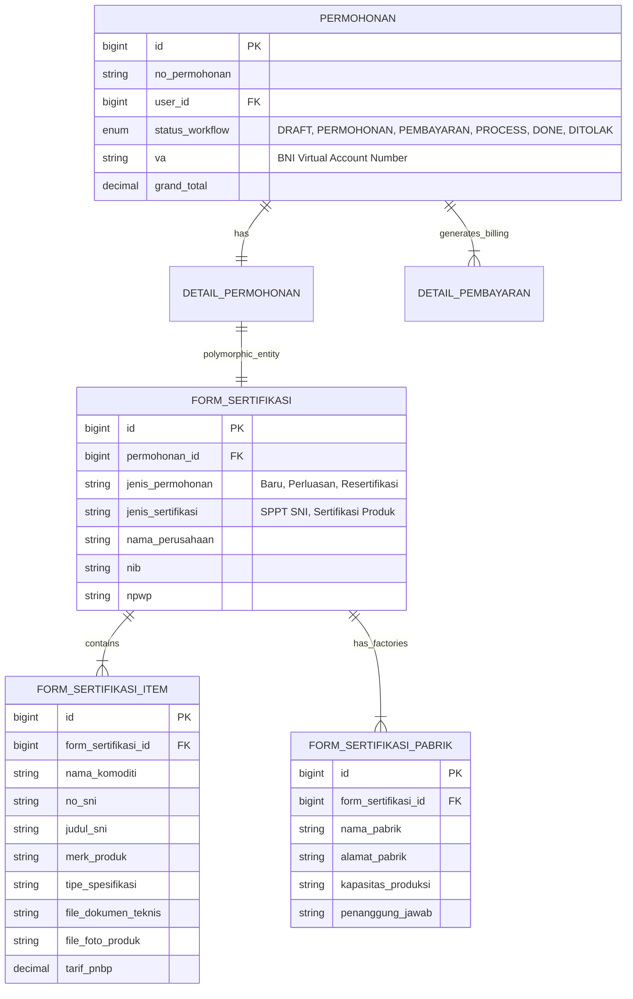
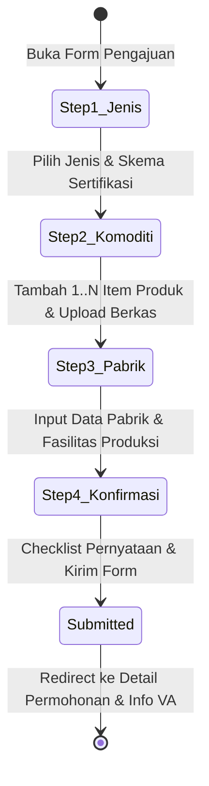

# 🏗️ Arsitektur Multi-Sertifikasi & Wizard Pengajuan (`bbkkp-polimer`)

> **File Sumber Terkait**:  
> - Frontend Wizard: [`Modules/Eksternal/resources/assets/js/components/service-requests/multiSertifikasi/FormSertifikasiWizard.tsx`](file:///f:/!Productive/BBKKP/private-polimer/Modules/Eksternal/resources/assets/js/components/service-requests/multiSertifikasi/FormSertifikasiWizard.tsx)  
> - Steps: `Step1JenisPermohonan.tsx`, `Step2KategoriDanKomoditi.tsx`, `Step3PerusahaanDanPabrik.tsx`, `Step4PernyataanKonfirmasi.tsx`  
> - Backend API: [`Modules/Eksternal/app/Http/Controllers/Api/SertifikasiController.php`](file:///f:/!Productive/BBKKP/private-polimer/Modules/Eksternal/app/Http/Controllers/Api/SertifikasiController.php)  
> - Models: `FormSertifikasi.php`, `FormSertifikasiItem.php`, `FormSertifikasiPabrik.php`

---

## 1. Latar Belakang & Kebutuhan Bisnis

Sebelum pembaruan pada 21 Agustus 2026, pengguna yang ingin mensertifikasi beberapa produk (misalnya beberapa varian barang atau tipe SNI berbeda) harus membuat satu permohonan untuk setiap produk. Hal ini menyebabkan:
1. Pemohon harus mengisi ulang data pabrik dan profil perusahaan berulang kali.
2. Munculnya banyak invoice dan virtual account terpisah untuk satu perusahaan yang sama.
3. Beban administrasi ganda bagi tim verifikasi dokumen di BBKKP.

Dengan **Multi-Certification Flow**, pemohon dapat mendaftarkan **banyak produk/SNI sekaligus dalam satu transaksi permohonan induk**, dengan rincian biaya yang dikonsolidasi secara otomatis ke satu tagihan/Virtual Account BNI.

---

## 2. Diagram Relasi Data (Database Schema)



---

## 3. Alur Wizard Frontend 4-Langkah (`FormSertifikasiWizard`)

Aplikasi React SPA di `/app/layanan/sertifikasi` mengimplementasikan wizard modular dengan validasi ketat per tahap:



### Rincian Tiap Langkah Wizard:
1. **`Step1JenisPermohonan`**:
   - Pemilihan kategori pengajuan: **Sertifikasi Baru**, **Perluasan Ruang Lingkup**, atau **Resertifikasi / Survailen**.
   - Pemilihan skema regulasi: Sertifikasi SPPT SNI Wajib, SNI Sukarela, atau Kesesuaian Teknis.
2. **`Step2KategoriDanKomoditi`**:
   - Dynamic item builder: Pengguna dapat menekan tombol **"Tambah Produk"** untuk memasukkan lebih dari satu komoditi.
   - Input per item: Nama komoditi, Nomor SNI, Merk dagang, Tipe/Model, dan upload berkas pendukung (PDF/Image max 5MB).
3. **`Step3PerusahaanDanPabrik`**:
   - Autofill otomatis profil legalitas perusahaan (NIB, NPWP, Alamat Kantor).
   - Pengisian form lokasi fasilitas manufaktur/pabrik yang memproduksi barang terkait.
4. **`Step4PernyataanKonfirmasi`**:
   - Ringkasan daftar produk yang diajukan beserta kalkulasi estimasi tarif PNBP.
   - Persetujuan pakta integritas dan validitas dokumen legal.

---

## 4. Struktur Payload & Endpoint Backend

### Endpoint Pembuatan Permohonan
* **Method**: `POST`
* **URL**: `/api/eksternal/sertifikasi`
* **Headers**: `Authorization: Bearer <token>`, `Content-Type: multipart/form-data`

### Contoh Struktur Data Payload:
```json
{
  "jenis_permohonan": "BARU",
  "jenis_sertifikasi": "SPPT_SNI",
  "pabrik": [
    {
      "nama_pabrik": "Pabrik Utama Cikarang",
      "alamat_pabrik": "Kawasan Industri MM2100 Blok C-12, Bekasi",
      "kapasitas": "50.000 unit/bulan",
      "pj_pabrik": "Budi Hartono"
    }
  ],
  "pengajuan": [
    {
      "nama_komoditi": "Sepatu Pengaman Kulit",
      "no_sni": "SNI 7079:2009",
      "merk": "SafetyPro",
      "tipe": "Tipe A (Steel Toe)",
      "file_spesifikasi": "(binary file)",
      "file_foto_produk": "(binary file)"
    },
    {
      "nama_komoditi": "Sol Sepatu Karet Vulkanisir",
      "no_sni": "SNI 0115:2008",
      "merk": "FlexiSole",
      "tipe": "Grade Heavy Duty",
      "file_spesifikasi": "(binary file)",
      "file_foto_produk": "(binary file)"
    }
  ]
}
```

---

## 5. Logika Transaksi di `SertifikasiController::store`

1. **Database Transaction (`DB::beginTransaction`)**: Seluruh proses entri permohonan dibungkus dalam single transaction.
2. **Generasi No. Permohonan**: Menggunakan pola format unik BBKKP (`SRT/YYYYMMDD/XXXX`).
3. **Persist Multi-Items**: Iterasi array `pengajuan` untuk menyimpan tiap record `FormSertifikasiItem` dan memindahkan berkas fisik ke disk `private-storage` atau S3.
4. **Perhitungan Billing & Detail Pembayaran**: Menghitung total tagihan PNBP berdasarkan master tarif per komoditi.
5. **Notifikasi Otomatis**: Men-trigger notifikasi internal ke tim verifikator/marketing.
