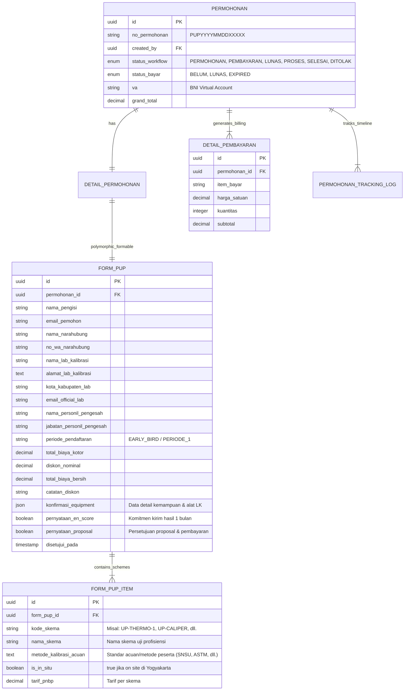

# 🏗️ Arsitektur Form Uji Profisiensi (PUP) BBSPJIKKP (`bbkkp-polimer`)

> **Dokumen Terkait**:
> - Sumber Formulir: `Pendaftaran UP Tahun 2025 BBSPJIKKP - Google Formulir.pdf`
> - Sub-Sistem: Penyelenggara Uji Profisiensi (PUP) BBSPJIKKP Yogyakarta (LK-005-IDN)
> - Frontend Entry: [`Modules/Eksternal/resources/assets/js/pages/service-requests/ProfisiensiPage.tsx`](file:///d:/Productive/BBKKP/private-polimer/Modules/Eksternal/resources/assets/js/pages/service-requests/ProfisiensiPage.tsx)
> - Wizard Component: `Modules/Eksternal/resources/assets/js/components/input-service-requests/multiPup/FormPupWizard.tsx`
> - Aset Foto Artefak: `public/images/pup/` (28 gambar artefak + `manifest.json`)
> - Backend Controller: `Modules/Eksternal/app/Http/Controllers/Api/PupController.php`
> - Models: `FormPup.php`, `FormPupItem.php`

---

## 1. Latar Belakang & Analisis Kebutuhan Bisnis

Sebelumnya, pendaftaran kegiatan Uji Profisiensi (PUP) di BBSPJIKKP dilakukan melalui Google Forms eksternal (*Pendaftaran UP Tahun 2025 BBSPJIKKP*). Proses tersebut memiliki kelemahan:
1. Data peserta dan kontak narahubung terpisah dari akun SSO dan riwayat permohonan Polimer.
2. Tagihan dan kode pembayaran (Virtual Account BNI) harus diproses secara manual oleh bendahara/marketing.
3. Tidak ada penelusuran status otomatis (tracking milestone) dari pendaftaran, pembayaran, pengiriman artefak, hingga penerbitan laporan evaluasi nilai $E_n$ (*En score*).

Melalui integrasi ini, layanan **Uji Profisiensi (PUP)** diaktifkan penuh di Polimer sebagai modul mandiri terintegrasi ke Core `Permohonan`, modul `Billing`/Pembayaran VA BNI, dan pelacakan riwayat permohonan.

---

## 2. Struktur Data & Relasi ERD

PUP mengadopsi pola polymorphic entity `DetailPermohonan` yang terhubung ke `permohonan` induk:



---

## 3. Matriks 28 Skema Uji Profisiensi & Aturan Diskon

Berdasarkan katalog resmi pendaftaran PUP BBSPJIKKP, terdapat 28 skema kalibrasi artefak dengan klasifikasi:

| No | Nama Skema UP | Kategori / Lokasi | Tarif Early Bird | Tarif Normal | Konfirmasi Equipment? |
|:---|:--------------|:------------------|:-----------------|:-------------|:----------------------|
| 1 | UP Termometer Gelas | Suhu / Kirim Artefak | Rp 1.000.000 | Rp 1.000.000 | ✅ Ya (Termometer) |
| 2 | UP Termometer Digital 1 | Suhu / Kirim Artefak | Rp 900.000 | Rp 900.000 | ✅ Ya (Termometer) |
| 3 | UP Termometer Digital 2 | Suhu / Kirim Artefak | Rp 1.200.000 | Rp 1.200.000 | ✅ Ya (Termometer) |
| 4 | UP Termometer Digital 3 | Suhu / Kirim Artefak | Rp 1.100.000 | Rp 1.100.000 | ✅ Ya (Termometer) |
| 5 | UP Termometer Radiasi | Suhu / Kirim Artefak | Rp 900.000 | Rp 1.100.000 | ❌ Tidak |
| 6 | UP Thermohygrometer | Suhu & Kelembaban | Rp 850.000 | Rp 850.000 | ❌ Tidak |
| 7 | UP Autoclave | Suhu & Tekanan [In Situ Yogyakarta] | Rp 1.100.000 | Rp 1.100.000 | ✅ Ya (Autoclave) |
| 8 | UP Oven | Suhu [In Situ Yogyakarta] | Rp 1.700.000 | Rp 1.700.000 | ❌ Tidak |
| 9 | UP Climatic Chamber | Suhu & Kelembaban [In Situ Yogyakarta] | Rp 1.400.000 | Rp 1.400.000 | ❌ Tidak |
| 10 | UP Timbangan Analitik | Massa [In Situ Yogyakarta] | Rp 1.500.000 | Rp 1.500.000 | ❌ Tidak |
| 11 | UP Timbangan Elektronik | Massa [In Situ Yogyakarta] | Rp 1.500.000 | Rp 1.500.000 | ❌ Tidak |
| 12 | UP Pipet Volume | Volumetrik | Rp 950.000 | Rp 950.000 | ❌ Tidak |
| 13 | UP Pipet Ukur | Volumetrik | Rp 950.000 | Rp 950.000 | ❌ Tidak |
| 14 | UP Labu Ukur 1 | Volumetrik | Rp 900.000 | Rp 900.000 | ❌ Tidak |
| 15 | UP Labu Ukur 2 | Volumetrik | Rp 750.000 | Rp 850.000 | ❌ Tidak |
| 16 | UP Buret | Volumetrik | Rp 950.000 | Rp 950.000 | ❌ Tidak |
| 17 | UP Gelas Ukur | Volumetrik | Rp 700.000 | Rp 700.000 | ❌ Tidak |
| 18 | UP Mikropipet | Volumetrik | Rp 900.000 | Rp 900.000 | ❌ Tidak |
| 19 | UP Pressure Gauge Pneumatik | Tekanan | Rp 800.000 | Rp 800.000 | ✅ Ya (Pressure Gauge) |
| 20 | UP Pressure Gauge Hidrolik | Tekanan | Rp 800.000 | Rp 800.000 | ✅ Ya (Pressure Gauge) |
| 21 | UP Digital Caliper | Dimensi & Panjang | Rp 850.000 | Rp 850.000 | ✅ Ya (Digital Caliper) |
| 22 | UP Digital Outside Micrometer 1 | Dimensi & Panjang | Rp 850.000 | Rp 850.000 | ❌ Tidak |
| 23 | UP Digital Outside Micrometer 2 | Dimensi & Panjang | Rp 800.000 | Rp 900.000 | ❌ Tidak |
| 24 | UP Dial Thickness Gauge | Dimensi & Panjang | Rp 850.000 | Rp 850.000 | ❌ Tidak |
| 25 | UP Stopwatch Digital | Waktu & Frekuensi | Rp 800.000 | Rp 800.000 | ✅ Ya (Stopwatch) |
| 26 | UP Centrifuge | Kecepatan Putar [In Situ Yogyakarta] | Rp 1.300.000 | Rp 1.300.000 | ❌ Tidak |
| 27 | UP Overhead Stirrer | Kecepatan Putar [In Situ Yogyakarta] | Rp 1.300.000 | Rp 1.300.000 | ❌ Tidak |
| 28 | UP Spektrofotometer UV-Vis | Optik [In Situ Yogyakarta] | Rp 1.950.000 | Rp 1.950.000 | ✅ Ya (Spektrofotometer) |

### 🏷️ Logika Diskon Bundling (Khusus)
- **Paket Bundling Centrifuge + Overhead Stirrer**:
  - Jika peserta memilih **kedua skema**: `UP Centrifuge` (Rp 1.300.000) dan `UP Overhead Stirrer` (Rp 1.300.000), sistem secara otomatis memberikan potongan diskon sebesar **Rp 1.000.000**.
  - Total paket: Rp 2.600.000 - Rp 1.000.000 = **Rp 1.600.000**.
  - Rincian diskon dicatat di `diskon_nominal`, `catatan_diskon`, dan ditampilkan pada rincian tagihan `detail_pembayaran`.

---

## 4. Spesifikasi Konfirmasi Sumber Daya Equipment Laboratorium (LK)

Untuk menjamin kesiapan laboratorium dalam menerima artefak kalibrasi BBSPJIKKP, konfirmasi sumber daya equipment diisi secara **kondisional** (hanya jika skema terkait dipilih):

### A. Termometer (Gelas & Digital 1/2/3)
1. Apakah melakukan pengukuran *ice point*? (`Ya` / `Tidak`)
2. Media kalibrasi artefak: `Ice point`, `Waterbath/Oilbath/Silicon bath/Salt bath`, `Dryblock calibrator/Dry Well`, `Furnace`, `Lainnya`
3. Kedalaman maksimal dryblock/well sensor jika digunakan (satuan cm)
4. Rentang ukur suhu yang dapat dilakukan (contoh: `-20 s.d. 250 °C`)

### B. Autoclave
1. Metode pengukuran parameter suhu:
   - `1 unit data logger suhu`
   - `Beberapa data logger suhu`
   - `Sensor berbentuk wire`
   - `Tidak melakukan pengukuran parameter suhu autoclave`
   - `Lainnya`
2. Metode pengukuran parameter tekanan:
   - `1 unit data logger tekanan`
   - `Beberapa unit data logger tekanan`
   - `Melepas indikator tekanan kemudian mengkalibrasi sebagai pressure gauge`
   - `Tidak melakukan pengukuran parameter tekanan autoclave`
   - `Lainnya`

### C. Pressure Gauge (Pneumatik & Hidrolik)
1. Kemampuan kalibrasi lingkup tekanan: `Pressure Gauge Pneumatik`, `Pressure Gauge Hidrolik`
2. Media tekanan yang tersedia: `Udara`, `Silicon oil`, `Air`, `Alkohol`, `Lainnya`
3. Pernyataan wajib memahami keharusan media tekanan sesuai artefak (`checkbox`)

### D. Digital Caliper
1. Alat standar yang dimiliki: `Gauge block`, `Caliper checker`, `Lainnya`

### E. Stopwatch Digital
1. Alat standar yang dimiliki: `Signal generator`, `Frequency counter`, `Stopwatch standar`, `Kamera shutter speed > 1/1000 detik (1000 FPS)`, `Lainnya`
2. Nilai $U_{95}$ pada CMC (satuan detik)

### F. Spektrofotometer UV-Vis
1. Filter standar Holmium: `Ya, glass filter`, `Ya, liquid filter`, `Tidak memiliki holmium`
   - Jika memiliki: Pilihan puncak $\lambda$ terkalibrasi (`241 nm`, `279 nm`, `287 nm`, `334 nm`, `361 nm`, `418 nm`, `445 nm`, `453 nm`, `460 nm`, `474 nm`, `536 nm`, `638 nm`, `Lainnya`)
2. Filter standar Didymium: `Ya, glass filter`, `Ya, liquid filter`, `Tidak memiliki didymium`
   - Jika memiliki: Pilihan puncak $\lambda$ (`440~443 nm`, `481~482 nm`, `512 nm`, `525~529 nm`, `573 nm`, `585 nm`, `681~684 nm`, `748 nm`, `807 nm`, `875~879 nm`, `Lainnya`)
3. Kalibrasi Akurasi Fotometrik pada 590 nm: (`Ya` / `Tidak`)
   - Jika ya: Filter yang digunakan (`Neutral density glass filter`, `Didymium glass filter`, `Potassium dichromate liquid filter`, `Niacin liquid filter`, `Lainnya`)
   - Titik ukur sertifikat (`0.25 Abs`, `0.31 Abs`, `0.55 Abs`, `0.58 Abs`, `1.05 Abs`, `1.16 Abs`, `1.57 Abs`, `Tidak ada`, `Lainnya`)

---

## 5. Alur Formulir Wizard Frontend (UI/UX Flow)

Formulir dirancang dalam **4 Langkah Wizard**:

```
[ Langkah 1: Identitas & Narahubung ] 
   └── Profil Lab, Alamat, Email Official, Penandatangan
            ↓
[ Langkah 2: Pemilihan Skema UP & Metode Acuan ]
   └── Katalog 28 Skema, Badge In-Situ, Live Discount, Input Metode Acuan per Skema
            ↓
[ Langkah 3: Konfirmasi Sumber Daya Alat LK ]
   └── Dynamic Accordion/Tabs (Hanya muncul untuk skema yang dipilih pemohon)
            ↓
[ Langkah 4: Rincian Biaya & Pernyataan Komitmen ]
   └── Ringkasan Tagihan, Checkbox En Score & Proposal, Submit Permohonan
```

1. **Langkah 1: Identitas & Laboratorium Peserta**
   - Data otomatis terisi (*pre-filled*) dari session user login Polimer.
   - Input khusus personil pengesah & kontak WhatsApp narahubung teknis.
2. **Langkah 2: Pemilihan Skema UP & Metode Acuan**
   - Grid kartu interaktif dengan status pilihan.
   - Deteksi otomatis promo bundling (Centrifuge + Overhead Stirrer).
   - Dynamic text field per skema terpilih untuk memasukkan *Metode Kalibrasi Acuan* (contoh: SNSU PK.M-01:2024).
3. **Langkah 3: Konfirmasi Sumber Daya Equipment LK**
   - Hanya menampilkan instrumen yang relevan dengan skema yang dicentang di Langkah 2.
   - Validasi kelengkapan data peralatan sebelum melangkah ke tahap berikutnya.
4. **Langkah 4: Rincian Biaya & Pernyataan Komitmen**
   - Tabel ringkasan skema terpilih, subtotal kotor, diskon bundling, dan grand total.
   - Checkbox persetujuan klausul evaluasi nilai $E_n$ (batas 1 bulan pasca kalibrasi).
   - Checkbox pernyataan kesanggupan pembayaran dan kepatuhan terhadap proposal kegiatan.
   - Tombol "Kirim Pendaftaran Uji Profisiensi".

---

## 6. Integrasi dengan Modul Lain

1. **Katalog Permohonan (`PermohonanPage.tsx`)**:
   - Kartu `profisiensi` diaktifkan (`isAvailable: true`).
   - Rute mengarah ke `/permohonan/profisiensi`.
2. **Detail Permohonan (`DetailPermohonanPage.tsx`) & Multi-Service Resolution**:
   - **Isolasi Layanan Dinamis**: Mencegah kebocoran tampilan PUP ke layanan lain dengan evaluasi deterministik (`isPup`, `isSertifikasi`, `isPelatihan`, `isLsp`, `isGrk`).
   - **Penyelesaian Bug `Boolean([])`**: Laravel mengembalikan `form_pup: []` untuk permohonan non-PUP. Evaluasi diperketat menggunakan pengecekan prefix `no_permohonan.startsWith("PUP")` atau `formable_type === 'App\\Models\\Db2\\FormPup'` atau array non-kosong `form_pup.length > 0`.
   - **Tampilan Khusus PUP**:
     - Stepper 5-tahap PUP: `Diajukan` -> `Verifikasi & Billing` -> `Pembayaran` -> `Pengiriman Artefak` -> `Laporan En Score`.
     - Tab `Data Permohonan`: Rincian 28 skema artefak terpilih, foto artefak, status in-situ, dan metode kalibrasi acuan peserta.
     - Tab `Laboratorium & Fasilitas`: Alamat lab, narahubung teknis, personil pengesah, dan konfirmasi sumber daya instrumen (equipment LK).
     - Tab `Pernyataan & Komitmen`: Klausul evaluasi nilai $E_n$ dalam batas 1 bulan pasca kalibrasi serta persetujuan proposal teknis.
     - Tab `Jadwal & Tim Audit`: Disembunyikan otomatis untuk PUP (hanya relevan untuk Sertifikasi Sistem Mutu/Produk LSPro).
3. **Billing & VA BNI**:
   - `DetailPembayaran` memecah biaya per skema dan baris potongan diskon jika bundling berlaku.
   - Pemohon langsung mendapatkan instruksi Virtual Account BNI saat permohonan disetujui marketing.
4. **Tracking Timeline**:
   - Log milestone `PERMOHONAN_MASUK` dibuat otomatis dengan judul *"Pendaftaran Uji Profisiensi (PUP) Diajukan"*.

---

## 7. Pengujian End-to-End (E2E) & Test Case (Tahap 5)

Pengujian end-to-end dilakukan menggunakan akun pelanggan resmi (`perusahaan@mailinator.com`, PT Indorubber Polymer Tech) dan diverifikasi melalui test suite otomatis [`tests/Feature/PupSubmissionE2ETest.php`](file:///d:/Productive/BBKKP/private-polimer/tests/Feature/PupSubmissionE2ETest.php):

| Test Case | Parameter Uji | Ekspektasi | Hasil Uji |
|:---|:---|:---|:---|
| **TC-01: Katalog & Foto Artefak** | Endpoint `/api/eksternal/pup/skema` | Mengembalikan 28 skema lengkap dan file gambar artefak valid di `public/images/pup/` | ✅ **PASS** |
| **TC-02: Pendaftaran Skema Tunggal** | Skema: `Digital Caliper` (Rp 3.000.000) | No permohonan `PUP...` terbit, subtotal Rp 3.000.000, diskon Rp 0, total bersih Rp 3.000.000 | ✅ **PASS** |
| **TC-03: Pendaftaran Bundling Diskon** | Skema: `Centrifuge` + `Overhead Stirrer` | No permohonan `PUP...` terbit, subtotal kotor Rp 6.000.000, diskon otomatis Rp 1.000.000, total bersih Rp 5.000.000 | ✅ **PASS** |
| **TC-04: API Detail Permohonan** | Endpoint `/api/eksternal/permohonan/{id}` | `formable_type` = `App\Models\Db2\FormPup`, memuat eager loading relasi `form_pup.items`, rincian diskon Rp 1.000.000 | ✅ **PASS** |
| **TC-05: Isolasi Non-PUP (Anti-Leak)** | Permohonan Sertifikasi LSPro (`CERT...`) | Halaman detail menampilkan form sertifikasi LSPro tanpa bocor ke tampilan PUP (`formable_type` != `FormPup`) | ✅ **PASS** |

---

## 8. Status & Rekapitulasi Tahapan Implementasi

- [x] **Tahap 1: Fondasi Database & Model Eloquent** — Migrasi `form_pup`, `form_pup_item`, model `FormPup`, `FormPupItem`, relasi `Permohonan`.
- [x] **Tahap 2: Backend API & Workflow Engine** — `PupController.php`, route katalog skema, kalkulasi diskon bundling, order generator `PUP`, `PermohonanController.php`.
- [x] **Tahap 3: Form Wizard Frontend (UI/UX 4 Langkah)** — `FormPupWizard.tsx` (Step 1 s.d. 4), sinkronisasi kontak, master wilayah provinsi/kabupaten, scrollable catalog, skeleton loader, aktivasi menu profisiensi.
- [x] **Tahap 4: Halaman Detail Permohonan & Multi-Service Resolution** — `PupDetailSection.tsx`, penyesuaian tab & stepper dinamis, perbaikan bug deteksi jenis layanan.
- [x] **Tahap 5: End-to-End Testing & Finalisasi** — Automated test feature suite `PupSubmissionE2ETest.php`, verifikasi skenario diskon bundling dan skema tunggal, verifikasi integritas build Vite.

