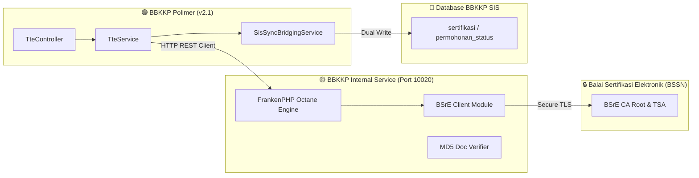

# 🔏 Integrasi Tanda Tangan Elektronik (TTE BSrE) via BBKKP Internal Service

> **File Sumber Terkait**:  
> - TTE Service: [`app/Services/TteService.php`](file:///f:/!Productive/BBKKP/private-polimer/app/Services/TteService.php)  
> - SIS Bridging: [`app/Services/SisSyncBridgingService.php`](file:///f:/!Productive/BBKKP/private-polimer/app/Services/SisSyncBridgingService.php)  
> - Controller: [`app/Http/Controllers/TteController.php`](file:///f:/!Productive/BBKKP/private-polimer/app/Http/Controllers/TteController.php)  
> - Internal Microservice: `bbkkp-internal-service` (FrankenPHP Octane di port `10020`)

---

## 1. Ikhtisar & Pola Decoupling

Sertifikat hasil uji, kalibrasi, dan sertifikasi produk yang diterbitkan oleh Balai Besar Kulit, Karet, dan Plastik (BBKKP) wajib dibubuhi **Tanda Tangan Elektronik (TTE) Tersertifikasi BSrE BSSN** sesuai regulasi Kemenperin.

Sebelumnya, integrasi TTE dilakukan langsung di aplikasi utama menggunakan library SDK monolitik yang sering menyebabkan *memory leak* dan isu kompatibilitas PHP. Sejak commit `935abdc` (20 Agustus 2026), Polimer telah **didecouple sepenuhnya** menggunakan Guzzle HTTP Client yang berkomunikasi dengan mikroservis terisolasi **`bbkkp-internal-service`**.



---

## 2. Fitur Utama & Protokol Layanan

### 2.1. Penandatanganan Dokumen Digital (`/api/esign/sign`)
* Polimer mengirimkan payload berkas PDF hasil render DomPDF, NIP penandatangan (Kepala Balai / Koordinator Pengujian), passphrase terenkripsi, dan koordinat visual QR code.
* `bbkkp-internal-service` menandatangani dokumen dan mengembalikan file PDF yang telah tersemat digital certificate X.509.

### 2.2. Verifikasi Hash Dokumen (`/api/esign/verify/doc`)
* Verifikasi keaslian sertifikat dilakukan dengan menghitung **MD5/SHA256 Checksum** dari file PDF yang diunggah publik di halaman `/tte/verify`.
* Internal service mencocokkan hash dengan metadata sertifikat di BSSN untuk memastikan dokumen belum dimodifikasi (*tamper-proof*).

### 2.3. Mode Dummy Bypass (`TTE_DUMMY=true`)
* Untuk kemudahan continuous integration (CI/CD) dan developer testing tanpa harus menggunakan sertifikat asli pejabat:
  * Jika `TTE_DUMMY=true` diset pada `.env`, sistem menyisipkan stempel QR digital visual simulasi dan langsung menandai status sertifikat sebagai `SIGNED` tanpa menghubungi gateway BSSN.

### 2.4. Sinkronisasi Data ke SIS Legacy (`SisSyncBridgingService`)
* Setelah dokumen berhasil ditandatangani, nomor sertifikat, tanggal terbit, dan tautan berkas otomatis ditulis ke tabel database `bbkkp_sis` untuk memastikan riwayat sertifikat dapat ditelusuri oleh sistem lama.

---

## 3. Konfigurasi Environment (`.env`)

```ini
# Koneksi ke Microservice BSrE TTE
INTERNAL_SERVICE_URL=http://127.0.0.1:10020
INTERNAL_SERVICE_API_KEY=bbkkp_internal_secret_token_2026
TTE_DUMMY=false

# Konfigurasi Fallback BSrE Sandbox
BSRE_ESIGN_URL=https://esign-sandbox.bssn.go.id/api
BSRE_ESIGN_CLIENT_ID=bbkkp_app
BSRE_ESIGN_SECRET_KEY=secret_key_from_bssn
```
