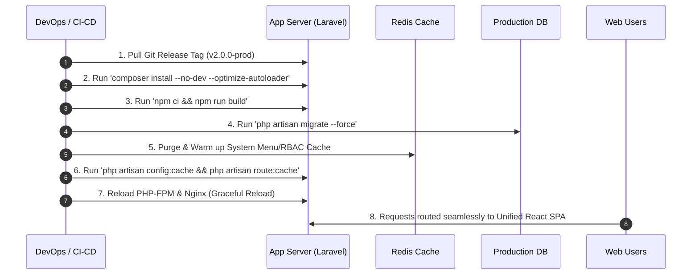

# Standar Operasional Prosedur (SOP) Cutover & Zero-Downtime Production Deployment
## Proyek Modernisasi Tech Stack BBKKP Polimer

---

## 1. Tujuan Dokumen
Dokumen ini menetapkan panduan teknis dan tahapan operasional untuk melakukan transisi (*Cutover*) dari arsitektur lama (Blade SSR Metronic) ke **Unified React 18 + Vite SPA** pada lingkungan *Production* dengan prinsip **Zero-Downtime** (tanpa gangguan layanan kepada pengguna dan pemohon balai).

---

## 2. Matriks Tanggung Jawab Tim (RACI Matrix)

| Peran | Penanggung Jawab | Tugas Utama |
| :--- | :--- | :--- |
| **Lead Architect / DevOps** | Lead Engineer | Eksekusi build, konfigurasi web server (Nginx), switching route, verifikasi cache. |
| **Backend Engineer** | Tim Backend | Eksekusi database migration, warm-up Redis cache, verifikasi webhook BNI & TTE BSrE. |
| **QA / Tester** | QA Lead | Pengujian Smoke Test pra & pasca cutover pada rute kritis. |
| **Product Owner / Balai** | Koordinator TI BBKKP | Otorisasi Final Go/No-Go Decision dan pengumuman cutover. |

---

## 3. Checklist Pra-Cutover (Pre-Deployment Checklist)

Lakukan verifikasi berikut sebelum memulai jendela cutover:
- [ ] **Database Backup Penuh**: Eksekusi snapshot & dump database production:
  ```bash
  pg_dump -h localhost -U postgres -d bbkkp_polimer_prod > /backup/polimer_pre_cutover_$(date +%Y%m%d_%H%M%S).sql
  ```
- [ ] **Object Storage MinIO/S3 Backup**: Pastikan bucket file lampiran tersinkronisasi.
- [ ] **Environment Variables Audit**: Pastikan `.env` production memiliki kredensial aktif:
  - `VITE_APP_ENV=production`
  - `SANCTUM_STATEFUL_DOMAINS` & `SESSION_DOMAIN`
  - `BNI_VA_CLIENT_ID`, `BNI_VA_SECRET_KEY`
  - `BSRE_TTE_API_URL`, `BSRE_TTE_API_KEY`
- [ ] **Staging Sign-Off**: Seluruh skenario E2E dan Unit Test lolos 100% pada staging server.

---

## 4. Tahapan Eksekusi Cutover (Zero-Downtime Deployment Flow)



### Rincian Perintah Eksekusi:

```bash
# 1. Masuk ke direktori aplikasi
cd /var/www/bbkkp-polimer

# 2. Ambil tag release final
git fetch --tags
git checkout tags/v2.0.0-release -b release-v2.0.0

# 3. Instalasi dependensi backend
composer install --no-dev --optimize-autoloader

# 4. Build asset frontend production teroptimasi
npm ci
npm run build

# 5. Eksekusi migrasi database jika ada penambahan kolom
php artisan migrate --force

# 6. Optimasi cache Laravel
php artisan config:clear
php artisan route:clear
php artisan view:clear
php artisan config:cache
php artisan route:cache
php artisan view:cache

# 7. Graceful reload PHP-FPM dan Web Server Nginx (Zero Downtime)
sudo systemctl reload php8.2-fpm
sudo systemctl reload nginx
```

---

## 5. Checklist Verifikasi Pasca-Cutover (Smoke Testing)

Segera setelah Nginx di-reload, QA dan tim teknis melakukan verifikasi berikut dalam waktu maksimal 15 menit:

| No | Modul / Fitur | Kriteria Keberhasilan | Status |
| :-: | :--- | :--- | :-: |
| 1 | **Portal Publik & Auth** | Homepage terbuka instan, login pemohon & pegawai berhasil tanpa error session. | [ ] |
| 2 | **Customer SPA Dashboard** | Data permohonan tampil rapi via TanStack Query tanpa reload browser. | [ ] |
| 3 | **Wizard Permohonan** | Formulir 4-step dapat disubmit dan berkas terunggah ke S3/MinIO. | [ ] |
| 4 | **Admin Dual-Rail Shell** | Admin layout terbuka cepat, menu terfilter sesuai RBAC peran yang aktif. | [ ] |
| 5 | **Verifikasi & Approval** | Verifikator dapat menyetujui berkas dan notifikasi terkirim. | [ ] |
| 6 | **Finance & Billing BNI** | Invoice billing terbit dan nomor VA BNI dapat digenerate. | [ ] |
| 7 | **Sertifikat & TTE BSrE** | Dokumen sertifikat PDF ter-render dengan QR Code dan signature digital. | [ ] |

---

## 6. Prosedur Mitigasi & Rollback Instan (Fallback Plan)

Apabila ditemukan anomali kritis pada sistem yang tidak dapat diatasi dalam batas waktu 30 menit pasca cutover:

1. **Trigger Rollback**: Keputusan diambil oleh Lead Architect & Product Owner.
2. **Eksekusi Rollback Kode**:
   ```bash
   # Switch kembali ke commit stabil sebelumnya
   git checkout v1.9.9-stable
   npm ci && npm run build
   php artisan config:cache && php artisan route:cache
   sudo systemctl reload php8.2-fpm
   sudo systemctl reload nginx
   ```
3. **Restore Database (Jika terjadi kerusakan data)**:
   ```bash
   psql -h localhost -U postgres -d bbkkp_polimer_prod < /backup/polimer_pre_cutover_XXXXXX.sql
   ```
4. **Komunikasi Pemangku Kepentingan**: Kirim pemberitahuan status operasional kepada manajemen balai dan pengguna.
