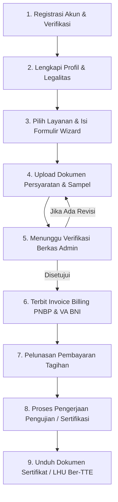

# Panduan Pengguna (User Manual) — Portal Pelanggan & Pemohon Layanan
## Balai Besar Standardisasi dan Pelayanan Jasa Industri Kulit, Karet dan Plastik (BBKKP)

---

## 1. Pendahuluan
Portal Pelanggan BBKKP Polimer adalah platform layanan publik terpadu untuk pengajuan permohonan jasa industri, meliputi **Pengujian Laboratorium**, **Kalibrasi Alat**, **Sertifikasi Profesi LSP**, dan **Bimbingan Teknis / Pelatihan Industri**.

Aplikasi ini berbasis *Unified React SPA* yang responsif di seluruh perangkat (desktop, tablet, dan smartphone) dengan integrasi notifikasi real-time dan pembayaran daring otomatis melalui Virtual Account BNI.

---

## 2. Alur Penggunaan Layanan (Customer Journey)

---

## 3. Panduan Langkah Demi Langkah

### A. Registrasi Akun & Pengaturan Profil
1. Buka portal pada URL `https://polimer.bbkkp.go.id/auth/register`.
2. Masukkan **Nama Lengkap**, **Alamat Email**, **Nomor WhatsApp**, dan **Kata Sandi**.
3. Selesaikan verifikasi reCAPTCHA dan klik tombol **Daftar Akun**.
4. Setelah berhasil masuk ke Dashboard, lengkapi data profil sesuai kategori:
   - **Perorangan**: Masukkan NIK (16 digit), tempat/tanggal lahir, jenis kelamin, dan alamat domisili.
   - **Instansi Pemerintah**: Masukkan nama instansi, unit kerja, nama pimpinan, nama PIC, dan kontak dinas.
   - **Badan Usaha / Perusahaan**: Masukkan nama perseroan/CV, NPWP badan (15/16 digit), NIB, nama pimpinan, dan PIC teknis.

---

### B. Pengajuan Permohonan Layanan Baru
1. Masuk ke menu **Permohonan Layanan** pada navigasi sidebar.
2. Klik tombol **Buat Permohonan Baru**.
3. Pilih kategori layanan yang diinginkan:
   - **Pengujian Laboratorium**: Pengujian bahan kulit, karet, plastik, alas kaki, barang teknik, dan komoditi SNI/ISO.
   - **Kalibrasi**: Kalibrasi instrumen suhu, massa, tekanan, volumetrik, dan dimensi.
   - **Sertifikasi LSP**: Uji kompetensi asesor, petugas pengambil contoh, analis lab polimer.
   - **Bimbingan Teknis & Pelatihan**: Pelatihan teknologi formulasi karet, vulkanisasi, penyamakan kulit, dan ekstrusi plastik.
4. Ikuti tahapan **Form Wizard Multi-Step**:
   - **Langkah 1**: Pemilihan lingkup, komoditi, dan parameter uji.
   - **Langkah 2**: Pengisian detail sampel (kode sampel, deskripsi, jumlah kemasan, kondisi penyimpanan).
   - **Langkah 3**: Unggah dokumen legalitas atau form APL (dalam format PDF/JPG maks 5MB).
   - **Langkah 4**: Ringkasan konfirmasi dan persetujuan pernyataan keabsahan data.
5. Klik **Kirim Permohonan**. Sistem akan menerbitkan **Nomor Order (ORD-YYYYMM-XXXX)** dan *QR Code Tracking*.

---

### C. Pelacakan Status & Revisi Dokumen
1. Buka menu **Dashboard** atau **Permohonan**.
2. Setiap permohonan memiliki indikator status visual:
   - 🟡 **Menunggu Verifikasi**: Berkas sedang ditinjau oleh petugas loket/verifikator balai.
   - 🟠 **Butuh Revisi**: Terdapat dokumen yang kurang jelas atau tidak sesuai. Buka detail permohonan, baca catatan revisi petugas, dan unggah ulang dokumen perbaikan.
   - 🔵 **Menunggu Pembayaran**: Berkas disetujui dan invoice PNBP telah diterbitkan.
   - 🟣 **Proses Lab / Asesmen**: Sampel sedang diuji di laboratorium atau peserta sedang dijadwalkan uji kompetensi.
   - 🟢 **Selesai**: Laporan Hasil Uji (LHU) / Sertifikat resmi telah diterbitkan.

---

### D. Pembayaran Tagihan PNBP & Virtual Account BNI
1. Pada status **Menunggu Pembayaran**, klik tombol **Lihat Tagihan / Bayar**.
2. Anda akan mendapatkan:
   - **Nomor Billing SIMPONI**.
   - **Nomor Virtual Account (VA) Bank BNI** (16 digit).
   - **Batas Waktu Pembayaran (Expired Time)**.
   - Rincian biaya per parameter tarif PNBP.
3. Lakukan transfer melalui ATM BNI, BNI Mobile Banking, atau Antar-Bank (Transfer Online/BI-FAST).
4. Status pembayaran akan terverifikasi **otomatis secara instan** (maksimal 1-2 menit setelah transfer berhasil).
5. Kuitansi Lunas Resmi ber-TTE dapat langsung diunduh pada tab **Riwayat Pembayaran**.

---

### E. Mengunduh Sertifikat & Laporan Hasil Uji (LHU)
1. Setelah pengujian laboratorium selesai dan ditandatangani secara elektronik (TTE BSrE), status akan berubah menjadi **Selesai**.
2. Buka detail permohonan, lalu klik **Unduh Sertifikat Resmi (PDF)**.
3. Dokumen sertifikat dilengkapi dengan **QR Code Validasi Balai** dan **Tanda Tangan Elektronik Tersertifikasi BSrE BSSN** yang sah secara hukum.

---

### F. Pusat Bantuan, Tanya Jawab & Layanan Pengaduan
1. Apabila memerlukan konsultasi teknis atau informasi kendala, buka menu **Tanya Jawab (Ask Questions)**.
2. Buat tiket baru dengan memilih topik pertanyaan (misal: *Tarif & Layanan*, *Status Sampel*, *Kendala Pembayaran*).
3. Tim Customer Service dan Helpdesk Balai akan membalas pesan Anda secara langsung di dalam portal.
