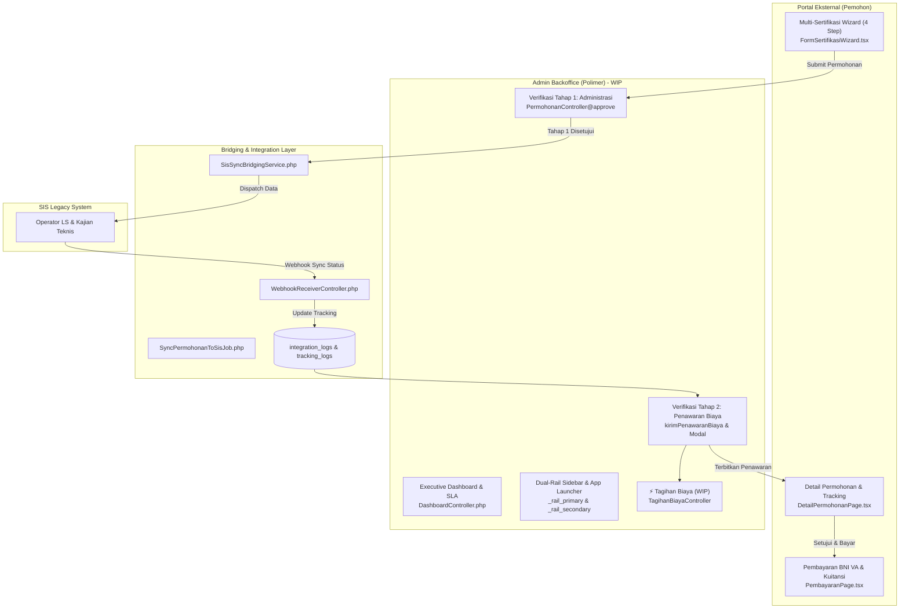

# 📋 Dokumentasi Perubahan Branch `polimer_sis` (7 Hari Terakhir)
**Author**: Fajar Permana Putra / Permanaff (`fajar.permanaf314@gmail.com`)  
**Repositori**: `Rayendraarya26/private-polimer`  
**Branch**: `polimer_sis`  
**Periode Analisis**: 02 September 2026 s/d 09 September 2026 (termasuk konteks 01 September 2026)  
**Status**: Admin section sedang dalam tahap pengerjaan (*Work-In-Progress*)  

---

## Executive Summary

Dalam 7 hari terakhir (02 September 2026 – 09 September 2026), telah dilakukan pengembangan skala besar (*major feature release & refactoring*) pada branch `polimer_sis` oleh **permanaff**. Pembaruan ini mencakup integrasi penuh sistem sertifikasi dua arah antara **Polimer** dan **SIS (Sistem Informasi Sertifikasi)**, alur pendaftaran multi-sertifikasi modern pada portal pemohon eksternal, mekanisme pembayaran digital BNI Virtual Account, perombakan layout admin (*Dual-Rail Sidebar* & *Operational Dashboard*), serta pembaruan alur verifikasi berkas permohonan.

Khusus untuk **bagian Admin Backoffice**, saat ini sedang dalam proses pengerjaan lanjutan (*active work-in-progress*), khususnya pada sub-modul **Manajemen Tagihan Biaya** (`TagihanBiayaController`) dan sinkronisasi status kajian teknis dari SIS.



---

## 📑 Ringkasan Log Git Commit (7 Hari Terakhir)

| Hash Commit | Tanggal & Waktu | Author | Pesan Commit & Ruang Lingkup |
| :--- | :--- | :--- | :--- |
| [`1aca9f7`](file:///f:/%21Productive/BBKKP/private-polimer/) | **09 Sep 2026, 09:05:59 WIB** | Fajar Permana Putra | `feat(core): implement bridging SIS, multi-sertifikasi flow, BNI VA payment, and dual-rail sidebar UI` *(82 files changed, +10.377 / -2.194 lines)* |
| [`798c6ac`](file:///f:/%21Productive/BBKKP/private-polimer/) | **07 Sep 2026, 15:43:19 WIB** | Fajar Permana Putra | `feat(integration): add auto-dispatch permohonan to SIS, webhook receiver, and sync master komoditi` *(48 files changed, +1.871 / -259 lines)* |
| [`cc59b07`](file:///f:/%21Productive/BBKKP/private-polimer/) | **02 Sep 2026, 15:33:40 WIB** | Permanaff | `refactor: rename services and update port mappings in docker-compose.yml` *(1 file changed, +14 / -15 lines)* |
| [`b7611db`](file:///f:/%21Productive/BBKKP/private-polimer/) | **02 Sep 2026, 15:33:07 WIB** | Permanaff | `feat: add MasterKomoditiSeeder to populate commodity data by service scope` *(3 files changed, +104 / -85 lines)* |

### 📌 Konteks Tambahan Tepat Sebelum Periode 7 Hari (01 September 2026):
* [`0f9110b`](file:///f:/%21Productive/BBKKP/private-polimer/) (01 Sep 2026, 15:10:49): `feat(tte): add dummy tte mode and enhance invoice approval error handling`
* [`a97951f`](file:///f:/%21Productive/BBKKP/private-polimer/) (01 Sep 2026, 15:10:44): `feat(permohonan): add detail form view for industrial certification (SRT)` (*Menambahkan view [sertifikasi-industri.blade.php](file:///f:/%21Productive/BBKKP/private-polimer/Modules/Permohonan/resources/views/layanan/forms/sertifikasi-industri.blade.php)*)

---

## 🔍 Detail Perubahan Berdasarkan Modul & Arsitektur

---

### 1. Bagian Admin & Backoffice (Status: SEDANG DALAM PENGERJAAN / WIP)

Bagian admin mengalami perombakan navigasi dan penyesuaian alur verifikasi sertifikasi industri. Saat ini bagian admin masih dalam tahap pengerjaan aktif oleh permanaff.

#### A. Revamp Layout Admin: Dual-Rail Sidebar & App Launcher
* **Dual-Rail Sidebar**:
  * `resources/views/layouts/partials/sidebar/_rail_primary.blade.php`: Kolom primer dengan ikon ringkas (Dashboard, Layanan Permohonan, Keuangan, Master Data, Pengaturan, Akun).
  * `resources/views/layouts/partials/sidebar/_rail_secondary.blade.php`: Kolom sekunder yang responsif memuat pohon navigasi kontekstual, sub-menu bertingkat, serta badge status.
  * `resources/views/layouts/app.blade.php`: Penyesuaian layout container global, grid CSS flex dual-rail, serta transisi toggle navigasi mobile/desktop.
* **App Launcher BBSPJIKKP Suite** (`_app_launcher.blade.php`):
  * Dropdown/modal terintegrasi di navbar untuk beralih antar aplikasi internal BBKKP (Polimer, SIS, SILAB, SILAP, E-Office, dan SSO Hub).
* **Helper Penanganan Menu**:
  * [MenuHelper.php](file:///f:/%21Productive/BBKKP/private-polimer/app/Helpers/MenuHelper.php): Menambahkan blok `try-catch` saat mengevaluasi `action($objMenu->controller)` untuk mencegah throw exception jika controller rute memerlukan parameter URL wajib.
  * `AuthTrait.php`: Mengambil kolom `sys_menu.desc` saat membangun permission tree grup pengguna untuk deskripsi menu.

#### B. Dashboard Operasional & Monitoring SLA ([DashboardController.php](file:///f:/%21Productive/BBKKP/private-polimer/Modules/Home/app/Http/Controllers/DashboardController.php))
* **Kartu Metrik KPI Eksekutif**:
  * `Total Permohonan Masuk Bulan Ini` dengan komparasi tren pertumbuhan persentase (`+14%`).
  * Hitungan antrean per status: *Menunggu Verifikasi*, *Sedang Diproses Lab/Asesor*, *Siap Terbit*, *Menunggu Pembayaran*, dan *Revisi Dokumen*.
* **Antrean Mendesak Berbasis SLA (*Urgent Permohonan Queue*)**:
  * Menampilkan 6 permohonan terlama dengan indikator tenggat waktu SLA (*Hari ini 16:00, Besok 12:00, 2 hari lagi*).
  * Label badges otomatis berdasarkan jenis permohonan (*LSPro SNI, LSP BNSP, Pelatihan, UMK*).
  * Tombol tautan cepat langsung ke halaman verifikasi detail permohonan.
* **Realisasi Penerimaan Negara Bukan Pajak (PNBP)**:
  * Kalkulasi pendapatan riil berstatus `LUNAS` dari tabel `detail_pembayaran` dibandingkan dengan target bulanan instansi (Rp 180.000.000,-).

#### C. Alur Verifikasi & Persetujuan Permohonan Bertahap ([PermohonanController.php](file:///f:/%21Productive/BBKKP/private-polimer/Modules/Permohonan/app/Http/Controllers/PermohonanController.php))
Khusus untuk permohonan Sertifikasi Industri (`CERT` / `SRT` / `FormSertifikasi`), alur approval dipecah menjadi 2 tahap terpisah:
1. **Tahap 1: Verifikasi Administrasi (Status `PERMOHONAN` $\rightarrow$ `IN_REVIEW`)**:
   * Tim Marketing memeriksa validitas kelengkapan legalitas perusahaan, data pabrik, dan spesifikasi produk.
   * Saat disetujui, status berubah menjadi `IN_REVIEW` dengan catatan *"Verifikasi administrasi disetujui Marketing. Permohonan diteruskan ke Operator LS di SIS"*.
   * Mencatat riwayat milestone di tabel `permohonan_tracking_logs` dengan kode `VERIFIKASI_ADMINISTRASI_ACCEPTED`.
   * **Pemicu Otomatis Integrasi SIS**: Memanggil `SisSyncBridgingService::syncPermohonanToSis($permohonan)` untuk membuat tiket di sistem SIS legacy.
2. **Tahap 2: Penerbitan Surat Penawaran Biaya (Status `IN_REVIEW` $\rightarrow$ `PEMBAYARAN` / `MENUNGGU_PERSETUJUAN_PELANGGAN`)**:
   * Dilakukan setelah kajian teknis operator LS di SIS menetapkan ruang lingkup audit dan mandays.
   * Marketing menginput total nominal biaya dan mengunggah dokumen PDF resmi Surat Penawaran Biaya.
   * Sistem membuat baris `detail_pembayaran`, record `permohonan_penawaran_biaya`, serta tracking log `PENAWARAN_BIAYA_TERKIRIM`.
   * Notifikasi otomatis dikirimkan ke akun pemohon.
* **Antarmuka Modal Persetujuan Adaptif** ([approval.blade.php](file:///f:/%21Productive/BBKKP/private-polimer/Modules/Permohonan/resources/views/layanan/components/approval.blade.php)):
  * Jika status `PERMOHONAN`: Menampilkan kartu informasi Verifikasi Administrasi dan tombol *"Terima Pengajuan"* tanpa field nominal.
  * Jika status `IN_REVIEW`: Menampilkan kartu Tahap 2 Penerbitan Surat Penawaran Biaya lengkap dengan input nominal dan upload dokumen penawaran.

#### D. Detail Form Sertifikasi Industri ([sertifikasi-industri.blade.php](file:///f:/%21Productive/BBKKP/private-polimer/Modules/Permohonan/resources/views/layanan/forms/sertifikasi-industri.blade.php))
* Menyajikan data pengajuan sertifikasi industri secara terstruktur:
  * **Profil Perusahaan & Kontak Person**.
  * **Tabel Multi-Komoditas / Produk**: Menampilkan nama komoditas, standar SNI, merek, tipe, jenis kemasan, dan link berkas spesifikasi teknis.
  * **Tabel Multi-Fasilitas Pabrik**: Menampilkan lokasi pabrik, luas area, jumlah lini produksi, kapasitas, serta shift tenaga kerja.
  * **Daftar Dokumen Persyaratan**: NIB, Akta Pendirian, IUI, Sertifikat ISO, Diagram Alir Produksi, dan Dokumen Merek.

#### E. ⚠️ Komponen Admin dalam Tahap Pengerjaan (*Work-In-Progress* oleh permanaff)
Berdasarkan pengecekan kode sumber per 09 September 2026:
1. **Rute Modul Tagihan Biaya Telah Didaftarkan**:
   * Pada [Modules/Permohonan/routes/web.php](file:///f:/%21Productive/BBKKP/private-polimer/Modules/Permohonan/routes/web.php), rute baru telah dipersiapkan:
     ```php
     Route::prefix('tagihan-biaya')->name('permohonan.tagihan-biaya.')->group(function() {
         Route::get('/', [TagihanBiayaController::class, 'index'])->name('index');
         Route::get('/ajax', [TagihanBiayaController::class, 'ajax'])->name('ajax');
         Route::put('/{id}/edit', [TagihanBiayaController::class, 'edit'])->name('edit');
         Route::post('/{id}/kirim', [TagihanBiayaController::class, 'index'])->name('index');
     });
     ```
   * *Status saat ini*: Controller `TagihanBiayaController.php` dan tampilan Blade-nya belum selesai di-commit (masih dalam penulisan oleh permanaff).
2. **Endpoint `kirimPenawaranBiaya`**:
   * Method `PermohonanController@kirimPenawaranBiaya` telah dibuat untuk menerima array rincian biaya (`rincian_item`), file PDF surat penawaran, dan catatan marketing, namun integrasi UI modal admin untuk rincian per-item masih disempurnakan.
3. **Penyelarasan Status Sinkronisasi SIS di Admin**:
   * Endpoint `retrySyncSis` telah disediakan untuk admin melakukan retry manual jika bridging ke SIS gagal. Antarmuka tabel tombol retry saat ini sedang dipoles.

---

### 2. Integrasi & Bridging SIS (Sistem Informasi Sertifikasi)

Fitur integrasi dibangun pada commit `798c6ac` dan disempurnakan pada `1aca9f7` untuk memastikan alur data permohonan sertifikasi Polimer sinkron dengan sistem SIS legacy BBSPJIKKP.

```
+-------------------+           +---------------------------------------+           +-------------------+
|   BBKKP Polimer   |           |             Integrasi SIS             |           |     BBKKP SIS     |
|   (Portal Baru)   |           |        (Modules/Webhook Layer)        |           |  (Database/Admin) |
+-------------------+           +---------------------------------------+           +-------------------+
          |                                         |                                         |
          | --- 1. Verifikasi Admin Selesai ------> |                                         |
          |                                         | --- 2. SisSyncBridgingService --------> |
          |                                         |        Push Permohonan, Komoditi, Berkas|
          |                                         |                                         |
          |                                         | <--- 3. Webhook Callback Event -------- |
          |                                         |        (Kajian Selesai / Biaya SIS)     |
          | <--- 4. Update Status & Milestone ----- |                                         |
          |      (permohonan_tracking_logs)         |                                         |
```

* **Modul Baru `Modules/Webhook`**:
  * `WebhookReceiverController.php`: Endpoint penerima callback webhook dari SIS (`POST /webhook/sis/sync`). Menerima pembaruan status kajian teknis, penetapan mandays audit, dan biaya dari tim SIS.
  * `SisSyncBridgingService.php`: Service sentral yang mengonstruksi payload transaksi sertifikasi Polimer ke skema API SIS.
  * `DispatchPermohonanToSisJob.php` & `SyncPermohonanToSisJob.php`: Antrean background (queue) untuk pengiriman data asinkron agar tidak membebani pemohon maupun admin saat klik tombol approve.
  * `VerifyWebhookSignature.php`: Middleware keamanan HMAC-SHA256 untuk memvalidasi token dan header signature kiriman webhook.
* **Struktur Database Baru untuk Integrasi**:
  * `permohonan` table: Penambahan kolom `sis_id`, `sis_status`, `sis_sync_at`, `sis_sync_error`.
  * `integration_logs` table & `IntegrationLog.php`: Mencatat seluruh audit trail lalu lintas data keluar-masuk API SIS (endpoint, payload request, status code, response body).
  * `permohonan_tracking_logs` table & `PermohonanTrackingLog.php`: Riwayat lengkap timeline status permohonan (*Verifikasi Administrasi*, *Sinkronisasi SIS*, *Kajian Teknis*, *Penawaran Biaya*, *Pembayaran*, dll.).
  * `permohonan_penawaran_biaya` table & `PermohonanPenawaranBiaya.php`: Menyimpan draf dan dokumen penawaran biaya yang disinkronkan antara SIS dan Polimer.

---

### 3. Alur Pendaftaran Multi-Sertifikasi (Portal Eksternal)

Mekanisme pendaftaran sertifikasi industri dirombak total menggunakan wizard React 18 dengan dukungan multi-komoditas dan multi-pabrik dalam satu permohonan.

* **Komponen Wizard 4 Langkah (`FormSertifikasiWizard.tsx`)**:
  * `Step1JenisPermohonan.tsx`:
    * Pemilihan skema sertifikasi: *Sertifikasi Baru*, *Perpanjangan / Resertifikasi*, *Surveilan Berkala*, *Perluasan Lingkup*, dan *Transfer Sertifikasi*.
    * Integrasi riwayat sertifikat aktif yang sudah pernah dimiliki pemohon.
  * `Step2KategoriDanKomoditi.tsx`:
    * Penambahan dinamis multi-komoditas permohonan.
    * Pemilihan standar SNI terkait secara dinamis.
    * Form spesifikasi komoditas: Nama komoditi, merek, tipe/model, jenis kemasan, dan upload file spesifikasi teknis per item.
  * `Step3PerusahaanDanPabrik.tsx`:
    * Auto-populate berkas legalitas dari profil perusahaan (Akta Perusahaan, NIB, IUI).
    * Penambahan dinamis multi-lokasi fasilitas pabrik / lini produksi.
    * Input detail data ketenagakerjaan: Manajemen, staf administrasi, pekerja operasional, shift kerja (1, 2, 3), pekerja paruh waktu, dan pekerja alih daya.
    * Unggah berkas sistem manajemen: Manual Mutu ISO 9001/14001, diagram alir produksi, layout pabrik, dan sertifikat merek DJKI.
  * `Step4PernyataanKonfirmasi.tsx`:
    * Tabulasi ringkasan seluruh data pengajuan dan daftar checklist berkas yang diunggah.
    * Estimasi tagihan awal dan persetujuan pakta integritas kejujuran data.
* **Fitur Edit & Detail Permohonan**:
  * `EditFormSertifikasi.tsx` & `EditFormRouter.tsx`: Memungkinkan pemohon mengedit kembali draf atau berkas permohonan saat berstatus `REVISI`.
  * `DetailPermohonanPage.tsx`: Antarmuka pelacakan real-time bagi pemohon, visualisasi timeline status, tampilan rincian penawaran biaya, dan tombol aksi persetujuan penawaran (*Accept Offer*).
* **State Management & Types**:
  * `useSertifikasi.tsx`: Hook TanStack Mutation untuk handle form submission multipart FormData.
  * `types/sertifikasi.ts`: Definisi interface TypeScript lengkap mencakup `FormSertifikasiData`, `KomoditasItem`, `PabrikItem`, dan payload API.

---

### 4. Sistem Penagihan & Pembayaran BNI Virtual Account (e-Collection)

* **Skema Database Pembayaran**:
  * Migrasi `2026_04_04_000001_add_bni_va_fields_to_permohonan_table.php`: Menambahkan field `nomor_va`, `va_status`, `va_expired_at`, dan metadata transaksi.
  * Migrasi `2026_04_04_000002_create_bni_va_logs_table.php`: Menyimpan riwayat log panggilan dan webhook BNI VA untuk menjaga idempotensi.
* **Kuitansi Digital Otomatis**:
  * `GenerateKwitansiDigitalJob.php`: Antrean job untuk menghasilkan file Kuitansi Pembayaran resmi berformat PDF lengkap dengan tanda tangan QR code verifikasi setelah pembayaran dinyatakan lunas.
* **Antarmuka Pemohon (`PembayaranPage.tsx` & `usePembayaran.tsx`)**:
  * Tampilan rincian invoice pembayaran dan kartu informasi nomor BNI Virtual Account.
  * Panduan cara pembayaran interaktif (ATM BNI, BNI Mobile Banking, Internet Banking, dan Transfer Antar Bank / ATM Bersama).
  * Auto-polling status pembayaran dan tombol unduh kuitansi digital instan.

---

### 5. Master Data Komoditi & Pengaturan Lingkungan Docker

* **Master Data Komoditi Berdasarkan Lingkup Layanan (`MasterKomoditiSeeder.php`)**:
  * Pembaruan data seeder komoditas standar BBSPJIKKP yang dipetakan langsung ke `lingkup_layanan_id`:
    1. **Sertifikasi Produk (SPPT SNI)**: Ban kendaraan, helm pengemudi, sepatu pengaman, sarung tangan lateks, pipa PVC air minum, dsb.
    2. **Sertifikasi Halal Reguler & UMK**: Kemasan makanan/minuman plastik, kerajinan kulit, peralatan makan polimer food grade.
    3. **Sistem Manajemen Mutu (ISO 9001)**: Industri manufaktur polimer, karet, dan penyamakan kulit.
    4. **Sistem Manajemen Lingkungan (ISO 14001)**: Industri daur ulang plastik, fasilitas IPAL penyamakan kulit.
    5. **Industri Hijau**: Crumb rubber hijau, penyamakan kulit ramah lingkungan.
    6. **Industri 4.0 (INDI 4.0)**: Smart factory lini ekstrusi/injeksi plastik, otomasi manufaktur alas kaki.
* **Penataan Port Docker Co-Existence (`docker-compose.yml`)**:
  * Untuk mencegah konflik port saat developer menjalankan project BBKKP lain (SIS dan `bbkkp-internal-service`) di lingkungan WSL/Docker:
    * Service `private_polimer` $\rightarrow$ `private_polimer_2_wsl` (Port `4903:80`).
    * Service `mysql` $\rightarrow$ `mysql_wsl` (Port `3311:3306`).
    * Service `minio` $\rightarrow$ `minio_wsl` (Port `9004:9000` API, `9005:9001` Console).

---

## 📊 Matriks Status Komponen

| Modul / Komponen | Status Implementasi | Author | Keterangan |
| :--- | :---: | :--- | :--- |
| **Frontend Multi-Sertifikasi Wizard** | 🟢 **Selesai** | Fajar Permana Putra | 4-step wizard, komoditi SNI dinamis, multi-pabrik, auto-populate profil |
| **Detail & Tracking Permohonan Eksternal** | 🟢 **Selesai** | Fajar Permana Putra | Timeline live, surat penawaran biaya, dokumen preview |
| **Pembayaran BNI VA & Kuitansi PDF** | 🟢 **Selesai** | Fajar Permana Putra | Virtual account issuance, auto-polling bayar, auto job kuitansi |
| **Bridging & Sync SIS Legacy** | 🟢 **Selesai** | Fajar Permana Putra | Service bridging, webhook receiver, tracking logs, integration logs |
| **Master Komoditi Seeder (SNI & Lingkup)** | 🟢 **Selesai** | Permanaff | Tersegmentasi rapi per skema sertifikasi (SNI, Halal, ISO, Hijau) |
| **Docker WSL Environment Setup** | 🟢 **Selesai** | Permanaff | Port mapping aman tanpa konflik (4903, 3311, 9004, 9005) |
| **Dual-Rail Sidebar & App Launcher** | 🟢 **Selesai** | Fajar Permana Putra | Layout admin modern, responsive tree, switch aplikasi balai |
| **Executive Dashboard Operasional** | 🟢 **Selesai** | Fajar Permana Putra | KPI card bulanan, SLA countdown antrean mendesak, target PNBP |
| **Admin Permohonan Approval Bertahap** | 🟢 **Selesai** | Fajar Permana Putra | Tahap 1 Verifikasi $\rightarrow$ IN_REVIEW $\rightarrow$ Sync SIS; Tahap 2 Penawaran Biaya |
| **Admin Tagihan Biaya (`TagihanBiayaController`)** | 🟡 **Sedang Dikerjakan (WIP)** | Permanaff | Rute telah terdaftar di `routes/web.php`, controller & view sedang disusun |
| **Admin Modal Rincian Penawaran Per-Item** | 🟡 **Sedang Dikerjakan (WIP)** | Permanaff | Backend `kirimPenawaranBiaya` siap, form input rincian tabel sedang diselaraskan |

---

## 🎯 Rekomendasi Langkah Kerja Selanjutnya (Next Action Items)

1. **Penyelesaian Modul Tagihan Biaya Admin**:
   * Buat controller `Modules/Permohonan/app/Http/Controllers/TagihanBiayaController.php` untuk memenuhi rute yang sudah didaftarkan (`index`, `ajax`, `edit`, `kirim`).
   * Sediakan view DataTables tagihan biaya permohonan sertifikasi industri dengan kolom: No. Permohonan, Pemohon, Jenis Sertifikasi, Nominal Penawaran, Status VA, dan Aksi Kirim Tagihan.
2. **Penyelarasan Form Penawaran Biaya Rinci**:
   * Sediakan modal form dinamis pada admin detail permohonan untuk menginput multi-baris biaya (misal: Biaya Administrasi, Biaya Asesmen Mandays, Biaya Pengujian Laboratorium) yang tersimpan ke format JSON `rincian_json` pada tabel `permohonan_penawaran_biaya`.
3. **Pengujian Integrasi End-to-End di Lingkungan Lokal**:
   * Jalankan container Docker WSL (`docker-compose up -d`) dengan port 4903.
   * Uji submit sertifikasi dari sisi pemohon eksternal $\rightarrow$ Verifikasi Administrasi oleh Admin $\rightarrow$ Dispatch ke SIS $\rightarrow$ Webhook callback $\rightarrow$ Penerbitan penawaran biaya $\rightarrow$ Pembayaran VA.
