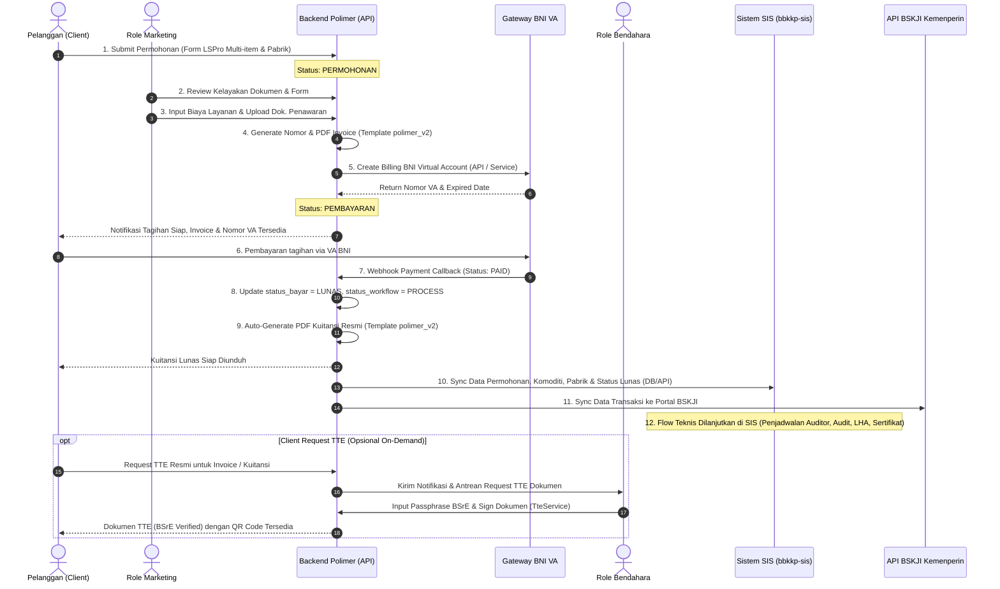

# Dokumentasi Penyesuaian Alur Invoicing, Kuitansi, TTE On-Demand & Data Bridging (Polimer ↔ SIS & BSKJI)

> **Dokumen Spesifikasi Teknis & Alur Bisnis Baru**  
> **Balai Besar Standardisasi dan Pelayanan Jasa Industri Kulit, Karet, dan Plastik (BBSPJIKKP)**  
> **Kementerian Perindustrian Republik Indonesia**  
> **Versi**: 2.2 (Post-Mentor Discussion Alignment)  
> **Tanggal**: 1 September 2026

---

## 1. Latar Belakang & Ringkasan Perubahan

Berdasarkan hasil diskusi dan arahan mentor terkait integrasi **BBKKP Polimer** dengan **Sistem Informasi Sertifikasi (SIS)** dan **BSKJI Kemenperin**, terdapat penyesuaian alur kerja operasional (*business process*) pada modul keuangan, verifikasi permohonan, penerbitan dokumen finansial (Invoice & Kuitansi), TTE (Tanda Tangan Elektronik), serta sinkronisasi data bridging.

### Perbandingan Alur:

```
[ ALUR SEBELUMNYA (polimer_v2) ]
Client Input Permohonan 
  ↳ Admin Approve & Input Nominal 
    ↳ Bendahara WAJIB Manual TTE Invoice (Passphrase BSrE) 
      ↳ Client Bayar VA 
        ↳ Bendahara Approve Kuitansi / Manual Generate Kuitansi

========================================================================================

[ ALUR BARU YANG DISEPAKATI ]
Client Input Permohonan
  ↳ 1. Verifikasi Kelayakan Administratif oleh Tim MARKETING
    ↳ 2. Tim MARKETING Menginput Rincian Biaya & Dokumen Penawaran
      ↳ 3. AUTO-GENERATE Invoice (Format polimer_v2) & BNI Virtual Account (VA)
        ↳ 4. Client Melakukan Pembayaran VA
          ↳ 5. AUTO-GENERATE Kuitansi Resmi (Format polimer_v2) saat Callback LUNAS
            ↳ 6. AUTO-BRIDGING: Kirim Data Permohonan & Pembayaran ke SIS & BSKJI
              ↳ 7. FLOW TEKNIS DILANJUTKAN DI SIS (Audit, PPC, Lab, Komite, Sertifikat)
                
* FITUR TAMBAHAN (ON-DEMAND):
  ↳ Client dapat mengajukan "Request TTE" untuk Invoice / Kuitansi.
  ↳ Jika ada request, notifikasi & antrean TTE dikirim ke BENDAHARA untuk di-sign via BSrE.
```

---

## 2. Diagram Alur Sistem (Sequence & Flowchart)



---

## 3. Rincian Teknis Setiap Tahapan

### Tahap 1: Pengajuan Permohonan oleh Client
- Client mengisi formulir **LSPro** melalui antarmuka Wizard 4 langkah di Polimer:
  - **Step 1**: Jenis Permohonan (Baru / Perpanjangan dengan dropdown referensi sertifikat lama, batas maks 2 pengajuan).
  - **Step 2**: Data Komoditas (Form Tambah Komoditi) & Daftar Komoditi Permohonan (Tabel), serta Kelengkapan Dokumen Persyaratan (Auto-populate dokumen legalitas dari profil perusahaan).
  - **Step 3**: Data Perusahaan, Data Lokasi Perusahaan, Data Operasional & Karyawan (Manajemen, Administrasi, Operasional Shift 1-3, Part-Time, Non-Permanen), Data Pabrik/Fasilitas Multi-Lokasi, dan Berkas Kelengkapan Permohonan (Form 1, 2, 3).
  - **Step 4**: Pakta Integritas & Konfirmasi Pengiriman.

#### 📍 Aturan Khusus Pengisian Wilayah & Lokasi (Perusahaan & Pabrik):
1. **Dropdown Bertingkat dari Data Master Wilayah**:
   - Pemilihan **Provinsi**, **Kabupaten/Kota**, dan **Kecamatan** wajib menggunakan komponen *dropdown* dinamis yang terhubung ke API Master Wilayah (`/eksternal/provinces`, `/eksternal/regencies/{provId}`, `/eksternal/districts/{regencyId}`).
   - Dropdown **Kabupaten/Kota** otomatis ter-filter dan aktif setelah Provinsi dipilih.
   - Dropdown **Kecamatan** otomatis ter-filter dan aktif setelah Kabupaten/Kota dipilih.
2. **Logika Kondisional Berdasarkan Negara (*Country-based Conditional Rendering*)**:
   - **Jika Negara = `Indonesia` (Domestik)**:
     * Field **Provinsi**, **Kabupaten/Kota**, dan **Kecamatan** wajib ditampilkan dan dipilih melalui dropdown master wilayah.
   - **Jika Negara $\neq$ `Indonesia` (Luar Negeri / Luar Domestik)**:
     * Field **Provinsi**, **Kabupaten/Kota**, dan **Kecamatan** **secara otomatis dihilangkan/disembunyikan** (*hidden*).
     * Input lokasi hanya membutuhkan kolom **Negara**, **Alamat Lengkap Kantor/Pabrik**, dan **Kode Pos** (opsional).
3. **Penerapan Multi-Entitas**:
   - Aturan wilayah dan kondisional negara ini berlaku seragam pada:
     - **Data Lokasi Perusahaan** (Kantor Pusat Pemohon)
     - **Data Pabrik & Fasilitas Produksi** (Setiap kartu fasilitas pabrik dalam fitur multi-lokasi).
- Permohonan tersimpan dengan `status_workflow = 'PERMOHONAN'` dan `status_bayar = 'BELUM'`.

---

### Tahap 2: Verifikasi Administratif & Input Biaya oleh Role Marketing
- **Pemisahan Hak Akses**: Tim **Marketing** memiliki akses verifikasi awal pada dashboard internal (`Modules/Permohonan` atau `Modules/Admin`).
- **Aksi Tim Marketing**:
  1. Melakukan validasi dokumen legalitas dan kelayakan teknis permohonan.
  2. Mengisi rincian tarif/komponen biaya (`nominal`, `item_bayar`, `kuantitas`) dan mengunggah dokumen surat penawaran harga (`dok_penawaran`).
  3. Menekan tombol **"Setujui & Terbitkan Tagihan"** (`approve`).

---

### Tahap 3: Auto-Generate Invoice & BNI Virtual Account (VA)
- Begitu Marketing menyetujui permohonan:
  1. **Invoice Auto-Generation**:
     - Sistem membuat nomor invoice resmi format: `INV/YYYYMMDD/XXXXX` atau `[no_permohonan]/INV`.
     - Data rincian pembayaran disimpan pada tabel `db2_detail_pembayaran`.
     - Template PDF Invoice menggunakan layout dari branch **`polimer_v2`** (`permohonan::layanan.invoice`) dengan DomPDF.
  2. **BNI VA Auto-Generation**:
     - Service `App\Libraries\BniVaService` secara otomatis memanggil API BNI E-Collection untuk membuat nomor Virtual Account (prefix dinamis + `trx_id`).
     - Nomor VA dan masa berlaku disimpan pada kolom `va`, `va_trx_id`, dan `va_expired_at` di tabel `db2_permohonan`.
  3. **Status Workflow**: Berubah menjadi `'PEMBAYARAN'`.
  4. **Notifikasi**: Sistem mengirimkan notifikasi internal dan email/WhatsApp kepada Client bahwa invoice dan VA siap dibayar.

---

### Tahap 4: Pembayaran oleh Client & Webhook Callback
- Client melakukan pembayaran melalui ATM, Mobile Banking, atau Internet Banking menggunakan nomor VA BNI yang tertera.
- **BNI Webhook Callback (`/api/v1/payment/bni/callback`)**:
  - Endpoint `BniWebhookController@handleCallback` menerima notifikasi pembayaran terenkripsi dari server BNI.
  - Sistem melakukan dekripsi payload, validasi nominal, dan pencocokan `trx_id`.
  - Status permohonan diperbarui secara transaksional (`DB::transaction`):
    * `status_bayar = 'LUNAS'`
    * `status_workflow = 'PROCESS'`
    * `va_status = 'PAID'`
    * `tgl_bayar = now()` pada `db2_detail_pembayaran`.

---

### Tahap 5: Auto-Generate Kuitansi Lunas (Format `polimer_v2`)
- Handler pembayaran langsung men-dispatch queue job: `App\Jobs\GenerateKwitansiDigitalJob`.
- **Proses Background Job**:
  1. Mengambil data transaksi dan nomor kuitansi resmi: `[no_permohonan]/KWT` atau `KWT/YYYYMMDD/XXXXX`.
  2. Merender PDF Kuitansi menggunakan template DomPDF branch **`polimer_v2`** (`permohonan::layanan.kuitansi`).
  3. Menyimpan berkas fisik PDF di storage publik: `storage/app/public/kuitansi/kuitansi-[no_permohonan].pdf`.
  4. Memperbarui record database: `kuitansi_number`, `kuitansi_file`, dan `kuitansi_generated_at`.
  5. Client langsung dapat melihat dan mengunduh berkas Kuitansi Lunas dari dashboard Polimer.

---

### Tahap 6: Pengiriman Data ke SIS & BSKJI (Data Bridging)
- Setelah pembayaran lunas dan kuitansi terbentuk:
  1. **Sinkronisasi ke SIS (`bbkkp-sis`)**:
     - Service `Modules\Integration\Services\SisSyncBridgingService` mengirimkan seluruh data permohonan, skema, komoditi JSON, pabrik JSON, dokumen persyaratan, dan status lunas ke database/API SIS.
     - Record di SIS berstatus *Siap Audit / Siap Penunjukan Tim Asesor*.
  2. **Sinkronisasi ke BSKJI**:
     - Service integration mengirimkan data metadata permohonan ke API BSKJI Kementerian Perindustrian untuk pencatatan PNBP dan registrasi layanan nasional.
  3. **Lanjutan di SIS**:
     - Tahapan teknis sertifikasi (penunjukan Lead Auditor, pelaksanaan Audit Tahap 1, Audit Lapangan Tahap 2, penerbitan LKS temuan, rapat Komite Sertifikasi, hingga penerbitan Sertifikat SNI) dilanjutkan oleh tim teknis di aplikasi **SIS (`bbkkp-sis`)**.

---

### Tahap 7: Fitur Khusus — Request TTE Invoice & Kuitansi (On-Demand)

#### Mekanisme Desain:
* **Mengapa On-Demand?**
  Tidak semua pelanggan instansi/perusahaan mewajibkan TTE tersertifikasi BSrE pada Invoice dan Kuitansi. Dokumen standar berbasis QR digital seal sistem sudah sah untuk kebutuhan umum. Dengan menjadikannya *opsional on-demand*, beban kerja tanda tangan Bendahara berkurang drastis dan proses bisnis berjalan lebih instan.
* **Alur Request TTE**:
  1. Pada halaman detail permohonan / riwayat pembayaran, Client memiliki tombol:
     * `[ Minta TTE Invoice ]`
     * `[ Minta TTE Kuitansi ]`
  2. Saat tombol diklik, sistem memperbarui status `tte_invoice_requested = true` atau `tte_kuitansi_requested = true`.
  3. Notifikasi dikirimkan ke dashboard **Role Bendahara**.
  4. **Role Bendahara**:
     * Membuka menu *"Antrean TTE Dokumen Keuangan"*.
     * Memeriksa dokumen, memasukkan **Passphrase BSrE**, dan menekan tombol *"Tandatangani Dokumen"*.
     * Sistem memanggil `TteService::signPDF()` ke internal service TTE.
     * File hasil TTE tersimpan dengan ID unik `pdf_tte` / `esign_id`.
  5. Client menerima notifikasi bahwa dokumen bertanda tangan elektronik resmi BSrE telah siap diunduh dan diverifikasi keasliannya via QR code `/tte/verify`.

---

## 4. Matriks Perubahan Basis Data & Kode Program

| Komponen | Lokasi File | Deskripsi Penyesuaian |
| :--- | :--- | :--- |
| **Model Permohonan** | `app/Models/Db2/Permohonan.php` | Menambahkan field flags request TTE: `tte_invoice_requested`, `tte_kuitansi_requested`, `tte_invoice_at`, `tte_kuitansi_at`. |
| **Controller Permohonan Admin** | `Modules/Permohonan/app/Http/Controllers/PermohonanController.php` | Memperbarui method `approve()` agar dijalankan oleh role `MARKETING`, sekaligus men-trigger auto-generate Invoice & BNI VA. |
| **Controller Invoice & Kuitansi** | `Modules/Permohonan/app/Http/Controllers/InvoiceController.php` | Mengadopsi generator Invoice & Kuitansi DomPDF dari `polimer_v2`, menambahkan endpoint antrean TTE untuk Bendahara. |
| **Job Kuitansi Otomatis** | `app/Jobs/GenerateKwitansiDigitalJob.php` | Memastikan PDF Kuitansi dibuat secara otomatis saat Webhook BNI callback sukses, lalu men-trigger `SisSyncBridgingService`. |
| **Bridging Service** | `Modules/Integration/app/Services/SisSyncBridgingService.php` | Menyempurnakan payload sinkronisasi data permohonan, pembayaran lunas, dan berkas ke SIS & BSKJI. |
| **UI Pemohon (React)** | `Modules/Eksternal/resources/assets/js/pages/service-requests/DetailPermohonanPage.tsx` | Menambahkan tombol aksi `Request TTE Invoice` dan `Request TTE Kuitansi` beserta badge status TTE. |
| **UI Keuangan / Bendahara** | `Modules/Permohonan/resources/views/layanan/` | Menyesuaikan modal approval TTE khusus saat terdapat permintaan TTE dari client. |

---

## 5. Kesimpulan & Langkah Selanjutnya

1. **Efisiensi Alur**: Alur baru menghilangkan bottleneck manual approval tanda tangan di awal proses sehingga Client dapat langsung membayar tagihan secara instan.
2. **Kesesuaian Legacy**: Template desain Invoice dan Kuitansi tetap 100% konsisten dengan standar branch **`polimer_v2`**.
3. **Fleksibilitas Legalitas**: Kebutuhan legalitas formal tersertifikasi BSrE tetap terakomodasi secara optimal melalui fitur **TTE On-Demand**.
4. **Keberlanjutan Sistem**: Data otomatis terdistribusi rapi ke sistem pusat **SIS** dan **BSKJI** setelah kewajiban finansial terselesaikan.
