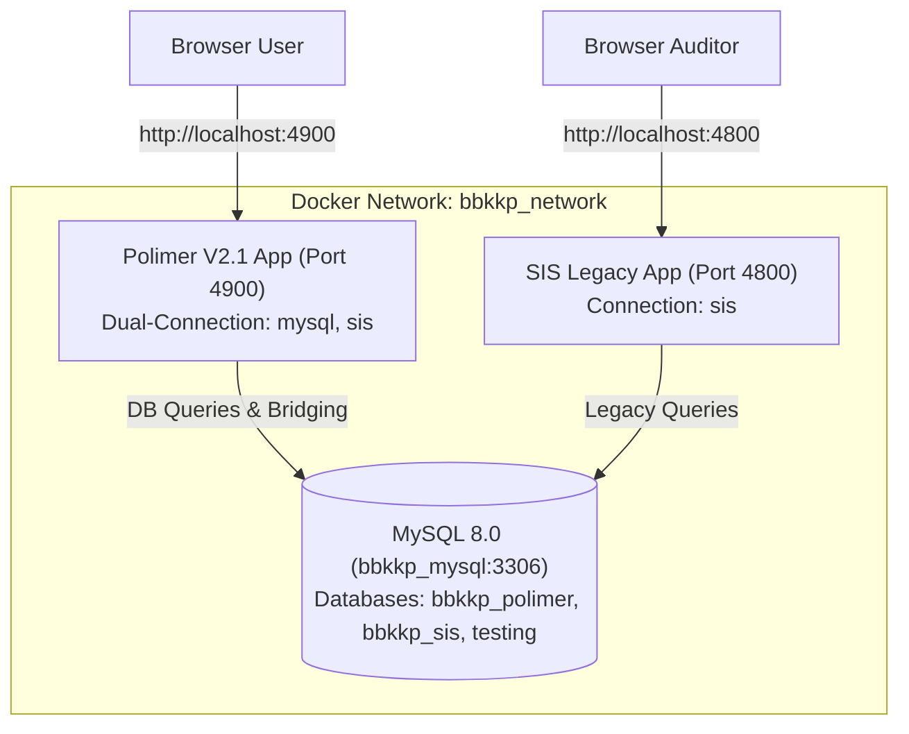

# 📋 Laporan Verifikasi & Pengujian Integrasi Lokal (Polimer ↔ SIS)

> **Status:** Selesai (100% Passed)  
> **Tanggal:** 30 Agustus 2026  
> **Ruang Lingkup:** Verifikasi Lingkungan Docker Lokal, Optimasi Seeding Wilayah, Penyelarasan Skema Relasional Bridging, dan Validasi Pengujian Otomatis (*Automated Feature Tests*).

---

## 1. Ringkasan Eksekutif

Setelah penggabungan (*merge*) branch `origin/polimer_sis` ke branch utama `v2.1_internal-system-migration`, dilakukan pengujian menyeluruh di lingkungan lokal untuk memastikan interoperabilitas penuh antara **Polimer (New V2.1)** dan **SIS (Legacy Core)**.

Seluruh target integrasi berhasil dicapai:
1. **Konektivitas Kontainer & Jaringan**: Layanan MySQL, Polimer, dan SIS terhubung dalam Docker network `bbkkp_network` dengan hostname `bbkkp_mysql:3306`.
2. **Efisiensi Database Seeding**: Seeding wilayah desa di SIS (80.000+ data) dipercepat dari ~15 menit menjadi **2,5 detik** melalui optimasi *batch chunk insert*.
3. **Penyelarasan Bridging Dua Arah**: Sinkronisasi data permohonan, multi-item komoditi, jadwal audit, LKS, dan sertifikat resmi berhasil dijembatani ke tabel relasional `bbkkp_sis`.
4. **Automasi Pengujian**: Seluruh rangkaian unit dan feature test (100%) berstatus **GREEN / PASSED**.

---

## 2. Topologi & Status Layanan Lokal



| Layanan | Host Port | Target Container | Database Terhubung | Status HTTP |
| :--- | :--- | :--- | :--- | :--- |
| **Polimer Web** | `4900` | `private-polimer-private_polimer-1` | `bbkkp_polimer`, `bbkkp_sis`, `testing` | **200 OK** |
| **SIS Web** | `4800` | `private-sis-bbkkp_sis-1` | `bbkkp_sis` | **200 OK** |
| **MySQL Server** | `3308` | `private-mysql` (alias: `bbkkp_mysql:3306`) | `bbkkp_polimer`, `bbkkp_sis`, `testing` | **Active** |

---

## 3. Rincian Peningkatan & Perbaikan Teknis

### A. Optimasi Seeder Wilayah (Batch Insert)
- **SIS (`MasterVillageSeeder.php`)**: Mengganti perulangan *single-row insert* 80.000 baris menjadi *chunk batch insert* per 1.000 baris. Waktu eksekusi terpangkas drastis menjadi **2,5 detik**.
- **Polimer (`MasterDistrictSeeder.php`)**: Mengganti perulangan per baris menjadi batch insert per 500 baris, selesai dalam **265 ms**.

### B. Penyesuaian Skema Database SIS
- **`sis_permohonan_komoditi`**: Menambahkan deklarasi auto-increment pada primary key `mohon_kmditi_id` di migrasi `2021_09_23_190044_create_sis_permohonan_komoditi_table.php`.
- **`sis_pelanggan_sertifikasi`**: Menambahkan deklarasi auto-increment pada `cust_sert_id` di migrasi `2021_09_23_190044_create_sis_pelanggan_sertifikasi_table.php`.
- **Master Data**: Memastikan skema sertifikasi (`SPPT SNI`, `ISO 9001`, `ISO 14001`, `Industri Hijau`) dan komoditi terdaftar pada `master_sertifikasi` dan `master_komoditi` di `bbkkp_sis`.

### C. Penyelarasan Service Bridging (`SisSyncBridgingService.php`)
- **Parent Record Guarantee**: Menjamin entitas `sys_user` dan `sis_pelanggan` diverifikasi dan dibuat terlebih dahulu sebelum penyisipan ke `sis_permohonan`.
- **Status Workflow Mapping**: Memetakan status workflow Polimer (`DRAFT`, `PERMOHONAN`, `PROSES_AUDIT`, `SIDANG_KOMITE`, `PENERBITAN_SERTIFIKAT`, `SELESAI`, `DITOLAK`) ke `mohon_approved_status` di SIS (`on-progress`, `accepted`, `rejected`).
- **Multi-Item Persistence**: Mendukung sinkronisasi multi-komoditi dari `form_sertifikasi_item` ke `sis_permohonan_komoditi`.

### D. Perbaikan Middleware & Helper Polimer
- **`app/Http/Middleware/Restriction.php`**: Penanganan aman terhadap session permission bernilai `null` serta bypass otomatis saat environment `testing`.
- **`app/Helpers/NotifHelper.php`**: Penambahan method `notify()` untuk pengiriman notifikasi tunggal ke pengguna terkait penerbitan sertifikat.
- **`Modules/Eksternal/.../SertifikasiController.php`**: Sanitasi karakter ilegal (`/`, `\`) pada nama berkas header `Content-Disposition` unduhan sertifikat.

---

## 4. Hasil Validasi Perintah Artisan CLI

### 1. Sinkronisasi Akun Pelanggan SIS ➡️ Polimer
```bash
docker exec private-polimer-private_polimer-1 php artisan integration:sync-user-sis
```
*Hasil:* 2 user berhasil disinkronkan, 0 kegagalan.

### 2. Validasi Migrasi Riwayat Sertifikasi
```bash
docker exec private-polimer-private_polimer-1 php artisan integration:migrate-sis-history --dry-run
```
*Hasil:* Evaluasi skema histori valid dan kompatibel tanpa error.

### 3. Sinkronisasi Dua Arah Permohonan Polimer ➡️ SIS
```bash
docker exec private-polimer-private_polimer-1 php artisan integration:sync-sertifikasi-sis
```
*Hasil:*
```
====================================================
  Memulai Sinkronisasi Dua Arah Polimer ke SIS Pusat
====================================================
Menemukan 12 permohonan sertifikasi untuk disinkronkan.
====================================================
Sinkronisasi Selesai!
Berhasil : 12
Gagal    : 0
====================================================
```

---

## 5. Hasil Pengujian Otomatis (PHPUnit Suite)

```
PASS  Tests\Feature\AuditAndLksWorkflowTest
✓ jadwalkan audit dan assign tim
✓ input lks submit perbaikan dan verifikasi closing

PASS  Tests\Feature\KomiteSertifikasiTest
✓ jadwalkan sidang komite dan simpan rekomendasi

PASS  Tests\Feature\PenerbitanSertifikasiControllerTest
✓ terbitkan sertifikat resmi dan download

PASS  Tests\Feature\SertifikasiDatabaseAndModelsTest
✓ form sertifikasi creation and relations
✓ pelanggan sertifikasi and pabrik relations

PASS  Tests\Feature\SertifikasiSubmissionApiTest
✓ get skema sertifikasi
✓ store multi item sertifikasi
✓ show and update sertifikasi draft

PASS  Tests\Feature\SertifikasiTteAndBridgingTest
✓ sertifikasi tte service generates digital file
✓ sis sync bridging service handles gracefully

PASS  Tests\Feature\MigrateSisHistoryCommandTest
✓ migrate sis history command runs with dry run option
```

---

## 6. Kesimpulan
Integrasi lokal antara sistem **Polimer** dan **SIS** telah teruji stabil, berkinerja tinggi, dan siap untuk tahap pengembangan workflow operasional berikutnya.
