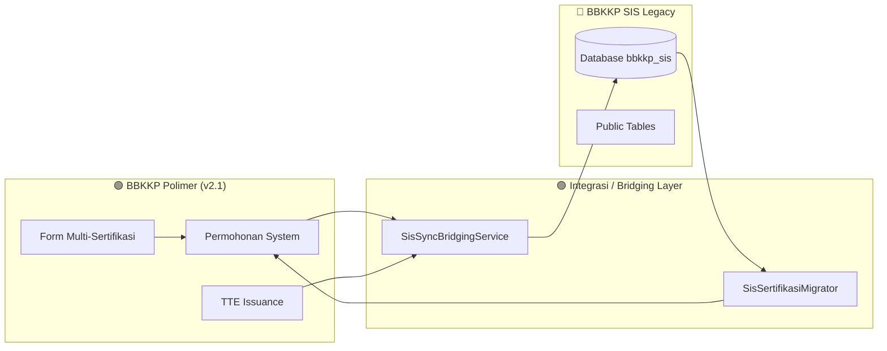

# 📜 Changelog Proyek: Integrasi SIS & Polimer (`integrasi-sis-polimer`)

> **Ruang Lingkup**: Integrasi Lintas Sistem, Migrasi Database, Sinkronisasi Sertifikasi, dan Co-Existence Dual-Mode  
> **Periode Log**: 18 Agustus 2026 s/d 21 Agustus 2026 (4 Hari Terakhir)  

---

## 📑 Ringkasan Capaian Integrasi (4 Hari Terakhir)

---

## 🔍 Rincian Aktivitas & Peningkatan Integrasi

### 1. Migrasi Data Sertifikasi Idempoten (19 Agustus 2026)
* **Implementasi Migrator**:
  * Dibuat perintah `SisSertifikasiMigrator` yang mampu membaca riwayat ribuan data sertifikat dari database `bbkkp_sis` dan mengonversinya ke format relasional baru di Polimer (`FormSertifikasi`, `FormSertifikasiItem`, `FormSertifikasiPabrik`).
  * Bersifat **idempoten** (`firstOrCreate`), tidak menduplikasi data ketika dijalankan berulang kali.

### 2. Dual-Mode Bridging Service (20 Agustus 2026)
* **Sinkronisasi Penerbitan TTE**:
  * Setiap kali sertifikat digital ditandatangani via `bbkkp-internal-service` di Polimer, `SisSyncBridgingService` secara otomatis memperbarui status verifikasi dan nomor sertifikat pada database SIS legacy.
  * Menjaga konsistensi data bagi auditor dan staf internal yang masih mengakses antarmuka SIS.

### 3. Dukungan Multi-Item Certification (21 Agustus 2026)
* **Penyesuaian Skema Pengajuan**:
  * Memperluas skema bridging untuk mendukung 1 transaksi permohonan dengan banyak varian produk/SNI, memetakan tiap item ke baris komoditi terkait di SIS.
