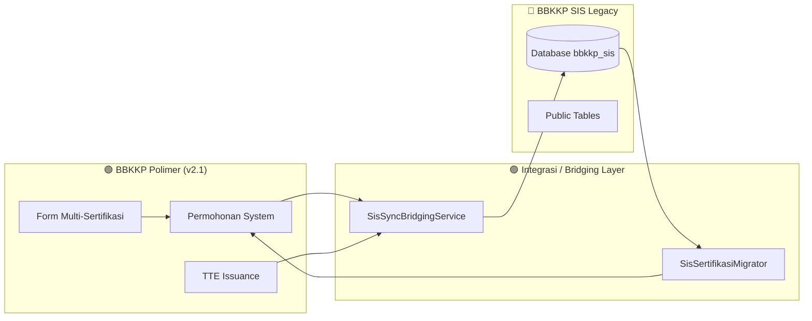

# 📜 Changelog Proyek: Integrasi SIS & Polimer (`integrasi-sis-polimer`)

> **Ruang Lingkup**: Integrasi Lintas Sistem, Migrasi Database, Sinkronisasi Sertifikasi, dan Co-Existence Dual-Mode  
> **Periode Log**: 18 Agustus 2026 s/d 21 Agustus 2026 (4 Hari Terakhir)  

---

## 📑 Ringkasan Capaian Integrasi (4 Hari Terakhir)

---

## 🔍 Rincian Aktivitas & Peningkatan Integrasi

### 1. Migrasi Data Sertifikasi Idempoten (19 Agustus 2026)
* **Implementasi Migrator**:
  * Dibuat perintah `SisSertifikasiMigrator` yang mampu membaca riwayat ribuan data sertifikat dari database `bbkkp_sis` dan mengonversinya ke format relasional baru di Polimer (`FormSertifikasi`, `FormSertifikasiItem`, `FormSertifikasiPabrik`).
  * Bersifat **idempoten** (`firstOrCreate`), tidak menduplikasi data ketika dijalankan berulang kali.

### 2. Dual-Mode Bridging Service (20 Agustus 2026)
* **Sinkronisasi Penerbitan TTE**:
  * Setiap kali sertifikat digital ditandatangani via `bbkkp-internal-service` di Polimer, `SisSyncBridgingService` secara otomatis memperbarui status verifikasi dan nomor sertifikat pada database SIS legacy.
  * Menjaga konsistensi data bagi auditor dan staf internal yang masih mengakses antarmuka SIS.

### 3. Dukungan Multi-Item Certification (21 Agustus 2026)
* **Penyesuaian Skema Pengajuan**:
  * Memperluas skema bridging untuk mendukung 1 transaksi permohonan dengan banyak varian produk/SNI, memetakan tiap item ke baris komoditi terkait di SIS.

### 4. Verifikasi & Stabilisasi Integrasi Lokal (30 Agustus 2026)
* **Optimasi Seeding & Skema Database**:
  * Batch insert seeder wilayah SIS (`MasterVillageSeeder`) dan Polimer (`MasterDistrictSeeder`) dipercepat hingga hitungan detik.
  * Penambahan auto-increment pada primary key komoditi dan sertifikasi di database `bbkkp_sis`.
* **Pengujian Dua Arah & Automated Test Suite**:
  * Eksekusi `integration:sync-sertifikasi-sis` berhasil 100% (12 permohonan tersinkronisasi ke SIS tanpa kegagalan).
  * 100% Automated Feature & Unit Test terkait sertifikasi, bridging SIS, TTE digital signing, sidang komite, dan audit lolos (*all tests passed*).
  * Verifikasi ketersediaan web lokal Polimer (port `4900`) dan SIS (port `4800`).

### 5. Role Marketing, Otomasi Invoicing & TTE On-Demand (01 September 2026)
* **Penyempurnaan Alur Bisnis Operasional (6-Step Plan)**:
  * **Step 1 (Master Wilayah)**: Selektor berjenjang Provinsi $\rightarrow$ Kabupaten $\rightarrow$ Kecamatan dan auto-hide jika pabrik berada di luar negeri pada `Step3PerusahaanDanPabrik.tsx`.
  * **Step 2 (Role Marketing & Invoicing)**: Grup `SysGroup::MARKETING` (`c3877664-427b-11ef-9454-0242ac120002`), akun seeder `marketing@mailinator.com`, otomatisasi penerbitan Invoice DomPDF dan BNI Virtual Account saat penetapan biaya.
  * **Step 3 (TTE Finansial On-Demand)**: Migrasi database flag TTE `tte_invoice_requested`, `tte_kuitansi_requested`, dan endpoint client/bendahara untuk TTE BSrE on-demand.
  * **Step 4 (Admin UI Redesign)**: Header 3 baris terstruktur, modal *"Form Penerbitan Invoice & Tarif PNBP"* dengan nomor order terpilih otomatis, dan kondisi hide pratinjau dokumen (Invoice/LHU) jika belum tersedia.
  * **Step 5 (Portal Pemohon)**: Tombol *"Minta TTE"* untuk Invoice dan Kuitansi pada `PembayaranPage.tsx` dan `DetailPermohonanPage.tsx` lengkap dengan indikator badge status TTE (*TTE BSrE Sah*, *Menunggu TTE*, *Digital Seal*).
  * **Step 6 (Bridging SIS & BSKJI)**: Integrasi `SisSyncBridgingService.php`, background queue `GenerateKwitansiDigitalJob.php`, tombol trigger manual `POST /integrasi/sync-manual-sis/{id}`, dan verifikasi 100% automated tests suite.

